## Final Project: Rheumatoid Arthritis Consortium
### BS859 Applied Genetic Analysis
### Addison Yam
### April 29, 2026

This is my project about the North American Rheumatoid Arthritis Consortium (NARAC) Rheumatoid arthritis GWAS data, where I applied previous methods used in class and the homework to this dataset. My project followed Option 2 and Question 3b.

The goal of Option 2 is for you to demonstrate that you understand the methods you use including what the methods do, how to run the analyses, and how to interpret the results. Be sure to state the hypotheses you are testing, and the methods you use (including any parameters you must choose). Present the results and your conclusions clearly. If you have difficulties with an analysis, you may contact me for hints. 

**Background information on the genetics of Rheumatoid Arthritis (RA)** 

The HLA region on 6p21 has been implicated in RA by numerous studies, and there is consistent evidence that HLA-DR alleles contribute to disease risk. HLA-DR is an MHC class II cell surface receptor encoded by the human leukocyte antigen complex on chromosome 6 region 6p21.31. The 'shared epitope' hypothesis was proposed by Gregersen et al. (1987) to explain the organization of risk for rheumatoid arthritis from DR alleles. According to this hypothesis, individuals who share the amino acid QK/RRAA motif in positions 70-74 of the DR molecule show an increased risk for disease. This model was not quite sufficient to explain risk according to DR types and a newer model utilizing data from positions 70-74 has been developed (du Montcel et al., 2005)

Specific autoantibodies are noted to co-occur with rheumatoid arthritis. Rheumatoid factor IgM is a measure of active disease correlated with erosive arthritic disease. However, a more newly identified autoantibody, anti-cyclic citrullinated peptide (anti-CCP), is more specific for the disease and is a better predictor of erosive outcome (Huizanga et al., 2005). Elevations of anti-CCP have been noted to predict increased risk for development of rheumatoid arthritis (Kroot et al., 2000). 

**The Data**
You will work with the NARAC GWAS data that was provided for Genetic Analysis Workshop 16. The NARAC data come from a case-control study of Rheumatoid Arthritis (RA; N=868 cases, N=1194 controls). Cases were recruited from across the United States and are predominantly of Northern European origin. All met the American College of Rheumatology criteria for RA. The controls are derived from the New York Cancer Project, were enrolled in the New York metropolitan area and are somewhat enriched for individuals of Southern European or Ashkenazi Jewish ancestry compared with cases. All subjects are believed to be unrelated. The data files can be found in `/projectnb/bs859/data/RheumatoidArthritis/final_project`. The genotype data are in PLINK binary format, and the genomic coordinates are on build 37 (hg19) of the genome. In addition to the RA phenotype in the *.fam file, which has the RA phenotype data, there is a covariate file that includes the following information:

1 Family ID

2 Individual ID (= Family ID – no known related individuals)

3 RA status (1=control, 2=case, 0=unknown)

4 sex (1=male, 2=female)

5 SEN Number of shared-epitope alleles (NN=0, SN =1, SS=2, missing=-9)

6 antiCCP anti-CCP, measured in cases only; missing=-9

7 IgM rheumatoid factor IgM, measured in cases only; missing=-9

The varaible SEN is the shared-epitope genotype at the five amino acid motif in the third allelic hypervariable region of the HLA-DRβ chain in the HLA region on chromosome 6 that is highly associated with rheumatoid arthritis.

```bash
# Load module
module load plink/1.90b6.27

# Set project and working directory
export PROJDATADIR=/projectnb/bs859/data/RheumatoidArthritis/final_project
export WORKDIR=/projectnb/bs859/students/addisony/BS859_Final_Project

# Check what is inside the project directory
ls -lh /projectnb/bs859/data/RheumatoidArthritis/final_project
total 1.2G
-rw-r--r-- 1 klunetta bs859 157M Apr 21  2022 EAS.1000G.AF.
-rw-r--r-- 1 klunetta bs859 192M Apr 21  2022 EUR.1000G.AF.
-rw-r--r-- 1 klunetta bs859  65K Apr 10  2017 narac.cov
-rw-r--r-- 1 klunetta bs859 268M Apr 10  2017 narac_hg19.bed
-rw-r--r-- 1 klunetta bs859  15M Apr 10  2017 narac_hg19.bim
-rw-r--r-- 1 klunetta bs859  52K Apr 10  2017 narac_hg19.fam
-rw-r--r-- 1 klunetta bs859  74M Mar 17  2019 RA_GWASmeta_Asian_v2.txt.gz
-rw-r--r-- 1 klunetta bs859 394M Apr 11  2017 RA_GWASmeta_European_v2.txt
-rw-r--r-- 1 klunetta bs859 112M Mar 17  2019 RA_GWASmeta_TransEthnic_v2.txt.gz
```

### 1. Perform genetic data cleaning of the NARAC GWAS data. Then, perform PCA on the data to identify study outliers, and create a set of PCs that can be used in association analyses. *In your write up, state and justify the analyses you did and in what order, and how many individuals and SNPs you removed and retained at each step. Provide your recommendations on which PCs to include in casecontrol GWAS analyses, and explain your choice.*

**Initial processing and Individual/SNP filtering**
Something I need to do before running PLINK is create a file to update the sex codes as the data has 0s and 1s while PLINK expects 1s and 2s. 

Then, we need to remove the individuals with >5% missingness through `--mind 0.05` and SNPs with >5% misssingness through `geno 0.05'`.   `--update-sex` is for PLINK to recognize that the sex codes aren't usually what it expects. `--make-bed` and `--out` specifies what file type and output we want.

```bash
# Gets the FID, IID, and sex columns (and skips the first row)
awk 'NR>1 {print $1, $2, $4}' $PROJDATADIR/narac.cov > $WORKDIR/update_sex.txt
head update_sex.txt 
D0024949 D0024949 2
D0024302 D0024302 2
D0023151 D0023151 2
D0022042 D0022042 2
D0021275 D0021275 2
D0021163 D0021163 2
D0020795 D0020795 2
D0020691 D0020691 2
D0019121 D0019121 2
D0018942 D0018942 2

plink \
    --bfile $PROJDATADIR/narac_hg19 \
    --update-sex $WORKDIR/update_sex.txt \
    --mind 0.05 \
    --geno 0.05 \
    --make-bed \
    --out $WORKDIR/narac_QC_stg1
PLINK v1.90b6.27 64-bit (10 Dec 2022)          www.cog-genomics.org/plink/1.9/
(C) 2005-2022 Shaun Purcell, Christopher Chang   GNU General Public License v3
Logging to /projectnb/bs859/students/addisony/BS859_Final_Project/narac_QC_stg1.log.
Options in effect:
  --bfile /projectnb/bs859/data/RheumatoidArthritis/final_project/narac_hg19
  --geno 0.05
  --make-bed
  --mind 0.05
  --out /projectnb/bs859/students/addisony/BS859_Final_Project/narac_QC_stg1
  --update-sex /projectnb/bs859/students/addisony/BS859_Final_Project/update_sex.txt

256039 MB RAM detected; reserving 128019 MB for main workspace.
Allocated 17087 MB successfully, after larger attempt(s) failed.
544276 variants loaded from .bim file.
2062 people (569 males, 1493 females) loaded from .fam.
2062 phenotype values loaded from .fam.
--update-sex: 2062 people updated.
0 people removed due to missing genotype data (--mind).
Using 1 thread (no multithreaded calculations invoked).
Before main variant filters, 2062 founders and 0 nonfounders present.
Calculating allele frequencies... done.
Warning: 10855 het. haploid genotypes present (see
/projectnb/bs859/students/addisony/BS859_Final_Project/narac_QC_stg1.hh ); many
commands treat these as missing.
Warning: Nonmissing nonmale Y chromosome genotype(s) present; many commands
treat these as missing.
Total genotyping rate is 0.99269.
18402 variants removed due to missing genotype data (--geno).
525874 variants and 2062 people pass filters and QC.
Among remaining phenotypes, 868 are cases and 1194 are controls.
--make-bed to
/projectnb/bs859/students/addisony/BS859_Final_Project/narac_QC_stg1.bed +
/projectnb/bs859/students/addisony/BS859_Final_Project/narac_QC_stg1.bim +
/projectnb/bs859/students/addisony/BS859_Final_Project/narac_QC_stg1.fam ...
done.
```

Looking at the PLINK output, there are a total of 2062 people loaded from the `.fam` file, specifically 569 males and 1493 females. The sex was successfully updated. And 0 individuals were removed due to missing genotype data with the `--mind 0.05` filter applied. 18,402 SNPs variants were removed for missing genetype data, leaving 525,874 variants. The output confirmed 868 cases and 1,194 controls.

**More SNP filtering**

I performed more advanced SNP filtering to remove SNPps with potential genotyping errors (with `--hwe 1e-6`) and uncommon variants that this GWAS don't have enough statistical power (with `--maf 0.01`)

```bash
plink \
    --bfile $WORKDIR/narac_QC_stg1 \
    --hwe 1e-6 \
    --maf 0.01 \
    --make-bed \
    --out $WORKDIR/narac_QC_stg2
PLINK v1.90b6.27 64-bit (10 Dec 2022)          www.cog-genomics.org/plink/1.9/
(C) 2005-2022 Shaun Purcell, Christopher Chang   GNU General Public License v3
Logging to /projectnb/bs859/students/addisony/BS859_Final_Project/narac_QC_stg2.log.
Options in effect:
  --bfile /projectnb/bs859/students/addisony/BS859_Final_Project/narac_QC_stg1
  --hwe 1e-6
  --maf 0.01
  --make-bed
  --out /projectnb/bs859/students/addisony/BS859_Final_Project/narac_QC_stg2
256039 MB RAM detected; reserving 128019 MB for main workspace.
Allocated 17087 MB successfully, after larger attempt(s) failed.
525874 variants loaded from .bim file.
2062 people (569 males, 1493 females) loaded from .fam.
2062 phenotype values loaded from .fam.
Using 1 thread (no multithreaded calculations invoked).
Before main variant filters, 2062 founders and 0 nonfounders present.
Calculating allele frequencies... done.
Warning: 9741 het. haploid genotypes present (see
/projectnb/bs859/students/addisony/BS859_Final_Project/narac_QC_stg2.hh ); many
commands treat these as missing.
Warning: Nonmissing nonmale Y chromosome genotype(s) present; many commands
treat these as missing.
Total genotyping rate is 0.995681.
Warning: --hwe observation counts vary by more than 10%, due to the X
chromosome.  You may want to use a less stringent --hwe p-value threshold for X
chromosome variants.
--hwe: 663 variants removed due to Hardy-Weinberg exact test.
22907 variants removed due to minor allele threshold(s)
(--maf/--max-maf/--mac/--max-mac).
502304 variants and 2062 people pass filters and QC.
Among remaining phenotypes, 868 are cases and 1194 are controls.
--make-bed to
/projectnb/bs859/students/addisony/BS859_Final_Project/narac_QC_stg2.bed +
/projectnb/bs859/students/addisony/BS859_Final_Project/narac_QC_stg2.bim +
/projectnb/bs859/students/addisony/BS859_Final_Project/narac_QC_stg2.fam ...
done.
```

The Hardy-Weinberg exact test removed 663 variants with p-values < 1e-6. The MAF filter removed 22,907 variants with minor allele frequency below 1%. This leaves us with 502,304 variants. 

| Step | Description          | Individuals | SNPs Remaining       |
|------|----------------------|-------------|----------------------|
| 0    | Raw data             | 2062        | 544,276              |
| 1    | Missingness filters  | 2062        | 525,874              |
| 2    | HWE + MAF filters    | 2062        | 502,304              |
| 3    | LD pruning (for PCA) | 2062        | ~107,710 (pruned-in) |

This is a table to summarize the QC steps I took to get to the next step of performing the PCA.

**Perform PCA**

We want to perform a PCA to identify and outliers as well as create a set of PCs for association analyses. first, we need to perform LD pruning to prune variants in high linkage disequilibrium because PCAs assume the variants are independent of each other. 

```bash
plink \
    --bfile $WORKDIR/narac_QC_stg2 \
    --indep-pairwise 10000kb 1 0.2 \
    --out $WORKDIR/narac_prune
PLINK v1.90b6.27 64-bit (10 Dec 2022)          www.cog-genomics.org/plink/1.9/
(C) 2005-2022 Shaun Purcell, Christopher Chang   GNU General Public License v3
Logging to /projectnb/bs859/students/addisony/BS859_Final_Project/narac_prune.log.
Options in effect:
  --bfile /projectnb/bs859/students/addisony/BS859_Final_Project/narac_QC_stg2
  --indep-pairwise 10000kb 1 0.2
  --out /projectnb/bs859/students/addisony/BS859_Final_Project/narac_prune

256039 MB RAM detected; reserving 128019 MB for main workspace.
Allocated 17087 MB successfully, after larger attempt(s) failed.
502304 variants loaded from .bim file.
2062 people (569 males, 1493 females) loaded from .fam.
2062 phenotype values loaded from .fam.
Using 1 thread (no multithreaded calculations invoked).
Before main variant filters, 2062 founders and 0 nonfounders present.
Calculating allele frequencies... done.
Warning: 9519 het. haploid genotypes present (see
/projectnb/bs859/students/addisony/BS859_Final_Project/narac_prune.hh ); many
commands treat these as missing.
Warning: Nonmissing nonmale Y chromosome genotype(s) present; many commands
treat these as missing.
Total genotyping rate is 0.995582.
502304 variants and 2062 people pass filters and QC.
Among remaining phenotypes, 868 are cases and 1194 are controls.
Pruned 29074 variants from chromosome 1, leaving 8421.
Pruned 32576 variants from chromosome 2, leaving 8045.
Pruned 26962 variants from chromosome 3, leaving 6898.
Pruned 23662 variants from chromosome 4, leaving 6310.
Pruned 24682 variants from chromosome 5, leaving 6445.
Pruned 26326 variants from chromosome 6, leaving 6409.
Pruned 21367 variants from chromosome 7, leaving 5668.
Pruned 23266 variants from chromosome 8, leaving 5336.
Pruned 19244 variants from chromosome 9, leaving 4971.
Pruned 20614 variants from chromosome 10, leaving 5435.
Pruned 19396 variants from chromosome 11, leaving 4978.
Pruned 19099 variants from chromosome 12, leaving 5303.
Pruned 14676 variants from chromosome 13, leaving 3951.
Pruned 13009 variants from chromosome 14, leaving 3627.
Pruned 11596 variants from chromosome 15, leaving 3368.
Pruned 11516 variants from chromosome 16, leaving 3639.
Pruned 9554 variants from chromosome 17, leaving 3402.
Pruned 11787 variants from chromosome 18, leaving 3420.
Pruned 5749 variants from chromosome 19, leaving 2611.
Pruned 9719 variants from chromosome 20, leaving 3101.
Pruned 5771 variants from chromosome 21, leaving 1733.
Pruned 5610 variants from chromosome 22, leaving 1915.
Pruned 9337 variants from chromosome 23, leaving 2721.
Pruned 2 variants from chromosome 24, leaving 3.
Pruning complete.  394594 of 502304 variants removed.
Marker lists written to
/projectnb/bs859/students/addisony/BS859_Final_Project/narac_prune.prune.in and
/projectnb/bs859/students/addisony/BS859_Final_Project/narac_prune.prune.out .
```

**Execute smartpca**

Then, we execute smartpca and make the parameter file necessary for smartpca.

```bash
module load eigensoft

# Create the parameter file (I referred back to Week 2 and HW2)
echo "genotypename: $WORKDIR/narac_QC_stg2.bed
snpname: $WORKDIR/narac_QC_stg2.bim
indivname: $WORKDIR/narac_QC_stg2.fam
evecoutname: $WORKDIR/narac_pca.evec
evaloutname: $WORKDIR/narac_pca.eval
altnormstyle: NO
numoutevec: 10
numoutlieriter: 5" > $WORKDIR/narac_smartpca.par

# Run smartpca
smartpca -p $WORKDIR/narac_smartpca.par > $WORKDIR/narac_smartpca.out

# Relevant info from narac_smartpca.out
eigenvector 1:means
                Case     -0.006
             Control      0.004
## Anova statistics for population differences along each eigenvector:
                                              p-value
             eigenvector_1_Control_Case_   1.11022e-16 +++
eigenvector 2:means
             Control     -0.005
                Case      0.007
             eigenvector_2_Control_Case_   1.33227e-15 +++
eigenvector 3:means
             Control     -0.002
                Case      0.003
             eigenvector_3_Control_Case_   4.24223e-06 ***
eigenvector 4:means
                Case     -0.000
             Control      0.000
             eigenvector_4_Control_Case_      0.763055 
eigenvector 5:means
             Control     -0.004
                Case      0.005
             eigenvector_5_Control_Case_   1.77636e-15 +++
eigenvector 6:means
             Control     -0.007
                Case      0.009
             eigenvector_6_Control_Case_             0 +++
eigenvector 7:means
             Control     -0.000
                Case      0.001
             eigenvector_7_Control_Case_      0.242437 
eigenvector 8:means
                Case     -0.002
             Control      0.001
             eigenvector_8_Control_Case_    0.00050795 ***
eigenvector 9:means
             Control     -0.001
                Case      0.001
             eigenvector_9_Control_Case_     0.0376986 
eigenvector 10:means
                Case     -0.000
             Control      0.000
            eigenvector_10_Control_Case_      0.631948 
```

From at the smartpca output, there are six PCs of interest, 1,2,3,5,6,8 as they have strong association with the case status as they have significant p-values, so these PCs will be included in the GWAS model to be used covariates. Also, the PCA showed evidence of population stratification between the case and control.

```bash
module load R

# PC1 and PC2 plotted
Rscript --vanilla /projectnb/bs859/materials/class02/plotPCs.R $WORKDIR/narac_pca.evec 1 2 10

# PC1 and PC3 plotted
Rscript --vanilla /projectnb/bs859/materials/class02/plotPCs.R $WORKDIR/narac_pca.evec 1 3 10
```

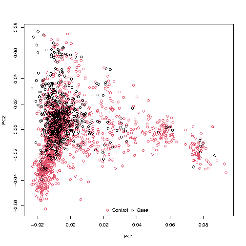

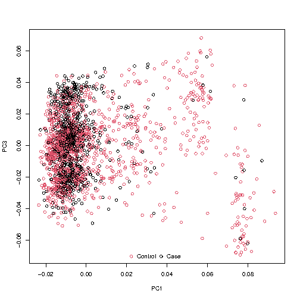

I plotted PC1 versus PC2 and PC1 versus PC3 because these are the top principal pomponents and capture the largest sources of genetic variation in the data. In both plots, cases are shown in red and controls in black. The PC1 vs PC2 plot shows that cases tend toward positive PC1 values while controls cluster near zero or negative values. No individuals appear as extreme outliers warranting removal, so all 2,062 samples were retained for the GWAS analyses.

### 2. It is well known that the HLA region on chromosome 6p21 plays an important role in RA. It is also well known that females are affected by RA much more frequently than males. Your goals are to determine if there are additional genomic regions (in addition to the HLA region on chromosome 6) that are associated with RA in females in this sample, and to determine whether any of the regions are sex-specific. For all analyses, be sure to state and justify the significance criteria you use.

**Make the covariate file** 

I rearranged the columns into the necessary format for running an analysis that is sex-specific. Having established the QC'd dataset and the appropriate PC covariates, I next performed sex-specific GWAS and a formal meta-analysis to test whether genetic effects on RA differ between males and females.

```bash
# Takes the PCs we want and the FID and IID from the first column
awk 'NR>1 {split($1,a,":"); print a[1], a[2], $2, $3, $4, $6, $7, $9}' $WORKDIR/narac_pca.evec > $WORKDIR/temp_pcs.txt

# Script to combine PCs with sex
Rscript - <<'EOF'
# The six PCs we want
pcs <- read.table("temp_pcs.txt", header=FALSE)
colnames(pcs) <- c("FID", "IID", "PC1", "PC2", "PC3", "PC5", "PC6", "PC8")

# Read the covariate file, take the FID, IID, and sex
cov <- read.table("/projectnb/bs859/data/RheumatoidArthritis/final_project/narac.cov", header=TRUE)
cov <- cov[, c("FID", "IID", "sex")]

# Use FID and IID to combine
final_cov <- merge(cov, pcs, by=c("FID", "IID"))

write.table(final_cov, "narac_gwas_covariates.txt", row.names=FALSE, quote=FALSE)
EOF

# Check output
head narac_gwas_covariates.txt 
FID IID sex PC1 PC2 PC3 PC5 PC6 PC8
10001201 10001201 2 -0.0184 0.0229 0.0164 0.0021 0.0413 -0.0122
10002 10002 2 -0.0055 0.0115 -0.0179 0.001 0.0152 0.0026
10004201 10004201 1 -0.0094 3e-04 -0.021 -0.0178 0.0185 -0.0218
10005201 10005201 2 -0.0035 0.0051 0.0073 0.0082 0.0185 0.0093
10006201 10006201 1 -0.0018 0.0087 0.007 0.0047 0.0059 -0.0013
10007202 10007202 2 -0.005 6e-04 -0.01 0.0264 0.0282 -0.0214
10009201 10009201 2 -0.0153 0.0036 -0.0119 0.0205 0.0187 0.0046
10010201 10010201 2 0.0036 5e-04 -5e-04 -0.033 0.0089 -0.0165
10011201 10011201 2 0.0108 0.0022 0.0024 0.0021 0.0244 0.0073
```

### 2a. Perform two genome-wide association analyses for rheumatoid arthritis: one using only female subjects, and one using only male subjects. Explain how you chose covariates, and how you accounted for population structure (or, if you chose not to account for population structure, justify your decision). *Present a written summary of your results with appropriate plots and tables that describe your findings.*

In order to run analyses for RA, I used `--logistic` and `--covar` and to specify to run analyses, I used `--filter-females` for only female subjects and `--filter-males` for only male subjects.

```bash
# Female
plink \
    --bfile $WORKDIR/narac_QC_stg2 \
    --covar $WORKDIR/narac_gwas_covariates.txt \
    --covar-name PC1,PC2,PC3,PC5,PC6,PC8 \
    --filter-females \
    --logistic beta hide-covar \
    --ci 0.95 \
    --out $WORKDIR/narac_female_GWAS
257340 MB RAM detected; reserving 128670 MB for main workspace.
502304 variants loaded from .bim file.
2062 people (569 males, 1493 females) loaded from .fam.
2062 phenotype values loaded from .fam.
569 people removed due to gender filter (--filter-females).
Using 1 thread (no multithreaded calculations invoked).
--covar: 6 out of 7 covariates loaded.
Before main variant filters, 1493 founders and 0 nonfounders present.
Calculating allele frequencies... done.
Warning: Nonmissing nonmale Y chromosome genotype(s) present; many commands
treat these as missing.
Total genotyping rate in remaining samples is 0.995463.
502304 variants and 1493 people pass filters and QC.
Among remaining phenotypes, 641 are cases and 852 are controls.
Writing logistic model association results to
/projectnb/bs859/students/addisony/BS859_Final_Project/narac_female_GWAS.assoc.logistic
... done.

# Male 
plink \
    --bfile $WORKDIR/narac_QC_stg2 \
    --covar $WORKDIR/narac_gwas_covariates.txt \
    --covar-name PC1,PC2,PC3,PC5,PC6,PC8 \
    --filter-males \
    --logistic beta hide-covar \
    --ci 0.95 \
    --out $WORKDIR/narac_male_GWAS
257340 MB RAM detected; reserving 128670 MB for main workspace.
502304 variants loaded from .bim file.
2062 people (569 males, 1493 females) loaded from .fam.
2062 phenotype values loaded from .fam.
1493 people removed due to gender filter (--filter-males).
Using 1 thread (no multithreaded calculations invoked).
--covar: 6 out of 7 covariates loaded.
Before main variant filters, 569 founders and 0 nonfounders present.
Calculating allele frequencies... done.
Warning: 9519 het. haploid genotypes present (see
/projectnb/bs859/students/addisony/BS859_Final_Project/narac_male_GWAS.hh );
many commands treat these as missing.
Total genotyping rate in remaining samples is 0.995893.
502304 variants and 569 people pass filters and QC.
Among remaining phenotypes, 227 are cases and 342 are controls.
Writing logistic model association results to
/projectnb/bs859/students/addisony/BS859_Final_Project/narac_male_GWAS.assoc.logistic
... done.

# check output
head $WORKDIR/narac_female_GWAS.assoc.logistic
 CHR         SNP         BP   A1       TEST    NMISS       BETA       SE      L95      U95
         STAT            P 
   1   rs3094315     752566    G        ADD     1485   -0.09178    0.131  -0.3485   0.1649
      -0.7007       0.4835
   1  rs12562034     768448    A        ADD     1456    -0.1475   0.1534  -0.4482   0.1532
      -0.9613       0.3364
   1   rs3934834    1005806    A        ADD     1464   -0.03536   0.1276  -0.2854   0.2147
      -0.2772       0.7817
   1   rs3737728    1021415    A        ADD     1486    -0.1012   0.1021  -0.3013  0.09882
      -0.9917       0.3213
   1   rs6687776    1030565    A        ADD     1493     0.2264   0.1189 -0.006646   0.459
4        1.904       0.0569
   1   rs4970405    1048955    G        ADD     1487     0.2321   0.1431 -0.04835   0.5126
        1.622       0.1048
   1  rs12726255    1049950    G        ADD     1485     0.2263   0.1289 -0.02632   0.4788
        1.756      0.07914
   1  rs11807848    1061166    G        ADD     1492     0.1135   0.0895 -0.06191   0.2889
        1.268       0.2047
   1   rs9442373    1062638    C        ADD     1488     0.1376  0.08859 -0.03604   0.3112
        1.553       0.1204 
```

To check if there are additional genomic regions associated with RA in a specific sex, we can use QQ plots to see if there's any inflation and Manhattan plots to see if there's significant regions we should look into. I used the qqplot.R and gwaplot.R from Week 3. 

```bash
# QQ plot and Manhattan for female GWAS
Rscript --vanilla /projectnb/bs859/materials/class03/qqplot.R \
    $WORKDIR/narac_female_GWAS.assoc.logistic \
    "Female GWAS" \
    ADD
Rscript --vanilla /projectnb/bs859/materials/class03/gwaplot.R \
    $WORKDIR/narac_female_GWAS.assoc.logistic \
    "Female GWAS (N=1493)" \
    "female_manhattan"
```
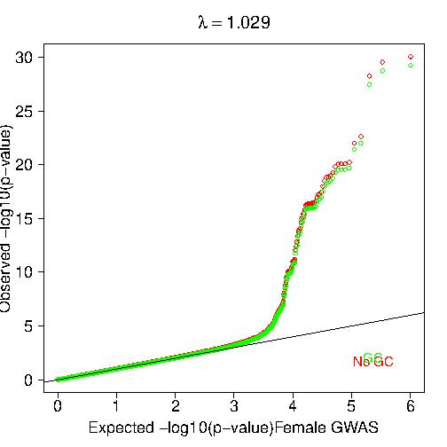

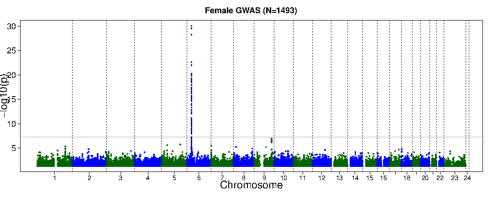

In the QQ plot for the female GWAS, the lambda value is 1.029, the x-axis is expected -log10(p) with ranges from 0 to 6 and the y-axis is observed with ranges from 0 to 30. The points follows a direct line until x=3.5 where it goes up and up to the point where there are points at around (x=6, y=30). 
In the manhattan plot for the female GWAS, there are points for all chromosomes from 1 to 24 but only chromosme 6 sees points above genome-wide significance line, where there are some points in chromosme 9 that are right below the threshold.

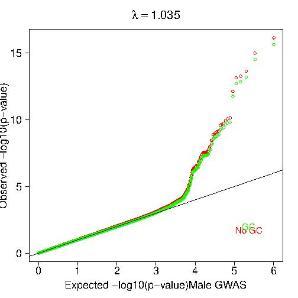

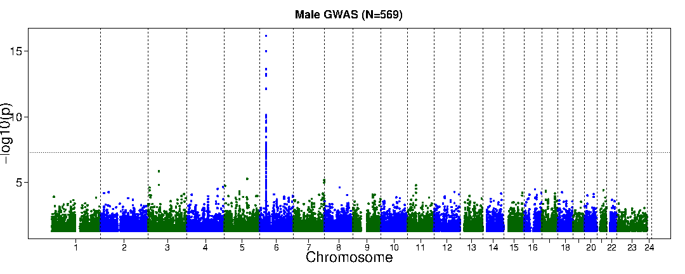

In the QQ plot for the male GWAS, the lambda value is 1.035, the x-axis range is from 0 to 6 and the y-axis range is from 0 to 16. The points follow the direct line until around x=3.5 where it trails off until it reaches around (x=6, y=16).
In the manhattan plot for the male GWAS, there only seems to be chromosome 6 having points below and above the genome-wide significance line, every other chromosme has points below it. 

### 2b. Perform a genome-wide meta-analysis that combines the male-only and female-only results with a test for heterogeneity. Present a written summary of your findings, including appropriate plots and tables, and be sure to address the questions: do males and females show association in the same regions? Do the significantly associated SNPs appear to have similar effects in males as in females? Discuss the limitations of the data and the methods you used.

```bash
module load metal
vi metal_sex_meta.txt
cat metal_sex_meta.txt

SCHEME STDERR
AVERAGEFREQ ON
MINMAXFREQ ON

# Study 1: Female GWAS
MARKER SNP
ALLELE A1 A2
FREQ   F_A
WEIGHT NMISS
EFFECT BETA
STDERR SE
PVAL   P
GENOMICCONTROL 1.029
PROCESS /projectnb/bs859/students/addisony/BS859_Final_Project/narac_female_GWAS.assoc.logistic

# Study 2: Male GWAS
MARKER SNP
ALLELE A1 A2
FREQ   F_A
WEIGHT NMISS
EFFECT BETA
STDERR SE
PVAL   P
GENOMICCONTROL 1.031
PROCESS /projectnb/bs859/students/addisony/BS859_Final_Project/narac_male_GWAS.assoc.logistic

OUTFILE /projectnb/bs859/students/addisony/BS859_Final_Project/narac_meta_sex .tbl
ANALYZE HETEROGENEITY

metal $WORKDIR/metal_sex_meta.txt > $WORKDIR/metal_sex_meta.log

```

**Got over a challenge**

The initial METAL run failed for two reasons. First, `AVERAGEFREQ ON` requires a frequency column (`F_A`) in the input files, but PLINK's logistic output does not include allele frequencies. Second, PLINK's `.assoc.logistic` file contains only the tested allele (`A1` column) but not the reference allele (`A2` column). METAL requires both alleles to align effect directions across studies. Without `A2`, METAL cannot determine whether the effect allele is the same in both the female and male GWAS, and therefore skips all markers (`Processed 0 markers`).

To resolve this, I first set `AVERAGEFREQ OFF` and `MINMAXFREQ OFF` in the METAL control file. Then, I merged the `A2` allele from the `.bim` file into each GWAS results file using `awk`, creating new input files with the required `A2` column. After these corrections, METAL successfully processed all 502,304 markers.

```bash
# Added the A2 column to the female GWAS data
awk 'NR==FNR {a2[$2]=$6; next} 
     FNR==1 {print $1, $2, $3, $4, "A2", $5, $6, $7, $8, $9, $10, $11, $12; next} 
     {print $1, $2, $3, $4, a2[$2], $5, $6, $7, $8, $9, $10, $11, $12}' \
    $WORKDIR/narac_QC_stg2.bim \
    $WORKDIR/narac_female_GWAS.assoc.logistic \
    > $WORKDIR/narac_female_GWAS_withA2.assoc.logistic

# Added the A2 column to the male GWAS data
awk 'NR==FNR {a2[$2]=$6; next} 
     FNR==1 {print $1, $2, $3, $4, "A2", $5, $6, $7, $8, $9, $10, $11, $12; next} 
     {print $1, $2, $3, $4, a2[$2], $5, $6, $7, $8, $9, $10, $11, $12}' \
    $WORKDIR/narac_QC_stg2.bim \
    $WORKDIR/narac_male_GWAS.assoc.logistic \
    > $WORKDIR/narac_male_GWAS_withA2.assoc.logistic

# Get the most significant SNPs by sorting from the lowest p-value
awk 'NR==1 {print $0; next} {print $0 | "sort -gk6"}' $WORKDIR/narac_meta_sex1.tbl | head -10
MarkerName      Allele1 Allele2 Effect  StdErr  P-value Direction       HetISq  HetChiSq HetDf    HetPVal
rs660895        a       g       -1.4073 0.1027  1.033e-42       --      18.1    1.221   10.2692
rs9275224       a       g       -1.4218 0.1101  3.503e-38       --      36.3    1.570   10.2102
rs6457617       a       g       1.4030  0.1092  8.457e-38       ++      10.0    1.112   10.2917
rs2395175       a       g       1.3116  0.1047  5.46e-36        ++      44.8    1.812   10.1782
rs2395163       a       g       -1.2118 0.0994  3.363e-34       --      32.2    1.475   10.2245
rs3763309       a       c       1.1404  0.0987  7.32e-31        ++      57.3    2.343   10.1258
rs3763312       a       g       1.1367  0.0990  1.617e-30       ++      62.7    2.679   10.1017
rs6910071       a       g       -1.1379 0.1001  6.169e-30       --      0.0     0.972   10.3243
rs2395185       a       c       0.9968  0.0917  1.666e-27       ++      0.0     0.273   10.6016

# Count how many times there is a ?
awk 'NR>1 && $7 ~ /\?/ {count++} END {print count}' $WORKDIR/narac_meta_sex1.tbl
6116

# Get the top HLA SNPs
awk 'NR==1 {print "MarkerName\tP-value\tDirection\tHetISq\tHetPVal"; next}
MarkerName      P-value Direction       HetISq  HetPVal
rs908551        0.3668  +-      0.0     0.4529
rs982887        0.03778 ++      0.0     0.7846
rs1996182       0.7531  -+      0.0     0.428
rs12188771      0.1569  -+      38.3    0.203
rs1488583       0.1671  ++      0.0     0.7014
rs17278013      0.4436  -+      0.0     0.3566
rs7521783       0.1895  ++      0.0     0.4623
rs7323548       0.1524  ++      0.0     0.3827
rs12364336      0.1653  --      0.0     0.9288
rs11004591      0.7163  -+      0.0     0.7972

# Count how many SNPs with significant heterogeneity where both studies contribute
awk 'NR>1 && $7 !~ /\?/ && $NF < 0.05 {count++} 
      END {print count }' \
     $WORKDIR/narac_meta_sex1.tbl
23900

# Get the top 10 SNPs with significant heterogeneity where both studies contribute
awk 'NR==1 {print $0; next} 
     $7 !~ /\?/ && $NF < 0.05 && $NF != "" {print $0 | "sort -gk6"}'     $WORKDIR/narac_meta_sex1.tbl | head -10
MarkerName      Allele1 Allele2 Effect  StdErr  P-value Direction       HetISq  HetChiSq        HetDf   HetPVal
rs3135363       a       g       0.8253  0.1212  9.727e-12       ++      75.6    4.106   1       0.04273
rs3129763       a       g       -0.8068 0.1320  9.753e-10       --      74.6    3.943   1       0.04708
rs2900180       a       g       0.4171  0.0846  8.273e-07       ++      75.3    4.044   1       0.04433
rs10760130      a       g       -0.3709 0.0801  3.612e-06       --      75.7    4.120   1       0.04238
rs10985073      a       g       0.3646  0.0800  5.21e-06        ++      74.0    3.847   1       0.04984
rs8059717       a       g       0.3442  0.0825  3.032e-05       ++      81.0    5.252   1       0.02192
rs3809591       a       g       -0.3528 0.0858  3.906e-05       --      77.7    4.487   1       0.03416
rs2071554       a       g       0.6717  0.1656  5.017e-05       ++      84.8    6.599   1       0.0102
rs267070        a       c       0.6054  0.1547  9.134e-05       ++      88.1    8.396   1       0.
```

The meta-analysis results confirm what we saw in the individual sex-specific GWAS that the HLA region on chromosome 6 is the dominant signal. The top SNP, rs660895, has a meta-analysis p-value of 1.03×10⁻^-42 and a Direction column showing "--", meaning the effect allele (G) is associated with lower RA risk in both females and males. The HetISq value for this SNP is 18.1% with a non-significant HetPVal of 0.269, so the effect is statistically consistent between sexes.

Looking more broadly, I found that 6,116 SNPs have a "?" in the Direction column. These are SNPs where one sex contributed data but the other did not—usually because the variant is monomorphic (fixed) in one sex group. For example, rs11189619 shows "+?" because it was only tested in females. These SNPs can't be used for heterogeneity testing since we need both sexes to compare effects.

After filtering out those 6,116 SNPs, I checked how many of the remaining SNPs showed significant sex-heterogeneity (HetPVal < 0.05). There were 23,900 such SNPs. The top heterogeneous SNP, rs3135363, has a meta-analysis p-value of 9.73×10⁻¹² with HetISq of 75.6% and HetPVal of 0.043. This means that while the SNP is strongly associated with RA overall, about 76% of the difference in its effect between females and males is due to real biological differences rather than chance. Many of the significantly heterogeneous SNPs have HetISq values above 75%, suggesting substantial sex-specific genetic effects on RA risk beyond the main HLA signal.

```bash
# Formatted the data to be into the right format for the R scripts from class 
awk 'NR==FNR {chr[$2]=$1; bp[$2]=$3; next}
     FNR==1 {print "CHR\tSNP\tBP\tP"; next}
     {if($1 in chr) print chr[$1]"\t"$1"\t"bp[$1]"\t"$6}' \
    $WORKDIR/narac_female_GWAS_withA2.assoc.logistic \
    $WORKDIR/narac_meta_sex1.tbl \
    > $WORKDIR/meta_for_plot.txt

# QQ plot for combined sex meta analysis
Rscript --vanilla /projectnb/bs859/materials/class03/qqplot.R \
    $WORKDIR/meta_for_plot.txt \
    "Sex-Combined Meta-Analysis" \
    ADD

# Manhattan plot for combined sex meta analysis
Rscript --vanilla /projectnb/bs859/materials/class03/gwaplot.R \
    $WORKDIR/meta_for_plot.txt \
    "NARAC Sex-Combined Meta-Analysis (N=2062)" \
    "meta_manhattan"
```
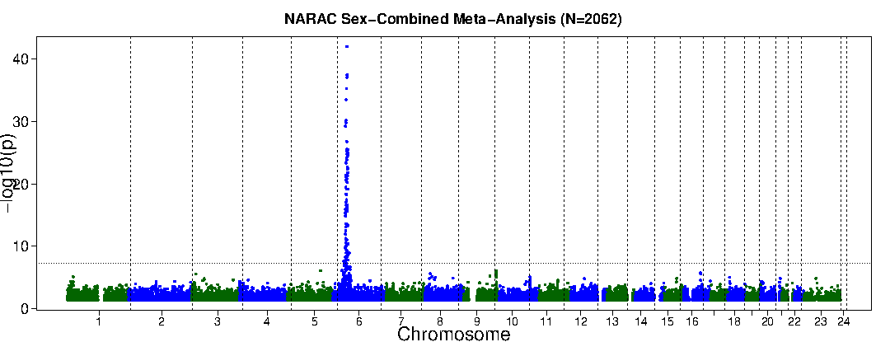


For the meta analysis manhattan plot, only chromosome 6 has plots above and below the genome-wide significance line, every other chromosome only has points below the line. I see the dominant HLA signal on chromosome 6. For the QQ plot, the range for the x-axis is 0 to 6 and for the y-axis is 0 to 42. The points show a direct relationship until x=3 and then it trails off until it reaches around (x=6, y=42).

### 3. a., b., and c. use summary statistics from the study Okada et al. “Genetics of rheumatoid arthritis contributes to biology and drug discovery.” Nature. 2014 Feb 20;506(7488):376-81. (http://www.nature.com.ezproxy.bu.edu/nature/journal/v506/n7488/full/nature12873.html), which includes 14,361 cases and 43,923 controls. 

The file RA_GWASmeta_European_v2.txt contains the genome-wide meta-analysis results for the European ancestry samples (14361 RA cases, 43923 controls). 

The file RA_GWASmeta_Asian_v2.txt.gz contains the genome-wide meta-analysis results for the Asian ancestry samples from the same study (4873 RA cases, 17642 controls).

The file RA_GWASmeta_TransEthnic_v2.txt.gz is a GWAS meta-analysis of all the European and Asian samples. (19234 RA cases and 61565 controls)

### 3b. Develop a polygenic risk score for RA using the Okada et al data, test it on the NARAC data you have analyzed in 2. Describe your methods – including all assumptions you’ve made - and present and explain your results.

For the final analysis, I used the Okada et al. (2014) European GWAS summary statistics to build a polygenic risk score and tested its predictive power in the NARAC cohort.

```bash
module load R
module load python2
module load ldsc
module load prsice

# Move and reformat the columns of the European GWAS summary statistics in the right format for prsice
awk 'NR==1 {print "SNP CHR BP A1 A2 OR P"; next} 
     {print $1, $2, $3, $4, $5, $6, $9}' \
    /projectnb/bs859/data/RheumatoidArthritis/final_project/RA_GWASmeta_European_v2.txt \
    > okada_base.txt

# Remove the chromosome 6 variants as that was causing inflation
awk '$1==6 {print $2}' narac_QC_stg2.bim > chr6_exclude.txt

# Initial prsice run
Rscript $SCC_PRSICE_BIN/PRSice.R --dir . \
    --prsice $SCC_PRSICE_BIN/PRSice \
    --base $WORKDIR/okada_base.txt \
    --target $WORKDIR/narac_QC_stg2 \
    --stat OR \
    --snp SNP \
    --chr CHR \
    --bp BP \
    --A1 A1 \
    --A2 A2 \
    --pvalue P \
    --binary-target T \
    --cov-file $WORKDIR/narac_gwas_covariates.txt \
    --cov-col PC1,PC2,PC3,PC5,PC6,PC8 \
    --clump-r2 0.1 \
    --clump-kb 250 \
    --out $WORKDIR/narac_prs

# Check the output
cat $WORKDIR/narac_prs.summary
Phenotype	Set	Threshold	PRS.R2	Full.R2	Null.R2	Prevalence	Coefficient	Standard.ErrorP	Num_SNP
-	Base	1	0.957456	0.97524	0.418006	-	85486.4	7667.99	7.28436e-29	94505

# Ran prsice without chromsome 6 as there was overfitting
Rscript $SCC_PRSICE_BIN/PRSice.R --dir . \
    --prsice $SCC_PRSICE_BIN/PRSice \
    --base $WORKDIR/okada_base.txt \
    --target $WORKDIR/narac_QC_stg2 \
    --exclude $WORKDIR/chr6_exclude.txt \
    --stat OR \
    --snp SNP \
    --chr CHR \
    --bp BP \
    --A1 A1 \
    --A2 A2 \
    --pvalue P \
    --binary-target T \
    --cov-file $WORKDIR/narac_gwas_covariates.txt \
    --cov-col sex \
    --clump-r2 0.1 \
    --clump-kb 250 \
    --bar-levels 5e-08,1e-06,1e-04,0.001,0.01,0.05,0.1,0.2,0.3,0.4,0.5 \
    --perm 1000 \
    --seed 1443 \
    --out $WORKDIR/narac_prs_sexOnly_restricted


# Run PRSice-2 three times with different thresholds
# PRS using genome-wide significant SNPs only (p < 5e-08)
Rscript $SCC_PRSICE_BIN/PRSice.R --dir . \
    --prsice $SCC_PRSICE_BIN/PRSice \
    --base $WORKDIR/okada_base.txt \
    --target $WORKDIR/narac_QC_stg2 \
    --exclude $WORKDIR/chr6_exclude.txt \
    --stat OR \
    --snp SNP \
    --chr CHR \
    --bp BP \
    --A1 A1 \
    --A2 A2 \
    --pvalue P \
    --binary-target T \
    --cov-file $WORKDIR/narac_gwas_covariates.txt \
    --cov-col sex \
    --clump-r2 0.1 \
    --clump-kb 250 \
    --upper 5e-08 \
    --lower 0 \
    --no-full \
    --out $WORKDIR/narac_prs_GWS
PRSice 2.3.5 (2021-09-20) 
https://github.com/choishingwan/PRSice
(C) 2016-2020 Shing Wan (Sam) Choi and Paul F. O'Reilly
GNU General Public License v3
If you use PRSice in any published work, please cite:
Choi SW, O'Reilly PF.
PRSice-2: Polygenic Risk Score Software for Biobank-Scale Data.
GigaScience 8, no. 7 (July 1, 2019)
2026-04-29 05:20:35
/share/pkg.8/prsice/2.3.5/install/bin/PRSice \
    --a1 A1 \
    --a2 A2 \
    --bar-levels 0.001,0.05,0.1,0.2,0.3,0.4,0.5 \
    --base /projectnb/bs859/students/addisony/BS859_Final_Project/okada_base.txt \
    --binary-target T \
    --bp BP \
    --chr CHR \
    --clump-kb 250kb \
    --clump-p 1.000000 \
    --clump-r2 0.100000 \
    --cov /projectnb/bs859/students/addisony/BS859_Final_Project/narac_gwas_covariates.txt \
    --cov-col sex \
    --exclude /projectnb/bs859/students/addisony/BS859_Final_Project/chr6_exclude.txt \
    --interval 5e-05 \
    --lower 0 \
    --no-full  \
    --num-auto 22 \
    --or  \
    --out /projectnb/bs859/students/addisony/BS859_Final_Project/narac_prs_GWS \
    --pvalue P \
    --seed 607984527 \
    --snp SNP \
    --stat OR \
    --target /projectnb/bs859/students/addisony/BS859_Final_Project/narac_QC_stg2 \
    --thread 1 \
    --upper 5e-08

Initializing Genotype file: 
/projectnb/bs859/students/addisony/BS859_Final_Project/narac_QC_stg2 
(bed) 

Start processing okada_base 
================================================== 

Only one column detected, will assume only SNP ID is 
provided 

Base file: 
/projectnb/bs859/students/addisony/BS859_Final_Project/okada_base.txt 
Header of file is: 
SNP CHR BP A1 A2 OR P 

Reading 100.00%
8747962 variant(s) observed in base file, with: 
32449 variant(s) excluded based on user input 
233352 variant(s) located on haploid chromosome 
8460167 variant(s) excluded due to p-value threshold 
3304 ambiguous variant(s) excluded 
18690 total variant(s) included from base file 

Loading Genotype info from target 
================================================== 

2062 people (569 male(s), 1493 female(s)) observed 
2062 founder(s) included 

Warning: Currently not support haploid chromosome and sex 
         chromosomes 

490082 variant(s) not found in previous data 
159 variant(s) included 

There are a total of 1 phenotype to process 

Start performing clumping 

Clumping Progress: 100.00%
Number of variant(s) after clumping : 40 

Processing the 1 th phenotype 

Phenotype is a binary phenotype 
1194 control(s) 
868 case(s) 

Processing the covariate file: 
/projectnb/bs859/students/addisony/BS859_Final_Project/narac_gwas_covariates.txt 
============================== 

Include Covariates: 
Name	Missing	Number of levels 
sex	0	- 

After reading the covariate file, 2062 sample(s) included 
in the analysis 


Start Processing
Processing 100.00%
There are 1 region(s) with p-value less than 1e-5. Please 
note that these results are inflated due to the overfitting 
inherent in finding the best-fit PRS (but it's still best 
to find the best-fit PRS!). 
You can use the --perm option (see manual) to calculate an 
empirical P-value. 

Begin plotting
Current Rscript version = 2.3.3
Plotting Bar Plot
Plotting the high resolution plot


# Second threshold p < 1e-05
Rscript $SCC_PRSICE_BIN/PRSice.R --dir . \
    --prsice $SCC_PRSICE_BIN/PRSice \
    --base $WORKDIR/okada_base.txt \
    --target $WORKDIR/narac_QC_stg2 \
    --exclude $WORKDIR/chr6_exclude.txt \
    --stat OR \
    --snp SNP --chr CHR --bp BP --A1 A1 --A2 A2 --pvalue P \
    --binary-target T \
    --cov-file $WORKDIR/narac_gwas_covariates.txt --cov-col sex \
    --clump-r2 0.1 --clump-kb 250 \
    --upper 1e-05 --lower 0 \
    --no-full \
    --out $WORKDIR/narac_prs_suggestive
PRSice 2.3.5 (2021-09-20) 
https://github.com/choishingwan/PRSice
(C) 2016-2020 Shing Wan (Sam) Choi and Paul F. O'Reilly
GNU General Public License v3
If you use PRSice in any published work, please cite:
Choi SW, O'Reilly PF.
PRSice-2: Polygenic Risk Score Software for Biobank-Scale Data.
GigaScience 8, no. 7 (July 1, 2019)
2026-04-29 05:22:40
/share/pkg.8/prsice/2.3.5/install/bin/PRSice \
    --a1 A1 \
    --a2 A2 \
    --bar-levels 0.001,0.05,0.1,0.2,0.3,0.4,0.5 \
    --base /projectnb/bs859/students/addisony/BS859_Final_Project/okada_base.txt \
    --binary-target T \
    --bp BP \
    --chr CHR \
    --clump-kb 250kb \
    --clump-p 1.000000 \
    --clump-r2 0.100000 \
    --cov /projectnb/bs859/students/addisony/BS859_Final_Project/narac_gwas_covariates.txt \
    --cov-col sex \
    --exclude /projectnb/bs859/students/addisony/BS859_Final_Project/chr6_exclude.txt \
    --interval 5e-05 \
    --lower 0 \
    --no-full  \
    --num-auto 22 \
    --or  \
    --out /projectnb/bs859/students/addisony/BS859_Final_Project/narac_prs_suggestive \
    --pvalue P \
    --seed 2620666258 \
    --snp SNP \
    --stat OR \
    --target /projectnb/bs859/students/addisony/BS859_Final_Project/narac_QC_stg2 \
    --thread 1 \
    --upper 1e-05

Initializing Genotype file: 
/projectnb/bs859/students/addisony/BS859_Final_Project/narac_QC_stg2 
(bed) 

Start processing okada_base 
================================================== 

Only one column detected, will assume only SNP ID is 
provided 

Base file: 
/projectnb/bs859/students/addisony/BS859_Final_Project/okada_base.txt 
Header of file is: 
SNP CHR BP A1 A2 OR P 

Reading 100.00%
8747962 variant(s) observed in base file, with: 
32449 variant(s) excluded based on user input 
233352 variant(s) located on haploid chromosome 
8452885 variant(s) excluded due to p-value threshold 
4388 ambiguous variant(s) excluded 
24888 total variant(s) included from base file 

Loading Genotype info from target 
================================================== 

2062 people (569 male(s), 1493 female(s)) observed 
2062 founder(s) included 

Warning: Currently not support haploid chromosome and sex 
         chromosomes 

489875 variant(s) not found in previous data 
366 variant(s) included 

There are a total of 1 phenotype to process 

Start performing clumping 

Clumping Progress: 100.00%
Number of variant(s) after clumping : 97 

Processing the 1 th phenotype 

Phenotype is a binary phenotype 
1194 control(s) 
868 case(s) 

Processing the covariate file: 
/projectnb/bs859/students/addisony/BS859_Final_Project/narac_gwas_covariates.txt 
============================== 

Include Covariates: 
Name	Missing	Number of levels 
sex	0	- 

After reading the covariate file, 2062 sample(s) included 
in the analysis 


Start Processing
Processing 100.00%
There are 1 region(s) with p-value less than 1e-5. Please 
note that these results are inflated due to the overfitting 
inherent in finding the best-fit PRS (but it's still best 
to find the best-fit PRS!). 
You can use the --perm option (see manual) to calculate an 
empirical P-value. 

Begin plotting
Current Rscript version = 2.3.3
Plotting Bar Plot
Plotting the high resolution plot


# Third threshold p < 0.05
Rscript $SCC_PRSICE_BIN/PRSice.R --dir . \
    --prsice $SCC_PRSICE_BIN/PRSice \
    --base $WORKDIR/okada_base.txt \
    --target $WORKDIR/narac_QC_stg2 \
    --exclude $WORKDIR/chr6_exclude.txt \
    --stat OR \
    --snp SNP --chr CHR --bp BP --A1 A1 --A2 A2 --pvalue P \
    --binary-target T \
    --cov-file $WORKDIR/narac_gwas_covariates.txt --cov-col sex \
    --clump-r2 0.1 --clump-kb 250 \
    --upper 0.05 --lower 0 \
    --no-full \
    --out $WORKDIR/narac_prs_nominal
PRSice 2.3.5 (2021-09-20) 
https://github.com/choishingwan/PRSice
(C) 2016-2020 Shing Wan (Sam) Choi and Paul F. O'Reilly
GNU General Public License v3
If you use PRSice in any published work, please cite:
Choi SW, O'Reilly PF.
PRSice-2: Polygenic Risk Score Software for Biobank-Scale Data.
GigaScience 8, no. 7 (July 1, 2019)
2026-04-29 05:23:12
/share/pkg.8/prsice/2.3.5/install/bin/PRSice \
    --a1 A1 \
    --a2 A2 \
    --bar-levels 0.001,0.05,0.1,0.2,0.3,0.4,0.5 \
    --base /projectnb/bs859/students/addisony/BS859_Final_Project/okada_base.txt \
    --binary-target T \
    --bp BP \
    --chr CHR \
    --clump-kb 250kb \
    --clump-p 1.000000 \
    --clump-r2 0.100000 \
    --cov /projectnb/bs859/students/addisony/BS859_Final_Project/narac_gwas_covariates.txt \
    --cov-col sex \
    --exclude /projectnb/bs859/students/addisony/BS859_Final_Project/chr6_exclude.txt \
    --interval 5e-05 \
    --lower 0 \
    --no-full  \
    --num-auto 22 \
    --or  \
    --out /projectnb/bs859/students/addisony/BS859_Final_Project/narac_prs_nominal \
    --pvalue P \
    --seed 1918337445 \
    --snp SNP \
    --stat OR \
    --target /projectnb/bs859/students/addisony/BS859_Final_Project/narac_QC_stg2 \
    --thread 1 \
    --upper 0.05

Initializing Genotype file: 
/projectnb/bs859/students/addisony/BS859_Final_Project/narac_QC_stg2 
(bed) 

Start processing okada_base 
================================================== 

Only one column detected, will assume only SNP ID is 
provided 

Base file: 
/projectnb/bs859/students/addisony/BS859_Final_Project/okada_base.txt 
Header of file is: 
SNP CHR BP A1 A2 OR P 

Reading 100.00%
8747962 variant(s) observed in base file, with: 
32449 variant(s) excluded based on user input 
233352 variant(s) located on haploid chromosome 
7981121 variant(s) excluded due to p-value threshold 
77195 ambiguous variant(s) excluded 
423845 total variant(s) included from base file 

Loading Genotype info from target 
================================================== 

2062 people (569 male(s), 1493 female(s)) observed 
2062 founder(s) included 

Warning: Currently not support haploid chromosome and sex 
         chromosomes 

463548 variant(s) not found in previous data 
1 variant(s) with mismatch information 
26692 variant(s) included 

There are a total of 1 phenotype to process 

Start performing clumping 

Clumping Progress: 100.00%
Number of variant(s) after clumping : 10496 

Processing the 1 th phenotype 

Phenotype is a binary phenotype 
1194 control(s) 
868 case(s) 

Processing the covariate file: 
/projectnb/bs859/students/addisony/BS859_Final_Project/narac_gwas_covariates.txt 
============================== 

Include Covariates: 
Name	Missing	Number of levels 
sex	0	- 

After reading the covariate file, 2062 sample(s) included 
in the analysis 


Start Processing
Processing 100.00%
There are 1 region(s) with p-value less than 1e-5. Please 
note that these results are inflated due to the overfitting 
inherent in finding the best-fit PRS (but it's still best 
to find the best-fit PRS!). 
You can use the --perm option (see manual) to calculate an 
empirical P-value. 

Begin plotting
Current Rscript version = 2.3.3
Plotting Bar Plot
Plotting the high resolution plot
```

The initial PRSice run using all chromosomes and the 6 ancestry PCs as covariates produced an implausible result: the best-fit PRS included all 94,505 clumped SNPs (p-value threshold = 1.0) and reported an R² of 0.957. This indicated severe overfitting, driven by two factors:

1. **The HLA region on chromosome 6:** The extended MHC region contains variants with extremely strong associations with RA in both the base and target datasets. Including this region allows the PRS to potentially memorize case/control status rather than predict it.
2. **Ancestry-informative PCs as covariates:** The 6 PCs were specifically chosen because they were strongly associated with case/control status (Null R2 = 0.418). Including them in the PRS model creates a analysis where ancestry itself predicts the phenotype almost perfectly.

To address this, I excluded all of chromosome 6 from the analysis, and used only sex as a covariate, which is a true confounder for RA risk independent of genetic ancestry.

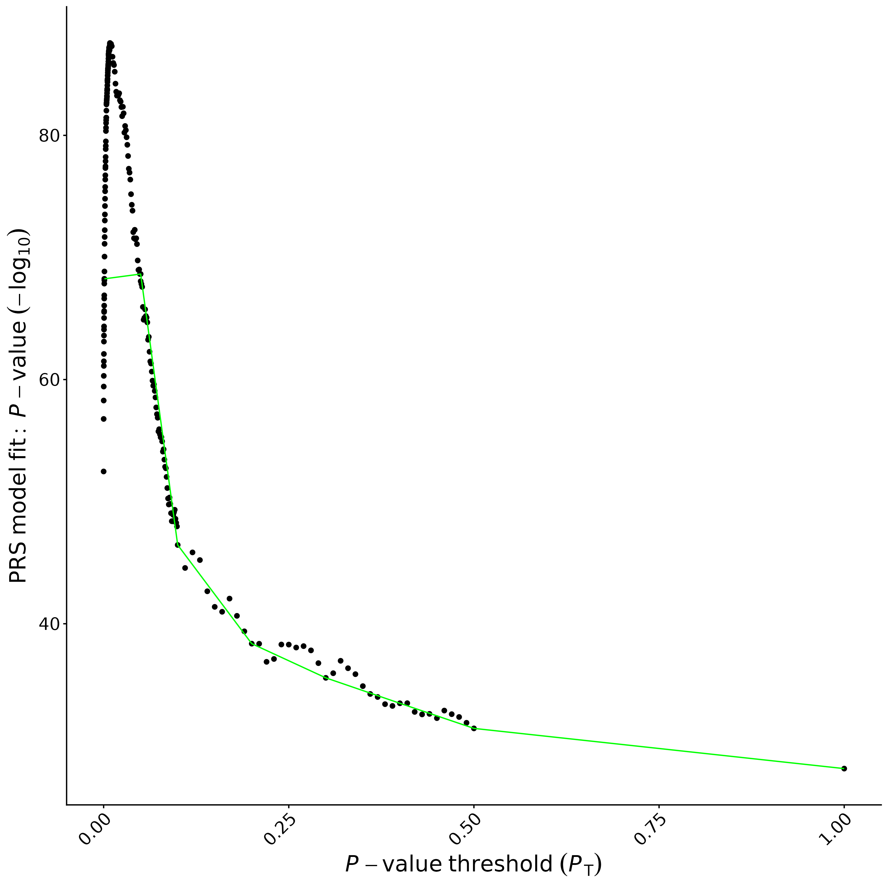

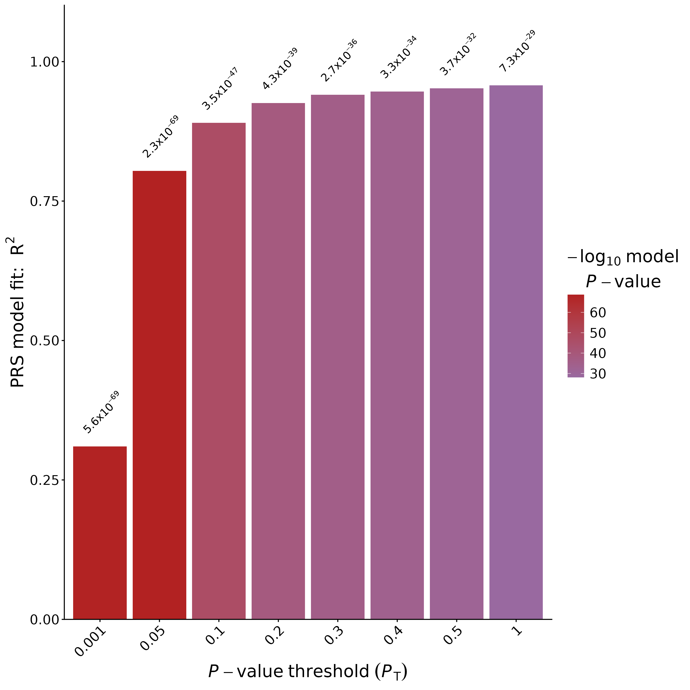

When I originally was running prsice, the data suggested overfitting as the model was using all of the 94,505 SNPS and saying it explained 95.7% of the variance. The high-resolution plot shows the PRS model fit (-log₁₀ p-value) across p-value thresholds (PT) where the -log₁₀(p) starts near 86 at low thresholds and declines to around 20 by p=0.5 until it reaches x=.50 and then one point at arond x=1.0, y=10. For the second plot, a bar plot, prsice tests multiple p-value thresholds (0.001, 0.05, 0.1, 0.2, 0.3, 0.4, 0.5), where the bars are increasing as the p-value threshold inclines.

This led me to removing chromosome 6 with the HLA region to actually test the rest of the genome to see if it can predict RA conditions as we already are aware of HLA doing so. This led to similar results though as the R2 of 0.969 means that it was explaining 95.7% of the variance. I looked into the okada base files to see what could be causing overfitting and say that the Okada RA GWAS had p-values of 10 x 1e--250 that were already pretty signigicant. 

The model with 6PCs had R2 of 0.418, so it was explaining 41.8% of the variance in the RA condition. This led me to run prsice without the PCs but using sex as an covariate as it is known.

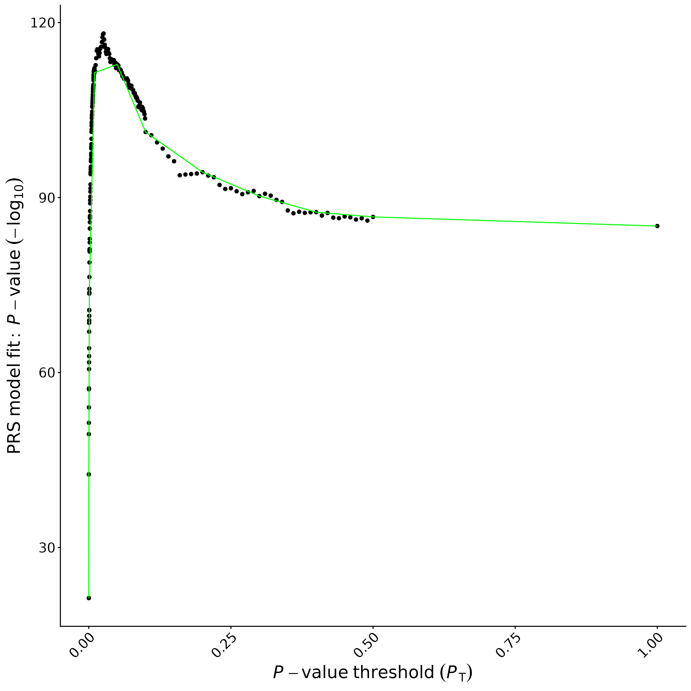

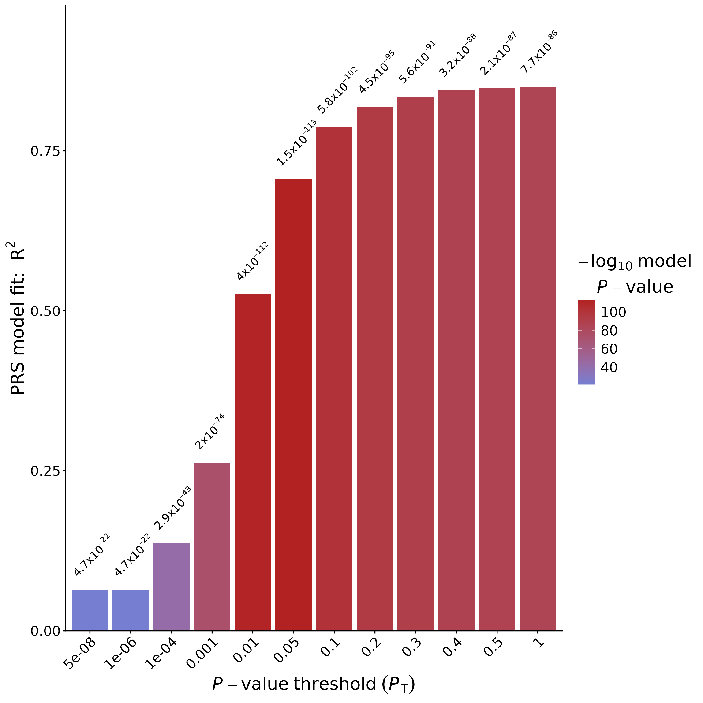

These are the plots for running prsice wihtout the six PCs and with only with sex as a factor. The first plot shows p-value threshold (PT) vs PRS model fit - p-value (-log10), where the most of the points at x=0 go up to y=120 and dwindle down to around y=90 once x=0.50 and no points past 0.5 except one at x=1.0. The bar plot shows the bars growing higher and higer meaning the R2 is being explained more and more. The reason why I wanted to highlight the plots for when we only consider sex as a factor is for the next plots down the line that don't look the prettiest. 

I ran prsice on three threshold levels of p < 5×10^-8 for genome-wide significance, the usual nominal p < 0.05, and inbetween p < 1×10^-5. 

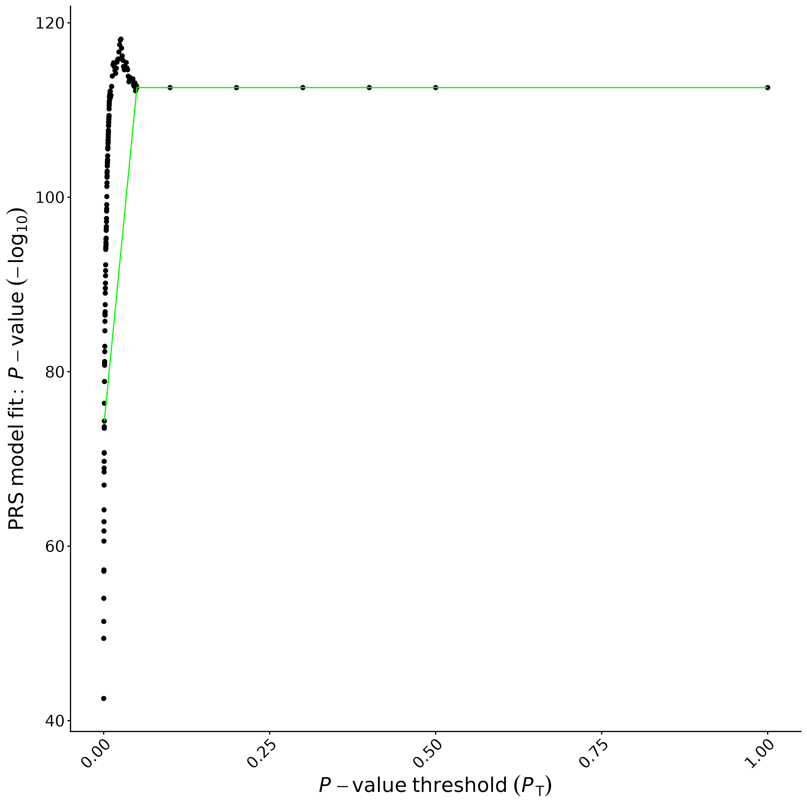

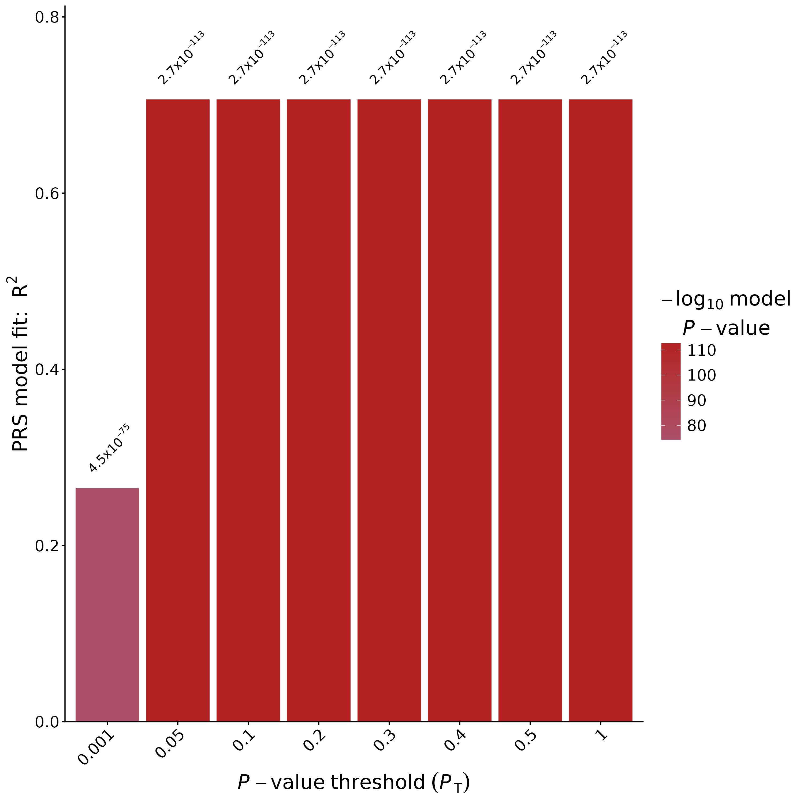

The nominal threshold (p < 0.05) included 10,496 SNPs after clumping. The high-resolution plot shows extremely high -log₁₀(p) values (~115) that remain nearly constant across all p-value thresholds, consistent with severe overfitting from including thousands of weakly associated variants. The bar plot shows the first bar (threshold = 0.001) at a somewhat lower significance level than all subsequent bars, which are uniformly at 2.7×10⁻¹¹³. The R² of 70.6% is clearly invalid.

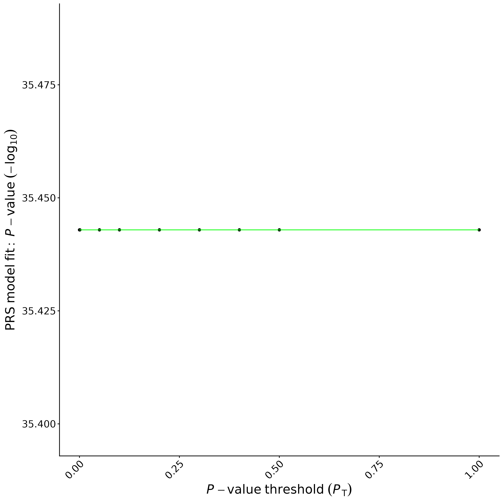

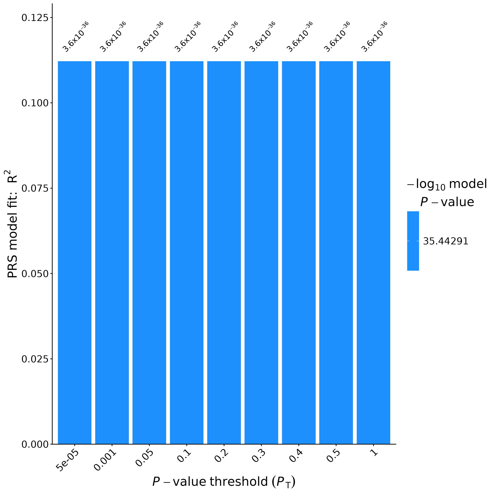

These are the plots for running prsice with a threshold of p < 1×10^-5. The first plot shows all the points at the same y axis around y=35.44 distributed before a p-value threshold of x=0.5 and one point at x=1. In the bar plot, it shows all of the bars at the same -log10 p-value of 3.6×10^-36. We see uniform bar heights and constant -log10 p values because the variants in the PRS have p-value below 1×10^-5 from the Okada base GWAS. This led to the internal p-value threshold that PRSICE test to capture the same 97 variants, which are the variants seen at each bar. These plots look similiar for the plots that resulted when running prsice with a threshold of p < 5×10^-8, where the line plot shows the points at the same y-axis or -log10 p-value of 21.325. And for the bar plot, all the bars reach a -log10 p-value of 4.7×10^-22.

| P-value Threshold | Independent SNPs | PRS R² | P-value |
|:------------------|:-----------------|:-------|:--------|
| p < 5×10^-8 | 40 | 0.064 (6.4%) | 4.7×10^-22 |
| p < 1×10^-5 | 97 | 0.112 (11.2%) | 3.6×10^-36 |
| p < 0.05 | 10,496 | 0.706 (70.6%) | 2.7×10^-113 |

This table shows the results of running prsice on the three thresholds. When using a p < 5×10^-8 threshold, there were 40 genome-wide significant variants outside of the HLA region of chromosome 6 which explain 6.4% of variance in the RA condition, which is more practical for a trait such as RA that complex. This reinforces that more robust thresholds omit fewer and fewer variants. 

For the inbetween p < 1×10^-5 threshold, there are 97 variants that explain 11.2% of variance where not all of these variants are genome-wide significant. This 11.2% is about two times the predictive power than the genome-wide significance level's R2. In the p < 0.05 threshold, there are 10,496 nominal variants that explain 70.6% of variance with but because there are so many SNPs, it's hard to tell which are real assocations with RA.

**Limitations**

In terms of limitations, the NARAC sample size of 2,062 is pretty low for Polygenetic Risk Score validation which leads to limited statistical power to detect modest polygenic effects. I removed the entirety of chromosome 6 mostly to not include the HLA region, but this leads to even less statistical power and potential SNPs around the HLA region that may be significant. I used the European subset of the Okada as the basis for the GWAS as the NARAC target sample is predominantly European ancestry and using the trans-ethnic or Asian-specific summary statistics may have introduced some mismatches and reduce the predictive accuracy. But, the European based GWAS may not perfectly match the NARAC sample, which includes some Southern European and Ashkenazi Jewish data in the control.