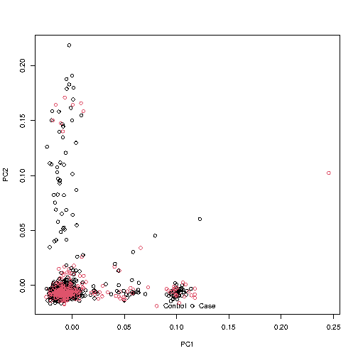
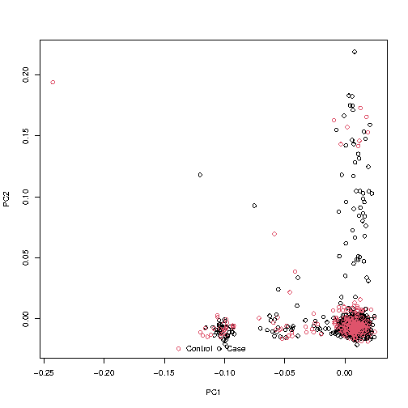

## Homework 2: Population Structure Detection
### BS859 Applied Genetic Analysis
### Addison Yam
### February 4, 2026

```bash
# set data directory
export DATADIR=/projectnb/bs859/data/tgen/cleaned/TGEN_cleaned
# load R, plink, and eigensoft (smartpca)
module load R
module load plink/1.90b6.27
module load eigensoft 
```

Use The TGEN+HapMap PCA esults we created during the class example analyses (the files TGEN_hapmap_pruned.evec, TGEN_hapmap_pruned.eval, hapmaptgen.out) to complete the first 2 questions.

1. **In our class example PCA using TGEN merged with hapmap samples, what are the IDs of the two TGEN samples that cluster with the YRI and JPT+CHB on the first two PCs? Which individual appears to be clustering with the CHB+JPT samples, and which close to the Yoruban?** 
    - Answer: The ID of the TGEN sample that clusters wiht the YRI is WGACON_66 because this individual has a negative PC1 (of -0.0839) and a negative PC2 (of -0.0658). The ID of the TGEN sample that clusters with the JPT_CHB is WGAAD_270 because this individual has a negative PC1 (of -0.0543) and a positive PC2 (0.0807).
```bash
# Filters for the outliers of the TGEN data set by selecting PC1 values in column 2 < -0.01 since CHB/JPT and YRI have negative PC1 values
> awk '($2 < -0.01) && ($12=="Case" || $12=="Control") {print $1,$2,$3,$4}' TGEN_hapmap_pruned.evec > outliers.txt
# Print the contents
> awk '{print $1,$2,$3,$4}' outliers.txt
NBB_S96149:NBB_S96149 -0.0118 0.0228 -0.0038
WGAAD_270:WGAAD_270 -0.0543 0.0807 -0.0041
WGAAD_339:WGAAD_339 -0.0101 -0.0143 0.0067
WGAAD_408:WGAAD_408 -0.0291 0.0332 0.0048
WGACON_66:WGACON_66 -0.0839 -0.0658 -0.0097
WGACON_194:WGACON_194 -0.0179 0.0210 -0.0092
```
2. **What are the IDs and case status of the other individuals who did not cluster closely with the CEU on PCs 1 and 2? Explain what filters you use to identify them.**
    - Answer: The filters I used to identify the individuals who don't cluster with the CEU were PC1 values less than -0.01 as CEU samples have positive PC1 values and also if there was 'Case' or 'Control' in the Phenotype/Hapmap in order to get TGEN samples only. The IDs that are control are NBB_S96149, WGACON_66, and WGACON_194 are controls while the IDs that are case are WGAAD_270, WGAAD_339, and WGAAD_408.
```bash
# Filter for PC1 < -0.01 and for Case/Control in the 12 column
> awk '$2<-0.01&&($12=="Case"||$12=="Control"){print $1, $12}' TGEN_hapmap_pruned.evec
GEN_hapmap_pruned.evec
NBB_S96149:NBB_S96149 Control
WGAAD_270:WGAAD_270 Case
WGAAD_339:WGAAD_339 Case
WGAAD_408:WGAAD_408 Case
WGACON_66:WGACON_66 Control
WGACON_194:WGACON_194 Control
```


In the next few problems, you will perform a PCA using the TGEN_cleaned dataset (without merging
the data with the hapmap reference data set). The TGEN_cleaned file set we used in class is located
here: /projectnb/bs859/data/tgen/cleaned/TGEN_cleaned.*
Use plink/1.90b6.27

PCA is used in genetic studies to identify axes of variation, or genetic ancestry. We will do the PCA
twice, with two slightly different sets of variants, to compare the PCs and determine how sensitive PCA
is to the variants used.

Follow the directions below.

3. **Use plink to remove variants with minor allele frequency <0.02, and with genotype missingness >0.02 and LD prune the variants using the parameters: --indep-pairwise 10000kb 1 0.2 Create a new data set that keeps only the pruned-in variants and has only variants from chromosomes 1-22**
```bash
# Remove variants with MAF < 0.02 and genotype missingness > 0.02
> plink --bfile $DATADIR --maf 0.02 --geno 0.02 --make-bed --out TGEN_Q3_MAF_geno
# Perform Pruning
> plink --bfile TGEN_Q3_MAF_geno --indep-pairwise 10000 kb 1 0.2 --out TGEN_Q3_pruned
# Keep the pruned-in variants and variants from chromosomes 1-22
> plink --bfile TGEN_Q3_MAF_geno --extract TGEN_Q3_pruned.prune.in --chr 1-22 --make-bed --out TGEN_Q3_pruned --allow-no-sex
```

a. **Fully explain what the pruning parameters we are using mean**

- Answer: The pruning parameters used --indep-pairwise 10000 kb 1 0.2 mean a  window size of 10,000 kilobases across when sliding through the chromosome, the window moving 1 variant each time, and to remove a SNP if two SNPs in a window have an r² greater than 0.2 (to decrease linkage disequalibrium). 

b. **Print the first 10 SNPs in the pruned data set**
```bash
# Display the first 10 SNPs
> head TGEN_Q3_pruned.bim
1	rs3094315	0	742429	C	T
1	rs4075116	0	993492	G	A
1	rs10907175	0	1120590	C	A
1	rs11260562	0	1155173	A	G
1	rs6685064	0	1201155	T	C
1	rs6603791	0	1490804	G	A
1	rs2281173	0	1678052	A	G
1	rs6603803	0	1802548	A	G
1	rs7513222	0	2017761	A	G
1	rs3107146	0	2037444	T	C
```

c. **Report the number of SNPs that remain after the filtering on minor allele frequency and pruning**

- Answer: There are 69,315 SNPs remaining
```bash
# Count the SNPs remaining
> wc -l TGEN_Q3_pruned.bim
69315 TGEN_Q3_pruned.bim
```
    
d. **Run smartpca with this pruned data set. Show your smartpca parameter file and plot PC1 vs PC2.**
```bash
# Created TGEN_Q3.par file parameter 
> vi TGEN_Q3.par
> head TGEN_Q3.par
genotypename:    TGEN_Q3_pruned.bed
snpname:         TGEN_Q3_pruned.bim
indivname:       TGEN_Q3_pruned.fam
evecoutname:     TGEN_Q3_pruned.evec
evaloutname:     TGEN_Q3_pruned.eval
altnormstyle:    NO
numoutevec:      10
numoutlieriter:  0

# Perform smartpca
> smartpca -p TGEN_Q3.par > TGEN_Q3.out

# Run R script plotting PC1 and PC2
> ?Rscript --vanilla plotPCs.R TGEN_Q3_pruned.evec 1 2 10
```


4. **Use plink to remove variants with minor allele frequency <0.02, and with genotype missingness >0.01 and LD prune the variants using the parameters: --indep-pairwise 10000kb 1 0.15 Again, create a new data set that keeps only the pruned-in variants and has only variants from chromosomes 1-22. Make sure you give this data set a different name than the pruned data set in 3) so that you do not overwrite it.**
```bash
# Set data directory
> DATADIR=/projectnb/bs859/data/tgen/cleaned

# Remove variant MAF < 0.02 and genotype missingness > 0.01
> plink --bfile $DATADIR/TGEN_cleaned --maf 0.02 --geno 0.01 --make-bed --out TGEN_Q4_MAF_geno

# Perform Pruning
> plink --bfile TGEN_Q4_MAF_geno --indep-pairwise 10000 kb 1 0.15 --out TGEN_Q4_pruned

# Keep the pruned-in variants and variants from chromosomes 1-22
> plink --bfile TGEN_Q4_MAF_geno --extract TGEN_Q4_pruned.prune.in --chr 1-22 --make-bed --out TGEN_Q4_pruned --allow-no-sex
```

a. **Fully explain what the pruning parameters we are using mean**
- Answer: The pruning parameters used --indep-pairwise 10000 kb 1 0.15 mean a  window size of 10,000 kilobases across when sliding through the chromosome, the window moving 1 variant each time, and to remove a SNP if two SNPs in a window have an r² greater than 0.15 (to decrease linkage disequalibrium). This is a smaller r², so this is a stricter pruning and removes SNP with a lower. 

b. **Print the first 10 SNPs in the pruned data set**
```bash
# Display the first 10 SNPs
> head TGEN_Q4_pruned.bim
1	rs3094315	0	742429	C	T
1	rs4075116	0	993492	G	A
1	rs10907175	0	1120590	C	A
1	rs11260562	0	1155173	A	G
1	rs6685064	0	1201155	T	C
1	rs6603791	0	1490804	G	A
1	rs2281173	0	1678052	A	G
1	rs6603803	0	1802548	A	G
1	rs3107146	0	2037444	T	C
1	rs3753242	0	2059541	T	C
```

c. **Report the number of SNPs that remain after the filtering on minor allele frequency and pruning**
- Answer: There are 52,572 SNPs remaining.
```bash
# Count the SNPs remaining
> wc -l TGEN_Q4_pruned.bim
52572 TGEN_Q4_pruned.bim
```
    
d. **Run smartpca with this 2nd pruned data set. Show your smartpca parameter file and Plot PC1 vs PC2.**
```bash
# Create and show parameter
> vi TGEN_Q4.par
> head TGEN_Q4.par
genotypename:    TGEN_Q4_pruned.bed
snpname:         TGEN_Q4_pruned.bim
indivname:       TGEN_Q4_pruned.fam
evecoutname:     TGEN_Q4_pruned.evec
evaloutname:     TGEN_Q4_pruned.eval
altnormstyle:    NO
numoutevec:      10
numoutlieriter:  0

# Perform smartpca
> smartpca -p TGEN_Q4.par > TGEN_Q4.out

# Run R script plotting PC1 and PC2
> Rscript --vanilla plotPCs.R TGEN_Q4_pruned.evec 1 2 10
```



5. Using the output from the 2 PCAs performed in questions 3 and 4,

a. **Compare: which PCs are significantly different between cases and controls for the two different PCAs in questions 3 and 4? Use p<0.005 to define significance (0.05/10, since we are testing 10 PCs for association with case status), and use the ANOVA output from smartpca.**
- Answer: When we use p<0.05 to define significance for question 3, PC8 has a p-value of 0.00221756 and is the only PC where we significance between the case and control. While for question 4, there are no significant PCs associated with the case and control. This may be because there were stricter filters performed in question 4. 
```bash
# Print the 10 PCs from ANOVA output Q3
> grep "eigenvector_._Control_Case_" TGEN_Q3.out
             eigenvector_1_Control_Case_      0.709043 
             eigenvector_2_Control_Case_     0.0116595 
             eigenvector_3_Control_Case_     0.0153472 
             eigenvector_4_Control_Case_      0.470637 
             eigenvector_5_Control_Case_     0.0847547 
             eigenvector_6_Control_Case_     0.0114253 
             eigenvector_7_Control_Case_     0.0620673 
             eigenvector_8_Control_Case_    0.00221756 
             eigenvector_9_Control_Case_      0.647577
            eigenvector_10_Control_Case_      0.297858 

# Print the 10 PCs from ANOVA output Q4
> grep "eigenvector_._Control_Case_" TGEN_Q4.out
             eigenvector_1_Control_Case_       0.78441 
             eigenvector_2_Control_Case_      0.027549 
             eigenvector_3_Control_Case_      0.030361 
             eigenvector_4_Control_Case_      0.682909 
             eigenvector_5_Control_Case_      0.546191 
             eigenvector_6_Control_Case_      0.866272 
             eigenvector_7_Control_Case_    0.00809185 
             eigenvector_8_Control_Case_      0.281012 
             eigenvector_9_Control_Case_     0.0188405
            eigenvector_10_Control_Case_     0.0327464 
```

b. **Visually compare the PC1 vs PC2 plots for the two PCAs. Do you see any major differences in the clusters of points? Ignore differences in sign (positive vs negative), and focus more on the general picture.**
- Answer: When visuallly comparing the plots for the two PCAs, there clusters (case and control) have a lot of overlap and between PC1 and PC2, there doesn't seem to be clear separation. Also, the outliers follow a similiar pattern. They have, overall, similiar population patterns and structure.

6. **Find the two individuals who clustered with the YRI and CHB+JPT populations (see Question 1) in your PC1 vs PC2 plots. Do they appear to be far from most of the other individuals in the plot?**
- Answer: I used the same individuals WGACON_66 which clustered with the YRI population and WGAAD_270 which clustered with the CHB+JPT. 

    In Question 3, WGACON_66 is plotted at (PC1 = 0.2456, PC2 = 0.1024), which is an outlier from almost every other individual all the way on the right as it has one of the highest PC1 values. In Question 3, WGAAD_270 is plotted at (PC1 = 0.1222, PC2 = 0.0604), while it is an outlier it seems to be halfway from most of the other individuals and individual WGACON_66. 

    In Question 4, WGACON_66 is plotted at (-0.2428, PC2 = 0.1939, where it is the most separate from every other individual as it is in the top left corner. In Question 4, WGAAD_270 is plotted at (PC1 = -0.1203, PC2 = 0.1181), similiar to the Q3, it is about halfway from most of the other individuals and individual WGACON_66. 
```bash
# Diplsay individuals WGACON_66 and WGAAD_270 from Q3 and Q4
> grep "WGACON_66" TGEN_Q3_pruned.evec
 WGACON_66:WGACON_66     0.2456      0.1024     -0.5980      0.6342      0.2192      0.1597      0.0220      0.0362     -0.0073     -0.0938          Control
> grep "WGAAD_270" TGEN_Q3_pruned.evec
 WGAAD_270:WGAAD_270     0.1222      0.0604     -0.4277     -0.4876      0.1123     -0.0213      0.0241     -0.0441     -0.0738     -0.0142             Case
> grep "WGACON_66" TGEN_Q4_pruned.evec
 WGACON_66:WGACON_66    -0.2428      0.1939     -0.6142      0.6424     -0.0772     -0.0514     -0.0129      0.0675      0.0524      0.0654          Control
> grep "WGAAD_270" TGEN_Q4_pruned.evec
 WGAAD_270:WGAAD_270    -0.1203      0.1181     -0.4197     -0.4781      0.0443     -0.0210      0.0256     -0.0717      0.4486     -0.1836             Case
```

7. **Individual MAYO_8170 had the lowest F statistic (-0.2124) in Homework 1. Where is this person on the PC1 vs PC2 plot? Does the PCA suggest that this person’s genotype data is extreme compared to the other individuals in the study?**
    - Answer: Individual MAYO_8170 is plotted at (PC1 = 0.0108, PC2 = 0.1585) in Question 3 and at (PC1 = -0.0034, PC2 = 0.1431) in Qustion 4. The plot shows that this person isn't in the main cluster but also isn't an outlier. The PCA does not suggest that this person's genotype is extreme compared to the other individuals in the study, but the low F statistic may be due to QC problems or contamination during sample collection.
```bash
# Diplsay individuals WGACON_66 from Q3 and Q4
> grep "MAYO_8170" TGEN_Q3_pruned.evec
 MAYO_8170:MAYO_8170     0.0108      0.1585     -0.0040      0.0200     -0.0392     -0.1527      0.0030      0.0315      0.0494      0.0407          Control
> grep "MAYO_8170" TGEN_Q4_pruned.evec
 MAYO_8170:MAYO_8170    -0.0034      0.1431      0.0228      0.0072      0.0313      0.0077      0.0069      0.0179     -0.0402     -0.0974          Control
```

8. **We will use the PCs from question 3 as covariates for future association analyses. We will need to re-format the “.evec” file to be in the format plink requires, where the first two columns are Family id and individual ID, and the rest of the columns are covariates, and all columns are whitespace delimited.**

```bash
> head -n  3 TGEN_Q3_pruned.evec 
           #eigvals:     4.124     3.348     2.355     1.843     1.653     1.586     1.521     1.487     1.439     1.413 
MAYO_10139:MAYO_10139    -0.0118     -0.0042     -0.0099      0.0094     -0.0339     -0.0592     -0.0268     -0.0251     -0.0310     -0.0818          Control
MAYO_10198:MAYO_10198    -0.0082     -0.0074     -0.0143      0.0037     -0.0690      0.0469     -0.0395     -0.0125     -0.0346      0.0191             Case
```

a. **What changes to the evec file are needed so that plink can read it?**
- Answer: Changes to the evac file that would need to be performed so that plink can read it is removing the header line, spiting the contents of the first column into the Family ID and individual ID, and removing the 12th phenotype column.

b. **Write code (linux shell, R, SAS, python, your choice!) to convert the file to the needed format. Share your code, and show its results (e.g.,the first 10 lines of the final covariate file).**
```bash
# Skips the first line, split 1st column, not use 12th, and keep the rest
> awk 'NR>1 {split($1,a,":"); print a[1], a[2], $2, $3, $4, $5, $6, $7, $8, $9, $10, $11}' TGEN_Q3_pruned.evec > TGEN_Q3_PCs_covar.txt

# Display the first ten lines
> head TGEN_Q3_PCs_covar.txt 
MAYO_10139 MAYO_10139 -0.0118 -0.0042 -0.0099 0.0094 -0.0339 -0.0592 -0.0268 -0.0251 -0.0310 -0.0818
MAYO_10198 MAYO_10198 -0.0082 -0.0074 -0.0143 0.0037 -0.0690 0.0469 -0.0395 -0.0125 -0.0346 0.0191
MAYO_102246 MAYO_102246 -0.0078 0.1098 0.0191 -0.0058 -0.0132 -0.0189 0.0090 0.0472 0.1206 -0.0425
MAYO_10249 MAYO_10249 -0.0162 -0.0096 -0.0174 -0.0121 0.0027 0.0203 0.0200 0.0584 0.0059 -0.0171
MAYO_10278 MAYO_10278 -0.0132 0.0045 -0.0142 0.0202 -0.0408 -0.1293 0.0126 0.0081 -0.0140 -0.0526
MAYO_10304 MAYO_10304 -0.0055 -0.0004 -0.0049 -0.0055 -0.0142 0.0070 0.0189 0.0023 0.0375 -0.0443
MAYO_10316 MAYO_10316 -0.0112 -0.0054 -0.0012 0.0068 0.0076 -0.0230 -0.0124 -0.0445 -0.0264 -0.0502
MAYO_10367 MAYO_10367 -0.0122 -0.0129 0.0016 0.0054 0.0015 0.0010 -0.0119 -0.0280 0.0025 -0.0014
MAYO_10403 MAYO_10403 -0.0115 -0.0056 0.0074 0.0146 -0.0088 -0.0058 -0.0096 0.0023 -0.0174 -0.0293
MAYO_10529 MAYO_10529 -0.0151 -0.0115 0.0001 0.0141 0.0079 -0.0074 -0.0010 -0.0064 0.0140 0.0151

```