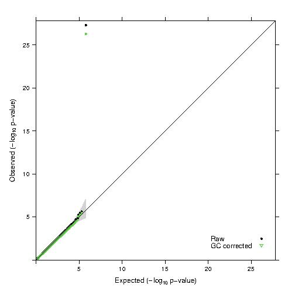
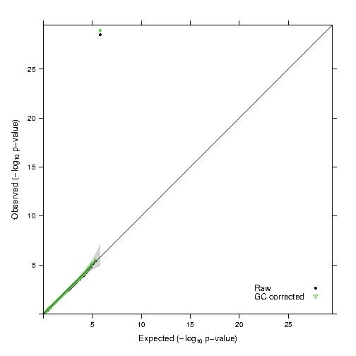
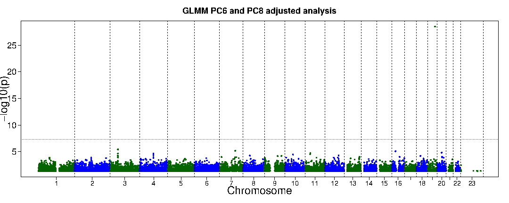

## Homework 3: Common Variant GWAS - Association Analysis & Mixed Models
### BS859 Applied Genetic Analysis
### Addison Yam
### February 11, 2026

We will use the TGEN Alzheimer data located in /projectnb/bs859/data/tgen/cleaned/ to do this assignment. For PC covariates, use the file use the file TGEN_pcs.txt in the same directory. In your submitted homework, include the commands you used to get your results, and the parts of the results that support your response. Use tables and/or plots to present results clearly and succinctly.

```bash
# load the necessary modules
module load R 
module load plink/1.90b6.27
#make an alias for the directory with the data
export DATADIR=/projectnb/bs859/data/tgen/cleaned
```

1. Use the file TGEN_pcs.txt to determine which PCs are associated with case status. (TGEN_pcs.txt is the output from smartpca with a column header added). **HINT: “--logistic no-snp” produces results for the specified covariates, with no SNPs in the model.**

a. Show the commands you used for the analysis.
```bash
> head $DATADIR/TGEN_pcs.txt
FID IID PC1 PC2 PC3 PC4 PC5 PC6 PC7 PC8 PC9 PC10
MAYO_10139 MAYO_10139 -0.0118 -0.0040 0.0100 -0.0080 0.0201 0.0615 -0.0219 -0.0301 0.0293 0.0737
MAYO_10198 MAYO_10198 -0.0083 -0.0074 0.0133 -0.0025 0.0624 -0.0283 -0.0572 -0.0150 0.0341 -0.0103
MAYO_102246 MAYO_102246 -0.0053 0.1093 -0.0200 0.0049 0.0073 0.0272 -0.0010 0.0474 -0.1290 0.0441
MAYO_10249 MAYO_10249 -0.0156 -0.0078 0.0181 0.0116 -0.0007 -0.0200 0.0069 0.0623 -0.0060 0.0203
MAYO_10278 MAYO_10278 -0.0127 0.0043 0.0139 -0.0173 0.0274 0.1298 0.0159 0.0068 0.0140 0.0518
MAYO_10304 MAYO_10304 -0.0049 -0.0004 0.0036 0.0040 0.0150 -0.0051 0.0108 0.0083 -0.0375 0.0445
MAYO_10316 MAYO_10316 -0.0113 -0.0052 0.0020 -0.0089 -0.0102 0.0184 0.0040 -0.0451 0.0274 0.0523
MAYO_10367 MAYO_10367 -0.0128 -0.0125 -0.0011 -0.0045 -0.0041 0.0003 -0.0079 -0.0297 -0.0026 -0.0026
MAYO_10403 MAYO_10403 -0.0118 -0.0051 -0.0075 -0.0123 0.0037 0.0092 -0.0105 0.0013 0.0180 0.0276

# Test to determine which PCs are associated with case status
# --bifle   input binary genotype files
# --covar   covariate file about PCs
# --logistic no snp     Logistic regression testing the covariates and no SNPs
> plink --bfile $DATADIR/TGEN_cleaned --covar $DATADIR/TGEN_pcs.txt --logistic no-snp --allow-no-sex --out PC_case_test
PLINK v1.90b6.27 64-bit (10 Dec 2022)          www.cog-genomics.org/plink/1.9/
(C) 2005-2022 Shaun Purcell, Christopher Chang   GNU General Public License v3
Logging to PC_case_test.log.
Options in effect:
  --allow-no-sex
  --bfile /projectnb/bs859/data/tgen/cleaned/TGEN_cleaned
  --covar /projectnb/bs859/data/tgen/cleaned/TGEN_pcs.txt
  --logistic no-snp
  --out PC_case_test

257325 MB RAM detected; reserving 128662 MB for main workspace.
308462 variants loaded from .bim file.
1237 people (0 males, 0 females, 1237 ambiguous) loaded from .fam.
Ambiguous sex IDs written to PC_case_test.nosex .
1237 phenotype values loaded from .fam.
Using 1 thread (no multithreaded calculations invoked).
--covar: 10 covariates loaded.
Before main variant filters, 1237 founders and 0 nonfounders present.
Calculating allele frequencies... done.
Total genotyping rate is 0.988302.
308462 variants and 1237 people pass filters and QC.
Among remaining phenotypes, 769 are cases and 468 are controls.
Writing logistic model association results to PC_case_test.assoc.logistic ...
done.

# View the contents of the association test
> cat PC_case_test.assoc.logistic
      TEST    NMISS         OR         STAT            P 
       PC1     1237     0.3603      -0.4574       0.6474
       PC2     1237      788.7        2.498      0.01249
       PC3     1237   0.003487       -2.023      0.04311
       PC4     1237      5.832        0.622        0.534
       PC5     1237     0.2724      -0.5759       0.5647
       PC6     1237   0.001533       -2.901     0.003718
       PC7     1237      125.1        2.226      0.02604
       PC8     1237    0.00382       -2.611     0.009026
       PC9     1237     0.2916      -0.5751       0.5652
      PC10     1237     0.1353      -0.9387       0.3479
```

b. Where is plink looking to find case status for your analysis?
- Answer: In the sixth column of the`TGEN_cleaned.fam` file is the Phenotype column where plink is looking for the case status this analysis. Values of 1 represent unaffected and 2 present affected. 

c. How many individuals are included in your analysis?
- Answer: There are 1237 individuals, which I got from the NMISS column in the `PC_case_test.assoc.logistic` file. 

d. Which PCs are associated with case status at p<0.01?
- Answer: PC6 and PC8 are associated with a case status at <0.01

2. Perform a GWAS of Alzheimer Disease case status using logistic regression, adjusting for the PCs associated with case status at p<0.01 that you found in question 1. *Use a plink command that hides the covariates so that your plink output has only the association results for the SNPs, and that gives the effect estimates as regression coefficients rather than odds ratios.*

a. Show your plink command
```bash
# Perform GWAS and adjusting for PCs (PC6, PC8) with a p-value of <0.01
# -- covar-name    Use PC6 and PC8 as covariates
# hide-covar         Only print the results for SNPs, not covariates
# --logistic beta   Gets the regression coefficients
# --ci 0.95           95% confidence internval and standard errors
> plink --bfile $DATADIR/TGEN_cleaned --covar $DATADIR/TGEN_pcs.txt --covar-name PC6, PC8 --logistic beta hide-covar --allow-no-sex --ci 0.95 --out GWAS_PC68
PLINK v1.90b6.27 64-bit (10 Dec 2022)          www.cog-genomics.org/plink/1.9/
(C) 2005-2022 Shaun Purcell, Christopher Chang   GNU General Public License v3
Logging to GWAS_PC68.log.
Options in effect:
  --allow-no-sex
  --bfile /projectnb/bs859/data/tgen/cleaned/TGEN_cleaned
  --ci 0.95
  --covar /projectnb/bs859/data/tgen/cleaned/TGEN_pcs.txt
  --covar-name PC6, PC8
  --logistic beta hide-covar
  --out GWAS_PC68

257325 MB RAM detected; reserving 128662 MB for main workspace.
308462 variants loaded from .bim file.
1237 people (0 males, 0 females, 1237 ambiguous) loaded from .fam.
Ambiguous sex IDs written to GWAS_PC68.nosex .
1237 phenotype values loaded from .fam.
Using 1 thread (no multithreaded calculations invoked).
--covar: 2 out of 10 covariates loaded.
Before main variant filters, 1237 founders and 0 nonfounders present.
Calculating allele frequencies... done.
Total genotyping rate is 0.988302.
308462 variants and 1237 people pass filters and QC.
Among remaining phenotypes, 769 are cases and 468 are controls.
Writing logistic model association results to GWAS_PC68.assoc.logistic ...
done.

> head -6 GWAS_PC68.assoc.logistic
 CHR         SNP         BP   A1       TEST    NMISS       BETA       SE      L95      U95         STAT            P 
   1   rs3094315     742429    C        ADD     1233     0.0525   0.1133  -0.1696   0.2746       0.4633       0.6431
   1   rs4040617     769185    G        ADD     1237    0.07299   0.1211  -0.1644   0.3104       0.6025       0.5468
   1   rs2980300     775852    T        ADD     1182   0.003232   0.1159  -0.2239   0.2304      0.02789       0.9778
   1   rs4075116     993492    G        ADD     1228    -0.0843  0.09289  -0.2664  0.09776      -0.9076       0.3641
   1  rs10907175    1120590    C        ADD     1227    0.01932   0.1511  -0.2769   0.3156       0.1279       0.8983
   1   rs6603781    1148494    A        ADD     1196    0.06635   0.1269  -0.1824   0.3151       0.5229        0.601
   1  rs11260562    1155173    A        ADD     1234    0.05847   0.1935  -0.3207   0.4376       0.3022       0.7625
   1   rs6685064    1201155    T        ADD     1229   -0.06814   0.1747  -0.4105   0.2742      -0.3901       0.6965
   1   rs3766180    1468016    G        ADD     1236    0.01147  0.09626  -0.1772   0.2001       0.1191       0.9052

# Gets a count of the SNPs with a p-value > 0.0001
> awk '$12 < 0.01 { count++ } END { print count+0 }' GWAS_PC68.assoc.logistic
33
```

b. Show the results for the first 5 SNPs in the output file.
```bash
> head -6 GWAS_PC68.assoc.logistic
 CHR         SNP         BP   A1       TEST    NMISS       BETA       SE      L95      U95         STAT            P 
   1   rs3094315     742429    C        ADD     1233     0.0525   0.1133  -0.1696   0.2746       0.4633       0.6431
   1   rs4040617     769185    G        ADD     1237    0.07299   0.1211  -0.1644   0.3104       0.6025       0.5468
   1   rs2980300     775852    T        ADD     1182   0.003232   0.1159  -0.2239   0.2304      0.02789       0.9778
   1   rs4075116     993492    G        ADD     1228    -0.0843  0.09289  -0.2664  0.09776      -0.9076       0.3641
   1  rs10907175    1120590    C        ADD     1227    0.01932   0.1511  -0.2769   0.3156       0.1279       0.8983
```
c. How many SNPs in this GWAS have p-value < 0.0001?
- Answer: There are 33 SNPs with a p-value less than 0.0001

d. Show the plink results for the most significant SNP. Show the 3 genotypes for the SNP, and how they are coded in the plink logistic regression. Compute the odds ratio. Which allele increases the risk of Alzheimer Disease?
- Answer: The most significant SNP is rs41377151. The genotypes for the rs41377151 SNP are AA, GA, GG and they're coded as 0, 1, 2. The β for this SNP is 1.174, using this value I can calculate the odds ratio. OR = e<sup>1.174</sup> = 3.2349. A positive β and OR > 1 tells us that that allele that increases the risk of AD is the G allele.
```bash
# Skip the header, sort the p-values in the 12th column by least to greatest, show the SNP with the most significant p-value
> awk 'NR>1' GWAS_PC68.assoc.logistic | sort -k12,12g | head -1
  19  rs41377151   50114786    G        ADD     1237      1.174   0.1069   0.9643    1.384        10.98    4.869e-28

# Shows the PLINK results for the most significant SNP
> awk 'NR==1 || $2=="rs41377151" {print $0}' GWAS_PC68.assoc.logistic
 CHR         SNP         BP   A1       TEST    NMISS       BETA       SE      L95      U95         STAT            P 
  19  rs41377151   50114786    G        ADD     1237      1.174   0.1069   0.9643    1.384        10.98    4.869e-28

# Find the SNP in the .bim 
grep "rs41377151" $DATADIR/TGEN_cleaned.bim
19	rs41377151	0	50114786	G	A
```

3. Create a GRM from the TGEN data so that you can perform a GWAS using a logistic mixed model. Use only chromosomes 1-22 (exclude X). Don’t forget to prune before you make the GRM! Use pruning parameters: --indep-pairwise 10000kb 1 0.15.
```bash
# For chromosomes 1-22, peform pruning
>plink --bfile $DATADIR/TGEN_cleaned --chr 1-22  --allow-no-sex --indep-pairwise 10000kb 1 0.15 --out Q3_pruned
PLINK v1.90b6.27 64-bit (10 Dec 2022)          www.cog-genomics.org/plink/1.9/
(C) 2005-2022 Shaun Purcell, Christopher Chang   GNU General Public License v3
Logging to Q3_pruned.log.
Options in effect:
  --allow-no-sex
  --bfile /projectnb/bs859/data/tgen/cleaned/TGEN_cleaned
  --chr 1-22
  --indep-pairwise 10000kb 1 0.15
  --out Q3_pruned

257325 MB RAM detected; reserving 128662 MB for main workspace.
308268 out of 308462 variants loaded from .bim file.
1237 people (0 males, 0 females, 1237 ambiguous) loaded from .fam.
Ambiguous sex IDs written to Q3_pruned.nosex .
1237 phenotype values loaded from .fam.
Using 1 thread (no multithreaded calculations invoked).
Before main variant filters, 1237 founders and 0 nonfounders present.
Calculating allele frequencies... done.
Total genotyping rate is 0.988305.
308268 variants and 1237 people pass filters and QC.
Among remaining phenotypes, 769 are cases and 468 are controls.
Pruned 19496 variants from chromosome 1, leaving 5264.
Pruned 20739 variants from chromosome 2, leaving 5030.
Pruned 16930 variants from chromosome 3, leaving 4277.
Pruned 15633 variants from chromosome 4, leaving 4004.
Pruned 16236 variants from chromosome 5, leaving 4176.
Pruned 16272 variants from chromosome 6, leaving 3943.
Pruned 12900 variants from chromosome 7, leaving 3570.
Pruned 14193 variants from chromosome 8, leaving 3290.
Pruned 11560 variants from chromosome 9, leaving 3073.
Pruned 14621 variants from chromosome 10, leaving 3481.
Pruned 13263 variants from chromosome 11, leaving 3229.
Pruned 12190 variants from chromosome 12, leaving 3372.
Pruned 9337 variants from chromosome 13, leaving 2527.
Pruned 7590 variants from chromosome 14, leaving 2203.
Pruned 6796 variants from chromosome 15, leaving 2124.
Pruned 7524 variants from chromosome 16, leaving 2254.
Pruned 5185 variants from chromosome 17, leaving 1995.
Pruned 7038 variants from chromosome 18, leaving 2158.
Pruned 2778 variants from chromosome 19, leaving 1346.
Pruned 6269 variants from chromosome 20, leaving 1861.
Pruned 3421 variants from chromosome 21, leaving 1041.
Pruned 2935 variants from chromosome 22, leaving 1144.
Pruning complete.  242906 of 308268 variants removed.
Marker lists written to Q3_pruned.prune.in and Q3_pruned.prune.out .

# With the pruned data, create GRM 
# --extract Q3_pruned.prine.in use the pruned-in variants
# --make-rel square makes the genetic relationship matrix
>plink --bfile $DATADIR/TGEN_cleaned --chr 1-22  --allow-no-sex --extract Q3_pruned.prune.in --make-rel square --out Q3_GRM
PLINK v1.90b6.27 64-bit (10 Dec 2022)          www.cog-genomics.org/plink/1.9/
(C) 2005-2022 Shaun Purcell, Christopher Chang   GNU General Public License v3
Logging to Q3_GRM.log.
Options in effect:
  --allow-no-sex
  --bfile /projectnb/bs859/data/tgen/cleaned/TGEN_cleaned
  --chr 1-22
  --extract Q3_pruned.prune.in
  --make-rel square
  --out Q3_GRM

257325 MB RAM detected; reserving 128662 MB for main workspace.
308268 out of 308462 variants loaded from .bim file.
1237 people (0 males, 0 females, 1237 ambiguous) loaded from .fam.
Ambiguous sex IDs written to Q3_GRM.nosex .
1237 phenotype values loaded from .fam.
--extract: 65362 variants remaining.
Using up to 27 threads (change this with --threads).
Before main variant filters, 1237 founders and 0 nonfounders present.
Calculating allele frequencies... done.
Total genotyping rate is 0.987189.
65362 variants and 1237 people pass filters and QC.
Among remaining phenotypes, 769 are cases and 468 are controls.
Relationship matrix calculation complete.
Relationship matrix written to Q3_GRM.rel , and IDs written to Q3_GRM.rel.id .
```

a. Show your code.

b. How many SNPs were left after pruning and removing the chromosome X variants?
- Answer: 65,362 SNPs

```bash
# Count SNPs left after pruning and removing chromosome X variants
> wc -l Q3_pruned.prune.in
65362 Q3_pruned.prune.in
```
c. Provide the first 10 lines of the id grm id file (the file with the ids for the grm)
```bash
# See the first 10 lines
> head Q3_GRM.rel.id
MAYO_10139	MAYO_10139
MAYO_10198	MAYO_10198
MAYO_102246	MAYO_102246
MAYO_10249	MAYO_10249
MAYO_10278	MAYO_10278
MAYO_10304	MAYO_10304
MAYO_10316	MAYO_10316
MAYO_10367	MAYO_10367
MAYO_10403	MAYO_10403
MAYO_10529	MAYO_10529
```

d. What is the maximum relationship coefficient for MAYO_10139, other than with itself?
- Answer: The maximum relationship coefficient for MAYO_10139 is 0.0197864.
```bash
# gets the first column values, sorts them and shows the largest value, so the maximum relationship coefficient is the second largest value because the largest value is itself.
cut -f1 Q3_GRM.rel | sort -g | tail
0.0161387
0.0166377
0.0175669
0.0178712
0.0182096
0.0192125
0.0193096
0.0196175
0.0197864
0.99507
```

4. Perform a GWAS using a logistic mixed model score test, with no covariates. Do a second GWAS using this model and the same PCs you included in the Q2 analysis. You can edit the GMMAT.R program we used in class to do this.
```bash
> cp /projectnb/bs859/materials/class03/GMMAT.R .
> Rscript --vanilla GMMAT.R
> head TGEN.glmm.score.nocov
CHR     SNP     cM      POS     A1      A2      N       AF      SCORE   VAR     PVAL
1       rs3094315       0       742429  C       T       1233    0.818329        -2.23469   7
5.7497  0.797364
1       rs4040617       0       769185  G       A       1237    0.858933        -2.88539   6
6.7969  0.724056
1       rs2980300       0       775852  T       C       1182    0.830372        0.594092   7
1.8399  0.94412
1       rs4075116       0       993492  G       A       1228    0.702362        7.84267 110.
061     0.454725
1       rs10907175      0       1120590 C       A       1227    0.914833        -0.862847  4
2.0955  0.894202
1       rs6603781       0       1148494 A       G       1196    0.863294        -4.0428 59.8
35      0.601223
1       rs11260562      0       1155173 A       G       1234    0.949352        -1.24956   2
5.8216  0.805757
1       rs6685064       0       1201155 T       C       1229    0.939382        1.20802 31.1
497     0.828641
1       rs3766180       0       1468016 G       A       1236    0.71966 -1.51038        103.
716     0.8821

> head TGEN.glmm.score.PC6PC8cov
CHR     SNP     cM      POS     A1      A2      N       AF      SCORE   VAR     PVAL
1       rs3094315       0       742429  C       T       1233    0.818329        -3.74476   7
4.3389  0.664051
1       rs4040617       0       769185  G       A       1237    0.858933        -4.68066   6
5.446   0.56287
1       rs2980300       0       775852  T       C       1182    0.830372        -0.233096  7
0.781   0.977896
1       rs4075116       0       993492  G       A       1228    0.702362        9.26089 109.
07      0.375215
1       rs10907175      0       1120590 C       A       1227    0.914833        -0.820516  4
1.7639  0.898967
1       rs6603781       0       1148494 A       G       1196    0.863294        -4.03733   5
9.1777  0.599705
1       rs11260562      0       1155173 A       G       1234    0.949352        -1.41571   2
5.6061  0.779654
1       rs6685064       0       1201155 T       C       1229    0.939382        1.96515 30.5
984     0.722395
1       rs3766180       0       1468016 G       A       1236    0.71966 -1.24831        102.
522     0.90188
```
This what the `GMMAT.R` script contains:
```r
library(GMMAT)

# Read in phenotype data from the .fam file
pheno <- read.table("/projectnb/bs859/data/tgen/cleaned/TGEN_cleaned.fam", header=F)
colnames(pheno) <- c("FID", "IID", "fa", "mo", "sex", "case")

# Read in the PC covariate data
pcs <- read.table("/projectnb/bs859/data/tgen/cleaned/TGEN_pcs.txt", header=T, as.is=T)

# Merge the PC data with the fam file (pheno) data
pheno1 <- merge(pheno, pcs, by=c("FID", "IID"), all.x=TRUE)

## Read in the GRM (genetic relationship matrix)
grm <- as.matrix(read.table("Q3_GRM.rel", header=F))

# Read in the grm id file:
grm.ids <- read.table("Q3_GRM.rel.id", header=F)

# Apply the IDs to the two dimensions of the grm. This is how
# GMMAT will know which row and column belongs to each ID
dimnames(grm)[[1]] <- dimnames(grm)[[2]] <- grm.ids[,2]

## These two commands create the Null models (no SNPs) for the score tests.
## model1.0 has no covariates
## model2.0 has covariates PC6 and PC8 (from question 1, p<0.01)

## Note that the outcome here is "case-1" -- this is because case status in plink 
## is coded 2=affected and 1=unaffected.
## GMMAT expects case status for a binary trait to be coded 1=affected and 0=unaffected.
## Using "case-1" achieves the recoding.

# First null model has only an intercept, no covariates:
model1.0 <- glmmkin(case-1~1, data=pheno1, id="IID", kins=grm, family=binomial("logit"))

# Second null model has PC6 and PC8 covariates (significant at p<0.01 from question 1):
model2.0 <- glmmkin(case-1~PC6+PC8, data=pheno1, id="IID", kins=grm, family=binomial("logit"))

## These two commands perform the score test for model 1 and model 2 for all of the SNPs
## in the plink fileset specified by the path in geno.file:

geno.file <- "/projectnb/bs859/data/tgen/cleaned/TGEN_cleaned"
glmm.score(model1.0, infile=geno.file, outfile="TGEN.glmm.score.nocov")
glmm.score(model2.0, infile=geno.file, outfile="TGEN.glmm.score.PC6PC8cov")
```
a. How many SNPs have p-value < 0.0001 in each of these two GWAS?
- Answer: The GWAS with no covariate has 28 SNPs with a p-value <0.0001.  And the GWAS with PC6 and PC8 has 22 SNPs with a p-value of <0.0001. 
```bash
> awk 'NR>1 && $11 < 0.0001 { count++ } END { print count+0 }' TGEN.glmm.score.nocov
28

> awk 'NR>1 && $11 < 0.0001 { count++ } END { print count+0 }' TGEN.glmm.score.PC6PC8cov
22
```
b. Compare the results of the two GLMMs and the logistic model from question 2 for the SNP that is most significantly associated with AD case status in the question 2d analysis. Which analysis yields the most significant association? Can you compare the effect estimates? Which allele increases risk in these models?
- Answer: The analysis that yielded the most significant association was the GLMM with no covariates as it has a p-value of 4.869e-28. The GLMM with PC6 and PC8 has a p-value of 6.17542e-30. And the logistic regression model from Q2 has a p-value of 3.07513e-29. I can't the compare the effect estimates becauase the GLMMs use 'SCORE' which is used for hypothesis testing and the logistic model uses 'BETA' which is used more to describe binary outcomes. The allele that increases AD risk in these models is the G allele. From the logistic regression model because β is positive (β = 1.174).
```bash
> awk 'NR==1 || $2=="rs41377151" {print $0}' GWAS_PC68.assoc.logistic
 CHR         SNP         BP   A1       TEST    NMISS       BETA       SE      L95      U95  
       STAT            P 
  19  rs41377151   50114786    G        ADD     1237      1.174   0.1069   0.9643    1.384  
      10.98    4.869e-28
> awk 'NR==1 || $2=="rs41377151" {print $0}' TGEN.glmm.score.nocov
CHR     SNP     cM      POS     A1      A2      N       AF      SCORE   VAR     PVAL
19      rs41377151      0       50114786        G       A       1237    0.691997        -126
.932    124.717 6.17542e-30
> awk 'NR==1 || $2=="rs41377151" {print $0}' TGEN.glmm.score.PC6PC8cov
CHR     SNP     cM      POS     A1      A2      N       AF      SCORE   VAR     PVAL
19      rs41377151      0       50114786        G       A       1237    0.691997        -124
.473    122.965 3.07513e-29
```

5. Produce QQ plots for the three GWAS analyses, and show them here. Looking at the Genomic Control Lambda and the overall qq plot, which analysis model do you think is best? Explain your choice.
- Answer: For the logistic model with PC6 and PC8, λ = 1.04. For the GLMM no PC, λ = 0.977. For the GLMM with PC6 and PC8, λ = 0.984. In the QQ plots, all three follow the diagonal line pretty well and have slight deviations at the tail. The analysis model that is the best is the GLMM with PC6 and PC8 because it has a λ close to 1 with out going over 1. A λ > 1 means there is inflation in the set of test statistics.

Here is the QQ plot for the logistic model with PC6 and PC8:


Here is the QQ plot for the GLMM model with no covariates:


Here is the QQ plot for the GLMM model with PC6 and PC8:

```bash
# Copy the QQ plot script
> cp /projectnb/bs859/materials/class03/qq_umich_gc.R .

#Replace the "PVAL" column header with "P", and the "POS" with "BP" to make it match the P-value and base pair column headers from PLINK output
> awk 'NR==1{$4="BP";$11="P"};{print $0}' TGEN.glmm.score.nocov > TGEN.glmm.score.nocov.formatted
> awk 'NR==1{$4="BP";$11="P"};{print $0}' TGEN.glmm.score.PC6PC8cov > TGEN.glmm.score.PC6PC8cov.formatted

# Create QQ plots
> Rscript --vanilla qq_umich_gc.R GWAS_PC68.assoc.logistic "Logistic_PC6PC8" ADD
[1] "GWAS_PC68.assoc.logistic" "Logistic_PC6PC8"         
[3] "ADD"                     
Loading required package: grid
null device 
          1 
[1] "lambda=" "1.04" 
> Rscript --vanilla qq_umich_gc.R TGEN.glmm.score.nocov.formatted "GLMM_nocov"
[1] "TGEN.glmm.score.nocov.formatted" "GLMM_nocov"                     
Loading required package: grid
null device 
          1 
[1] "lambda=" "0.977"  
> Rscript --vanilla qq_umich_gc.R TGEN.glmm.score.PC6PC8cov.formatted "GLMM_PC6PC8"
ormatted "GLMM_PC6PC8"
[1] "TGEN.glmm.score.PC6PC8cov.formatted" "GLMM_PC6PC8"                        
Loading required package: grid
null device 
          1 
[1] "lambda=" "0.984" 
```
6. Produce a Manhattan plot for the GWAS that you chose in 5. Based on this plot, are there any regions of the genome OTHER than chromosome 19, that may be of interest? Why or why not?
- Answer: After producing the Manhattan plot for the GLMM with PC6 and PC8 GWAS, there don't seem to be any obvious peaks than what we see at chromosome 19. This may be because no other SNP has a p-value as significant as the SNP in chromosome 19. 



```bash
# Copy the manhattan plot R script
> cp /projectnb/bs859/materials/class03/gwaplot.R .

# Run the R script with the GLMM with PC6 and PC8
> Rscript --vanilla gwaplot.R TGEN.glmm.score.PC6PC8cov.formatted "GLMM PC6 and PC8 adjusted analysis" GLMM_PC6PC8_manhattan
```