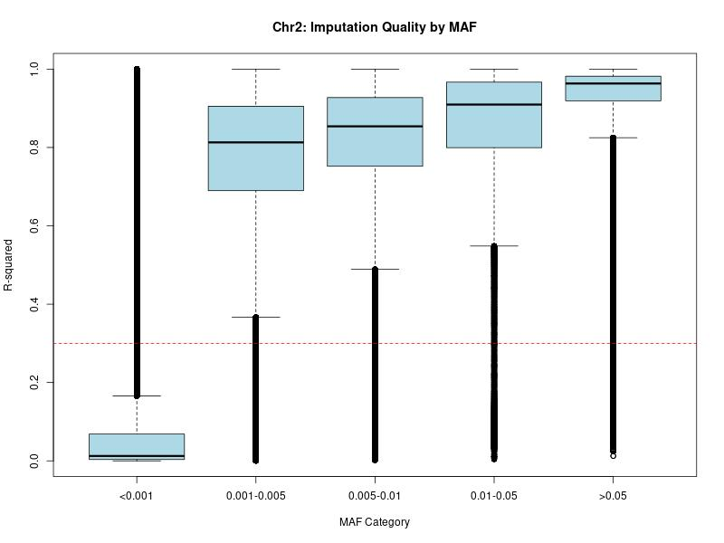
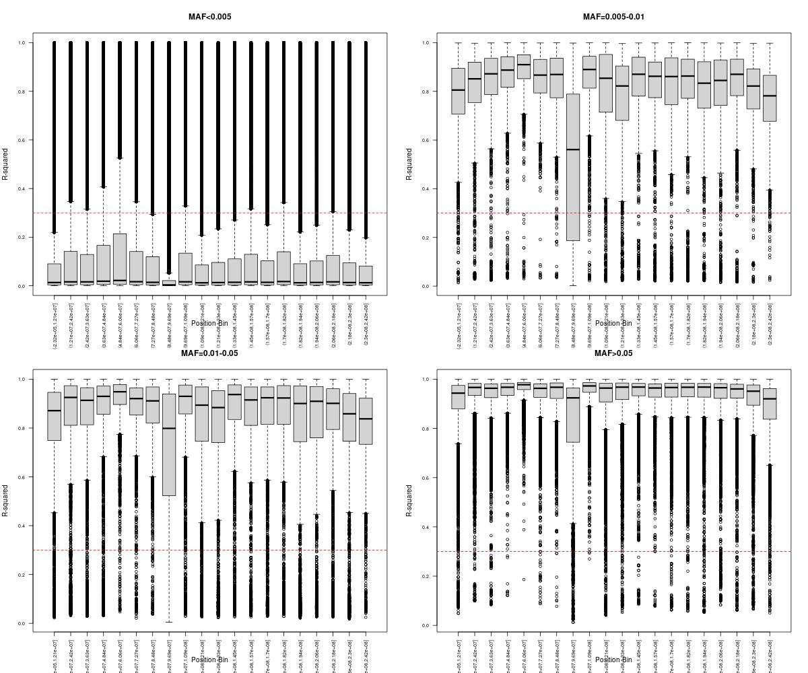
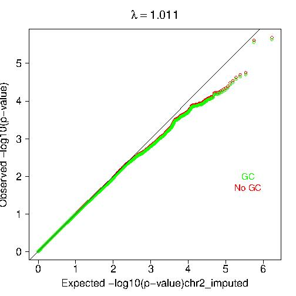
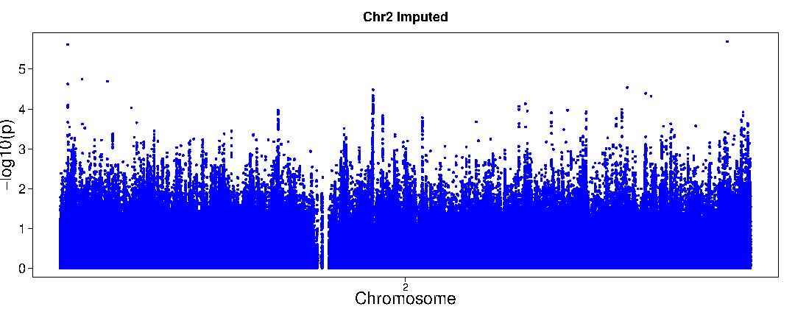

## Homework 4: Genotype Imputation
### BS859 Applied Genetic Analysis
### Addison Yam
### February 18, 2026

Use the chromosome 2 TOPMed-reference imputed genotype data and genotyped data in /projectnb/bs859/data/tgen/2023/chr2 to complete this assignment.

Imputed genotypes and information files (using the TOPMed reference panel, build 38 locations):
- chr2.dose.vcf.gz
- chr2.info.gz

The Chromosome 2 genotyped data file (using genome build 37 locations) uploaded to the imputation server are in the same directory:
- chr2.vc

The PC covariate file and fam file with case/control status are:
- /projectnb/bs859/data/tgen/cleaned/TGEN_pcs.txt
- /projectnb/bs859/data/tgen/cleaned/TGEN_cleaned.fam

(the same files that we used in the in-class analysis.)

Chromosome 2 has robust, replicated association at the BIN1 gene in published analyses. The end goal today is to 1) assess the overall imputation quality and 2) determine whether there is evidence for association at or near this locus in the TGEN data set. The top SNP in the IGAP GWAS is rs6733839, which has location
2:127135234 (GRCh38)
2:127892810 (GRCh37)
(see class notes for link to paper).
```bash
# load the necessary modules
module load R 
module load plink2/alpha3.7
#make an alias for the directory with the data
export DATADIR=/projectnb/bs859/data/tgen/2023/chr2
```

1. The imputation report and QC report for chromosome 2 from the imputation server are in the files chr2_imputationreport.pdf and chr2_imputationQCreport.pdf. Looking at the plot in the QC report, explain what is being plotted. Do you have any concerns, or any suggestions that might improve the imputation?
- Answer: Looking at the plot in the QC plot, allele frequencies of the reference panel is on the y-axis and allele frequencies of the uploaded samples is on the x-axis, and SNPs are being plotted in this density plot. It says there are 461 total mismatches where chi square is greater than 300. This is a lot of mismatches and when we compare the frequency between the reference and uploaded samples, the difference between the frequencies is big. The first mismatched frequency displayed sees 0.9548:0.0452 vs 0.7788:0.2212. Some ways to improve the imputation are remove low quality genotyped SNPs with low call rates, make sure that the TGEN sample matches to the respective reference ancestry, check these 461 mismatches frequencies statistics, and potentially remove these 461 SNPs.

2) How many imputed SNPs are in the chromosome 2 dosage vcf?
- Answer: There are 25543691 imputed SNPs in the chromosome 2 dosage vcf.
```bash
> zcat $DATADIR/chr2.info.gz | wc -l
25543692
```
3) a) How many imputed SNPs have both R2>=0.3 and MAF>=0.005?
- Answer: There are 853292 SNPs that have both R2>=0.3 and MAF>=0.005.
```bash
# Check the first two lines of the file
> zcat $DATADIR/chr2.info.gz | head -2
SNP     REF(0)  ALT(1)  ALT_Frq MAF     AvgCall Rsq     Genotyped       LooRsq  EmpR    EmpRsq  Dose0 Dose1
chr2:10257:C:CCCTAAA    C       CCCTAAA 0.00020 0.00020 0.99980 0.00520 Imputed -       -       -    - -
# Counts the amount of SNPs that have a R2>0.3 and an MAF>=0.005
> zcat $DATADIR/chr2.info.gz | awk 'NR>1 && $7>=0.3 && $5>=0.005 {count++} END {print count+0}'
853292
# Gets the amount of SNPs that were used to impute these variants
> grep -v "^#" $DATADIR/chr2.vcf | wc -l
24161
```
b) How does this number compare to the number of SNPs that were used to impute these variants.
- Answer: This number of 853292 SNPs that have a R2>0.3 and an MAF>=0.005 is 3531.69% larger than the number of 24161 SNPs used to impute these variants. Or the opposite the number of SNPs used to impute these variants makes up 2.831% of the number of SNPs that have a R2>0.3 and an MAF>=0.005.

c) How does this number compare to the total number of variants imputed?
Answer: This number (853292 SNPs) makes up 3.3405% of the total number of variants imputed (25543692 SNPs).

4) Provide a crosstabulation of the imputed variants with MAF>0, broken down into the same MAF and R2 bins as we did for chr19 in class. Which bin has the largest number of SNPs?
- Answer: The bin with the largest number of SNPs is MAF>0.05.
```bash
# Make and write the R script
> vi MAFinfo_chr2.R

# R script contents
> cat MAFinfo_chr2.R
# Read chr2 info file
info <- read.table(gzfile("/projectnb/bs859/data/tgen/2023/chr2/chr2.info.gz"), 
                   header=TRUE, as.is=TRUE)

# Extract position from SNP column (format: chr2:position:ref:alt)
info$POS <- as.numeric(sapply(strsplit(info$SNP, ":"), "[", 2))

# Remove monomorphic variants
info <- info[info$MAF > 0, ]

# Create MAF categories - 5 bins initially
info$mafcat <- cut(info$MAF, 
                   breaks=c(0, 0.001, 0.005, 0.01, 0.05, 0.5),
                   labels=c("MAF<0.001", "MAF=0.001-0.005", "MAF=0.005-0.01", "MAF=0.01-0.05", "MAF>0.05"))

# EXCLUDE the lowest MAF bin (MAF<0.001) for position plots
info <- info[info$MAF >= 0.001, ]

# Create position bins
info$posbin <- cut(info$POS, breaks=20)

# Create 4-panel plot (2x2 layout) - one panel per MAF category (excluding lowest)
jpeg("chr2_Rsq_by_position_by_MAF.jpeg", width=1200, height=1000)
par(mfrow=c(2, 2))

# Get the 4 MAF levels (excluding the first/lowest one)
maf_levels <- levels(info$mafcat)[levels(info$mafcat) %in% unique(info$mafcat)]

# Plot for each MAF category
for(maf in maf_levels) {
  subset_data <- info[info$mafcat == maf, ]
  
  boxplot(Rsq ~ posbin, data=subset_data,
          main=maf,
          xlab="Position Bin",
          ylab="R-squared",
          col="lightgrey",
          las=2,
          cex.axis=0.7)
  abline(h=0.3, col="red", lty=2)
}

par(mfrow=c(1, 1))
dev.off()

# Summary statistics by MAF category
cat("\nSummary by MAF category:\n")
aggregate(Rsq ~ mafcat, data=info, summary)

# Run the R script
> Rscript MAFinfo_chr2.R
null device 
          1 
Summary by MAF category:
           mafcat  Rsq.Min. Rsq.1st Qu. Rsq.Median  Rsq.Mean Rsq.3rd Qu.
1       MAF<0.001 0.0003200   0.5841800  0.7954950 0.6952940   0.8306250
2 MAF=0.001-0.005 0.0003200   0.6896900  0.8129100 0.7687674   0.9051900
3  MAF=0.005-0.01 0.0014300   0.7520350  0.8539400 0.8061618   0.9273800
4   MAF=0.01-0.05 0.0042800   0.7994300  0.9094600 0.8275396   0.9667500
5        MAF>0.05 0.0125500   0.9190800  0.9633000 0.9295836   0.9818900
   Rsq.Max.
1 0.8988800
2 1.0000000
3 0.9998200
4 1.0000000
5 1.0000000
```

5) a) Provide Rsq box plots (or violin plots if you are feeling fancy) for all of the imputed variants, broken down into the same MAF bins as we did for chr19 in class.
- Answer: Here are the Rsq box plots for the imputed variants with the specific MAF bins.



```bash
# Make and create the R script
> vi Rsq_MAF_plots_chr2.R

# R script contents
> cat Rsq_MAF_plots_chr2.R
# Read chr2 info file
info <- read.table(gzfile("/projectnb/bs859/data/tgen/2023/chr2/chr2.info.gz"), 
                   header=TRUE, as.is=TRUE)

# Remove monomorphic variants
info <- info[info$MAF > 0, ]

# Create MAF categories - 5 bins
info$mafcat <- cut(info$MAF, 
                   breaks=c(0, 0.001, 0.005, 0.01, 0.05, 0.5),
                   labels=c("<0.001", "0.001-0.005", "0.005-0.01", "0.01-0.05", ">0.05"))

# Boxplot
jpeg("chr2_Rsq_by_MAF.jpeg", width=800, height=600)
boxplot(Rsq ~ mafcat, data=info,
        main="Chr2: Imputation Quality by MAF",
        xlab="MAF Category",
        ylab="R-squared",
        col="lightblue")
abline(h=0.3, col="red", lty=2)
dev.off()

# Summary statistics
aggregate(Rsq ~ mafcat, data=info, summary)

# Run the R script
> Rscript Rsq_MAF_plots_chr2.R
null device 
          1 
       mafcat  Rsq.Min. Rsq.1st Qu. Rsq.Median  Rsq.Mean Rsq.3rd Qu.  Rsq.Max.
1      <0.001 0.0000000   0.0034700  0.0125000 0.1404701   0.0684100 1.0000000
2 0.001-0.005 0.0003200   0.6896900  0.8129100 0.7687674   0.9051900 1.0000000
3  0.005-0.01 0.0014300   0.7520350  0.8539400 0.8061618   0.9273800 0.9998200
4   0.01-0.05 0.0042800   0.7994300  0.9094600 0.8275396   0.9667500 1.0000000
5       >0.05 0.0125500   0.9190800  0.9633000 0.9295836   0.9818900 1.0000000
```

b) Explain the plot, including why the distribution of R2 is different by MAF bin.
- Answer: The plot shows R2 vs MAF bins where there seems to a direct relationship between the R2 and MAF bin. If we exclude the bin [<0.005], the order of the distribution of R2 from lowest to highest follows the increasing MAF bin size The R2 is lowest for bins [<0.005] because these are rare variants which aren't represented well in the reference panel. The R2 that is not the lowest or highest, it's in middle becuse there's more representation of these SNPs in the reference panel, so its distribution is more narrow than the previous. And the R2 is highest for bin [>0.05] because the variants are the most common here and so it has the most narrow distribution. Basicaly the more common the variants are, the more likely they'll be imputed more accurately.

c) How does this plot compare to the same type of plot for the CHR19 imputed data we looked at in class?
- When we compare this chr2 plot to the chr19 plot from class, we see similiarites in terms that both see direct relationships between the R2 and MAF bins. One major difference is that the distributions are more narrow for chr2 than seen in chr19. Also, the distributions are higher for chr2 than chr19. 

6) a) Plot the R2 boxplots vs BP location for chr2 as we did for chr 19 in class.
- Answer: Here is what the R2 by BP location boxplots for chr2.


```bash
# Make and write the R script
> vi Rsq_BP_plots_chr2.R

# R script contents
> cat Rsq_BP_plots_chr2.R
# Read chr2 info file
info <- read.table(gzfile("/projectnb/bs859/data/tgen/2023/chr2/chr2.info.gz"), 
                   header=TRUE, as.is=TRUE)

# Extract position from SNP column (format: chr2:position:ref:alt)
info$POS <- as.numeric(sapply(strsplit(info$SNP, ":"), "[", 2))

# Remove monomorphic variants
info <- info[info$MAF > 0, ]

# Create MAF categories - 5 bins
info$mafcat <- cut(info$MAF, 
                   breaks=c(0, 0.001, 0.005, 0.01, 0.05, 0.5),
                   labels=c("MAF<0.001", "MAF=0.001-0.005", "MAF=0.005-0.01", "MAF=0.01-0.05", "MAF>0.05"))

# EXCLUDE the lowest MAF bin (MAF<0.001) for position plots
info_subset <- info[info$MAF >= 0.001, ]

# Drop unused factor level
info_subset$mafcat <- droplevels(info_subset$mafcat)

# Create position bins
info_subset$posbin <- cut(info_subset$POS, breaks=20)

# Create 4-panel plot (2x2 layout) - one panel per MAF category (excluding lowest)
jpeg("chr2_Rsq_by_position_by_MAF.jpeg", width=1200, height=1000)
par(mfrow=c(2, 2))

# Plot for each of the 4 remaining MAF categories
for(maf in levels(info_subset$mafcat)) {
  subset_data <- info_subset[info_subset$mafcat == maf, ]
  
  boxplot(Rsq ~ posbin, data=subset_data,
          main=maf,
          xlab="Position Bin",
          ylab="R-squared",
          col="lightgrey",
          las=2,
          cex.axis=0.7)
  abline(h=0.3, col="red", lty=2)
}

par(mfrow=c(1, 1))
dev.off()

# Summary statistics by MAF category
cat("\nSummary by MAF category (excluding MAF<0.001):\n")
aggregate(Rsq ~ mafcat, data=info_subset, summary)

# Run the R script
> Rscript Rsq_BP_plots_chr2.R
null device 
          1 
Summary by MAF category:
           mafcat  Rsq.Min. Rsq.1st Qu. Rsq.Median  Rsq.Mean Rsq.3rd Qu.
1       MAF<0.001 0.0003200   0.5841800  0.7954950 0.6952940   0.8306250
2 MAF=0.001-0.005 0.0003200   0.6896900  0.8129100 0.7687674   0.9051900
3  MAF=0.005-0.01 0.0014300   0.7520350  0.8539400 0.8061618   0.9273800
4   MAF=0.01-0.05 0.0042800   0.7994300  0.9094600 0.8275396   0.9667500
5        MAF>0.05 0.0125500   0.9190800  0.9633000 0.9295836   0.9818900
   Rsq.Max.
1 0.8988800
2 1.0000000
3 0.9998200
4 1.0000000
5 1.0000000
```

b) How do these compare to the plots from chr 19?
- Answer: When comparing the plots between chr2 and chr19, the spread of these distributions across the BF follows a similar trend in all four MAF bins for chr19 that form a 'n' but for chr2, none of the MAF bins follow a similar spread of dstribtutions across the BF. For chr19, there is one BF that has an extremely large distribution across the R2 in the MAF bin [0.01-0.1]. While for chr2, there is one BF that has an large distribution across the R2 in MAF bins [0.005-0.01], [0.01-0.05], and [>0.05]. But the distribution for that one BF in chr19 is a lot larger than the dstribtion for that one BF in chr2. One difference between the two is that there are considerate gaps in BP for chr19 that isn't seen in chr2. Something else, chr2 overall has pretty consistent high R2 in MAF bins [0.005-0.01], [0.01-0.05], and [>0.05] while there isn't one MAF bin in chr19 that has consistent high R2.

c) Based on this, do you think that the chromosome 2 imputation is overall better or worse than the chromosome 19 imputation? Explain your answer.
- Answer: Chromosome 2's imputation is overall better than chromosome 19's imputation because three out of four MAF bins [0.005-0.01], [0.01-0.05], and [>0.05] in chr2 have consistent high R2 across the BP. While for chr19, none of the MAF bins have consistent R2 distributions. Also, there are BP gaps in chr19 which is not ideal. 

7) Perform an association analysis of the imputed chromosome 2 variants with MAF>=0.005 and imputation R2>=0.3 with Alzheimer disease in the TGEN data. Use the same PCs we used in class for the chromosome 19 analyses as covariates.
```bash
# Convert the vcf file to plink2 "pgen" format because it is faster 
# Filters imputed variants that have (MAF)<0.005 and R2<0.3 
# Specified the phenotype is in column 6
> plink2 --double-id \
  --exclude-if-info "MAF<0.005" \
  --extract-if-info "R2>=0.3" \
  --vcf $DATADIR/chr2.dose.vcf.gz dosage=DS \
  --pheno /projectnb/bs859/data/tgen/cleaned/TGEN_cleaned.fam \
  --pheno-col-nums 6 \
  --make-pgen \
  --out chr2_imputed_filtered

PLINK v2.00a3.7LM 64-bit Intel (24 Oct 2022)   www.cog-genomics.org/plink/2.0/
(C) 2005-2022 Shaun Purcell, Christopher Chang   GNU General Public License v3
Logging to chr2_imputed_filtered.log.
Options in effect:
  --double-id
  --exclude-if-info MAF<0.005
  --extract-if-info R2>=0.3
  --make-pgen
  --out chr2_imputed_filtered
  --pheno /projectnb/bs859/data/tgen/cleaned/TGEN_cleaned.fam
  --pheno-col-nums 6
  --vcf /projectnb/bs859/data/tgen/2023/chr2/chr2.dose.vcf.gz dosage=DS
Start time: Tue Feb 17 22:54:26 2026
256039 MiB RAM detected; reserving 128019 MiB for main workspace.
Allocated 17087 MiB successfully, after larger attempt(s) failed.
Using up to 32 threads (change this with --threads).
--vcf: 25543692 variants scanned.
--vcf: chr2_imputed_filtered-temporary.pgen +
chr2_imputed_filtered-temporary.pvar.zst + chr2_imputed_filtered-temporary.psam
written.
1228 samples (0 females, 0 males, 1228 ambiguous; 1228 founders) loaded from
chr2_imputed_filtered-temporary.psam.
853292 out of 25543692 variants loaded from
chr2_imputed_filtered-temporary.pvar.zst.
1 binary phenotype loaded (767 cases, 460 controls).
853292 variants remaining after main filters.
Writing chr2_imputed_filtered.psam ... done.
Writing chr2_imputed_filtered.pvar ... done.
Writing chr2_imputed_filtered.pgen ... done.
End time: Tue Feb 17 23:00:15 2026

# Run logistic regression with PC6 and PC8 as covariates
> plink2 --pfile chr2_imputed_filtered \
  --covar /projectnb/bs859/data/tgen/cleaned/TGEN_pcs.txt \
  --covar-name PC6,PC8 \
  --logistic hide-covar \
  --out chr2_assoc

PLINK v2.00a3.7LM 64-bit Intel (24 Oct 2022)   www.cog-genomics.org/plink/2.0/
(C) 2005-2022 Shaun Purcell, Christopher Chang   GNU General Public License v3
Logging to chr2_assoc.log.
Options in effect:
  --covar /projectnb/bs859/data/tgen/cleaned/TGEN_pcs.txt
  --covar-name PC6,PC8
  --glm hide-covar
  --out chr2_assoc
  --pfile chr2_imputed_filtered
Start time: Tue Feb 17 23:27:06 2026
256039 MiB RAM detected; reserving 128019 MiB for main workspace.
Allocated 17087 MiB successfully, after larger attempt(s) failed.
Using up to 32 threads (change this with --threads).
1228 samples (0 females, 0 males, 1228 ambiguous; 1228 founders) loaded from
chr2_imputed_filtered.psam.
853292 variants loaded from chr2_imputed_filtered.pvar.
1 binary phenotype loaded (767 cases, 460 controls).
2 covariates loaded from /projectnb/bs859/data/tgen/cleaned/TGEN_pcs.txt.
Calculating allele frequencies... done.
--glm logistic-Firth hybrid regression on phenotype 'PHENO1': done.
Results written to chr2_assoc.PHENO1.glm.logistic.hybrid .
End time: Tue Feb 17 23:27:10 2026
```
a) Make a QQ and (single chromosome) manhattan plot for the tgen imputed analysis of chromosome 2 to display the results. Interpret them in a few sentences.
- Answer: For the qqplot, we see the right tail fall below the tail end. This means there is deflation and the p-values are larger than usual. Also the lambda=1.011, which is ideal and means there is no global inflation. For the manhattan plot, there are many significant SNPs, more than usual. This may mean that there is high linkage disequilibrium or a confounding variable. 

Here is what the QQ plot looks like. 


Here is what the manhattan looks like. 

```bash
# Use that same qq and Manhattan plots R scripts from class
cp /projectnb/bs859/materials/class04/qqplot_pgen.R .
cp /projectnb/bs859/materials/class04/gwaplot_pgen.R .

# Run the scripts for tgen imputed analysis of chromosome 2
> Rscript qqplot_pgen.R chr2_assoc.PHENO1.glm.logistic.hybrid chr2_imputed ADD
[1] "chr2_assoc.PHENO1.glm.logistic.hybrid"
[2] "chr2_imputed"                         
[3] "ADD"                                  
null device 
          1 

> Rscript gwaplot_pgen.R chr2_assoc.PHENO1.glm.logistic.hybrid "Chr2 Imputed" "chr2_imputed_manhattan"
[1] "chr2_assoc.PHENO1.glm.logistic.hybrid"
[2] "Chr2 Imputed"                         
[3] "chr2_imputed_manhattan"               
null device 
          1 
```

b) Find the 4 most significant associations (i.e., the 4 variants with the smallest p-values), and show the full results for these 4. Are any of them within 100,000 bp of the top BIN1 gene variant reported in the IGAP GWAS? (That snp is located at 127,135,234 on genome build 38).
- Answer: I found the four most significant associations, but none of them are within 100,000 bp of the top BIN1 gene variant.
``` bash
# Sort and shows the variants with the smallest p-values
> sort -gk13 chr2_assoc.PHENO1.glm.logistic.hybrid | head -5 | cut -f1-6,10-13
CHROM	POS	ID	REF	ALT	A1	OR	LOG(OR)_SE	Z_STAT	P
2	233,975,499	chr2:233975499:A:G	A	G	G	0.6186880.101099	-4.74935	2.04074e-06
2	2,656,300	chr2:2656300:C:T	C	T	C	1.52247	0.0891284	4.71603	2.40495e-06
2	7,669,635	chr2:7669635:G:C	G	C	C	1.59905	0.1093634.29224	1.76883e-05
2	16,616,255	chr2:16616255:C:T	C	T	T	0.4739810.175164	-4.26224	2.0239e-05
```
c) Report the association for the BIN1 gene variant reported in the IGAP paper (rs6733839, which is at location 127135234 on genome build 38) in your imputed chromosome 2 association analyses. In the published paper (see paper or the table in the class notes), the T allele of this SNP increased odds of Alzheimer Disease by 1.22. Are your results for this SNP consistent with the published results? Explain your answer.
- The SNP at the location of 127135234 shows a similiar increased OR of AD, specifically it shows an increased odds of AD by 1.24. This SNP is consistent with the published results. 

```bash
> awk '$2 == 127135234' chr2_assoc.PHENO1.glm.logistic.hybrid
2	127135234	chr2:127135234:C:T	C	T	T	N	ADD	1227	1.24928	0.0894997	2.48682	0.0128892	.
```
d) What is the allele frequency of the T allele, and imputation R2, for this variant? Is this variant reliably imputed? Explain your answer.
- Answer: This variant is reliable imputed as it has an allele frequency of 0.42332 and an R2 of 0.90455 because since the R2 is pretty close to 1 and since the MAF is 42%, the model has a good amount of data to pedict these genotypes accurately. 
```bash
grep "127135234" chr2_imputed_filtered.pvar
2       127135234       chr2:127135234:C:T      C       T       PASS    AF=0.42332;MAF=0.42332;R2=0.90455;IMPUTED
```

e) Was this SNP among the genotyped variants used to do the imputation? Explain your answer.
- Answer: This SNP was not among the genotyped variants, this variant came about the result of being imputed. The code I ran above shows the IMPUTED tag at the end of the line and it was pretty successful in being imputed as it has a high R2. 