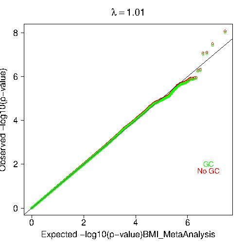
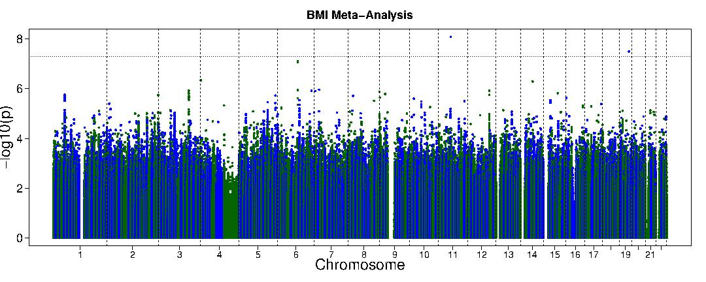

## Homework 6: Meta-Analysis for Genetic Studies
### BS859 Applied Genetic Analysis
### Addison Yam
### March 4, 2026

For this homework, you will meta-analyze the single-variant GWAS of body mass index (weight  divided by height2 (kg/m2), a measure of body weight that is adjusted for height.  The four studies to be meta-analyzed include individuals for four different studies in a few different African countries.  Each study analyzed their data separately; linear mixed effects models were used to account for population structure and relatedness, with fixed effect covariates defined separately by each study.  The combined studies include up to 14126 individuals.  For more information about the studies, see https://pubmed.ncbi.nlm.nih.gov/31675503/
 and https://www.ebi.ac.uk/gwas/publications/31675503#study_panel 
The file /projectnb/bs859/data/bmi/Uganda/Uganda_BMI_GWAS_MAF01.txt.gz  has the results from all 4 studies.  The first four columns are: snpid CHR POS.b37 CODED NONCODED 
snpid is in chr:pos:ref:alt format, CHR= chromosome POS.b37:  position on build 37 of the human genome.
The remaining columns are the results for the four studies, denoted 
Uganda: Ugandan genome resource GWAS and sequencing, N=6197)
DCC: Durban Case Control study (Durban, South Africa, Diabetes study, N=1478)
DDS: Durban Diabetes study (Durban, South Africa, population-based cross-sectional study, N=1114)
AADM: The Africa America Diabetes Mellitus Study (from study centers in Nigeria (Ibadan, Lagos, and Enugu), Ghana (Accra and Kumasi), and Kenya (Eldoret). N=5187

beta_x:  the regression coefficient for the additive-coded SNP (bmi in kg/m2 is the outcome)
se_x:  its standard error
pval_x: the p-value of the association 
no_x: the sample size for that variant
where x=uganda, DCC, DDS, or AADM

```bash
# load the necessary modules
module load R 
module load metal
```

1)	The following are QQ and Manhattan plots for each of the four studies you will meta-analyze.  
a)	Do you have any concerns about genomic inflation in these 4 studies?  
The Uganda, DCC, and DSS QQ plots show lambda values close to 1 and the tails close to the digaonal, which does not raise any concerns about genomoic inflation. When looking at the AADM QQ plot, it does have a lambda cvalue close to 1, but the tail shows serveral points significantly above the diagonal with observe -log10(p) values reaching close to 20 while expected values go up to 8. This suggest strong genome-wide significant associations rather than inflation. Overall, these four studies don't show concern for genomic inflation. 
b)	Based on the plots alone, does it look like these studies genome-wide significant findings are consistent across the 4 study populations?
Explain your answers.
The Uganda, DCC, and DDS Manhattan plot show no genome-wide significant findings where -log10(p) values were all below 8 (the genome-wide significance threshol of p<5x10^-8 corresponds to -log10(p) >7.3) and their y-axes only go up to 8 and no points exceed this threshold. The AADM Manhattan plot show several significant associations, with -log10(p) values reaching up to 20 on chromosome 7. So, this means that the genome-wide significant findings are not consistent across the four study populations since only the AADM study shows significant associations. This could be due to associated variants that are specific in the AADM study that are not present or associated in the Uganda, DCC, and DDS studies. Or this could be due to the AADM study having more power to detect these associations.

2)	Perform an inverse variance weighted meta-analysis, pooling the effect estimates, applying genomic control corrections for each study, and testing for heterogeneity.    
a) Include your METAL control file pasted into the homework file at the end.  
```bash
# Create and edit the metail control file
> vi metal_bmi.txt

> cat metal_bmi.txt
# Inverse variance weighted meta-analysis for BMI
# With genomic control corrections for each study
# And heterogeneity testing

SCHEME   STDERR
AVERAGEFREQ ON
MINMAXFREQ ON

# Study 1: Uganda
MARKER   snpid
ALLELE   CODED NONCODED
FREQ     af_uganda
WEIGHT   no_uganda
EFFECT   beta_uganda
STDERR   se_uganda
PVAL     pval_uganda
GENOMICCONTROL 1.021
PROCESS Uganda_BMI_GWAS_MAF01.txt

# Study 2: DCC
MARKER   snpid
ALLELE   CODED NONCODED
FREQ     af_DCC
WEIGHT   no_DCC
EFFECT   beta_DCC
STDERR   se_DCC
PVAL     pval_DCC
GENOMICCONTROL 1.006
PROCESS Uganda_BMI_GWAS_MAF01.txt

# Study 3: DDS
MARKER   snpid
ALLELE   CODED NONCODED
FREQ     af_DDS
WEIGHT   no_DDS
EFFECT   beta_DDS
STDERR   se_DDS
PVAL     pval_DDS
GENOMICCONTROL 1.012
PROCESS Uganda_BMI_GWAS_MAF01.txt

# Study 4: AADM
MARKER   snpid
ALLELE   CODED NONCODED
FREQ     af_AADM
WEIGHT   no_AADM
EFFECT   beta_AADM
STDERR   se_AADM
PVAL     pval_AADM
GENOMICCONTROL 1.004
PROCESS Uganda_BMI_GWAS_MAF01.txt

# Output and analysis
OUTFILE BMI_meta_ .tbl
ANALYZE HETEROGENEITY


# Ran metal command
>metal metal_bmi.txt > metal_bmi.log
```

b) The METAL output gives some warnings, such as “## WARNING: Invalid standard error for marker 10:100003534:G:A, ignored”.  Investigate the warning and explain:  why did this warning occur?
- This warning occurs whenever there is a NA or empty values for that specific variant. I see a lot of NA's in the Uganda_BMI_GWAS_MAF01.txt that are leading to these warnings. For variant 10:100003534:G:A, has missing standard error values, which are used to calculate the weights for the inverse variatnce meta-analysis. 
```bash
# Check the variant in the input file
> grep "10:100003534:G:A" Uganda_BMI_GWAS_MAF01.txt
10:100003534:G:A 10 100003534 G A 5.462479e-02 6.095619e-02 0.370182 0.976018 6197 NA NA NA 0.999009 1478 NA NA NA 0.9975 1114 -0.1706 0.5549 0.758506 0.989879 5187
```

3)	Create a QQ plot and a Manhattan plot of the meta-analysis results.

QQ plot:



Manhattan plot:




```bash
# Copy the R scripts from class 4
cp /projectnb/bs859/materials/class04/qqplot_pgen.R .
cp /projectnb/bs859/materials/class04/gwaplot_pgen.R .

# Create the necessary input structure for running the QQ plot script
> awk 'NR==1{print "P"; next} {print $10}' BMI_meta_1.tbl > BMI_meta_pvals.txt
> head BMI_meta_pvals.txt
P
0.1843
0.6953
0.75
0.08425
0.8111
0.09468
0.4726
0.6809
0.3783

# Create the necessary input structure for running the Manhattan plot script
> awk 'NR==1{print "X.CHROM\tPOS\tP"; next} 
      {split($1,a,":"); print a[1]"\t"a[2]"\t"$10}' BMI_meta_1.tbl > BMI_meta_manhattan.txt

> head BMI_meta_manhattan.txt
X.CHROM POS     P
6       105891755       0.0369
12      124805484       0.0430
10      87086125        0.0180
1       172615563       0.0576
3       57508538        0.0220
6       33025792        0.0155
6       94925353        0.0168
3       6038374 0.0701
6       31228974        0.0281

# Run the scripts
Rscript qqplot_pgen.R BMI_meta_pvals.txt "BMI_MetaAnalysis" ADD
Rscript gwaplot_pgen.R BMI_meta_manhattan.txt "BMI Meta-Analysis" "BMI_manhattan"
```

4) Do the plots you created suggest any potential issues with the meta-analysis, such as inflation?  Explain your answer.
- Answer: The plots do not suggest issues with the meta-analysis. The QQ plot shows a lambda value of 1.01, and it's a good sign that the observed p-values are following the expected. The tail has a slight dip that isn't too far from the diagonal and a couple points are above the diagonal at the end of the x-axis which may represent true associations. The Manhattan plot have no points exceeding y=-log10(p)=9 and onlt two points were above the -log10(p)=7.3 threshold, these are two genome-wide significant points on chromosomes 11 and 19. The gaps at chromosomes 1, 9, 13-15, and 21 match the pattern seen in the individual study plots. 

5) Using the plots in question 1 and your meta-analysis plot, do the regions that showed genome-wide significant associations in the individual studies also show genome-wide significance in the meta-analysis? 
- Answer: Not all of the regions that show genome-wide significant associations in the individual studeies also show genome-wide significance in the meta-analysis. For the Uganda individual study, they had one genome-wide significant association on chromosome 19, which we see as well in the meta-analysis. For the DCC individual study, there is one genome-wide significant association on chromosome 19, that isn't shown in the meta-analysis. For the DDS individual, there is one genome-wide significant association on chromosome 1, that isn't shown in the meta-analysis. For the AADM individual study, there are many genome-wide significant associations on chromosome 1, 7, and 12, that aren't shown in the meta-analysis. 
 
6) Extract the meta-analysis results for the two variants with genome-wide significant p-values in the meta-analysis and present those lines from the results file below.  
- Answer: I extracted the two variants with genome-wide significant p-values in the meta-analysis. The first variant is 19:45954045:A:G on chromosome 19, with a p-value=3.199e-08, allele1 is A, and allele2 is G. The second variant is 11:56591541:T:G on chromosome 11, with a p-value=8.37e-09, allele1 is T, and allele2 is G. 
```bash
# Get variants with p-value < 5e-8 (-log10(p) > 7.3)
> awk 'NR==1 || $10 < 5e-8 {print $0}' BMI_meta_1.tbl
MarkerName      Allele1 Allele2 Freq1   FreqSE  MinFreq MaxFreq Effect  StdErr  P-value Direction H
etISq   HetChiSq        HetDf   HetPVal
19:45954045:A:G a       g       0.9701  0.0002  0.9690  0.9702  0.3163  0.0572  3.199e-08       +??
+       0.0     0.116   1       0.7332
11:56591541:T:G t       g       0.9288  0.0174  0.9087  0.9563  -0.2162 0.0375  8.37e-09        ---
-       0.0     1.195   3       0.7542
```

a) Did data from all 4 studies contribute to the results?  Explain your answer.
- No, data from all four studies didn't contribute to the variant on chromosome 19. Only Uganda and AADM contributed to variant 19:45954045:A:G as +??+ tells us that DCC and DDS had missing or invalid data (signified by ?), while the positive effect of Uganda and AADM is signified by +. The data from all four studies did contribute to the 11:56591541:T:G variant on chromosome 11 though. The ---- tells us each study had a negative effect. 

b) Are the effects of the effect allele (Allele 1)  at these variants BMI in the same direction for all 4 studies?  Explain your answer.
- Answer: The effects of the affected allele for 19:45954045:A:G are in the same direction for two studies, Uganda and AADM, not all four because DCC and DDS had missing or invalid data signified by ?. The effects of the affected allele for 11:56591541:T:G are in the same direction for all four studies as ---- tells us each study had a negative effect. 

c) Write an interpretation of the effect estimate for these  two SNPs, and make sure explain which allele increases (or decreases) BMI compared to the other.  Explain how you determined this.
- Answer: For 19:45954045:A:G, with each copy of A allele, there is an associated with a 0.3163 kg/m² increase in BMI when compared to the G allele. For 11:56591541:T:G, with each copy of the T allele, there is an associated 0.2162 kg/m² decrease in BMI compared to the G allele. I got this from the Effect column which tells us the BETA variable and the effect of these variants.

d) Are the allele effects from the studies contributing to the meta-analysis heterogeneous?  Provide and explain statistic(s) to back your statement.
- Answer: For 19:45954045:A:G where two studies contributed, HetISq=0, HetPVal=0.7332, and HetDf=1. This means that this variant effect isn't heterogenous as the I²=0% tells us that the variation is happening because of chance. For 11:56591541:T:G where all four studies contributed, HetISq=0.0, HetPVal=0.7542, and HetDf=3. This also means that there isn't heterogeneity as the I²=0% tells us that the variation is happening because of chance.

7) The Manhattan plot for study AADM showed a highly significant association on chromosome 7.  The two SNPs with smallest p-value in that study are 7:141551191:C:T and 7:141549317:A:G, both with p=1.33e-16. Find these variants in the meta-analysis and report the results 

```bash
# Finds the two variants
> grep "7:141551191" BMI_meta_1.tbl
7:141551191:C:T t       c       0.0297  0.0145  0.0223  0.0870  -0.1067 0.0490  0.02949 --+-    96.
2       78.317  3       7.047e-17

> grep "7:141549317" BMI_meta_1.tbl
7:141549317:A:G a       g       0.9703  0.0145  0.9130  0.9777  0.1070  0.0490  0.02915 ++-+    96.
2       78.304  3       7.092e-17
```

a)	Do these SNPs show any evidence of association with BMI in the meta-analysis? Explain your answer.
- Answer: No, these SNPs do not show evidence of association with BMI in the meta-analysis because 7:141551191 has a p-value of 0.02949 and 7:141549317 has a p-value of 0.02915 which don't meet the genome-wide significance threshold of of 5×10⁻⁸. 
 
b)	Do these two SNPs show any evidence of heterogeneity? Explain your answer.
- Answer: For 7:141551191:C:T where all four studies contributed, HetISq = 96.2%, HetPVal = 7.047e-17, and HetDf = 3. For 7:141549317:A:G where all four studies contributed, HetISq = 96.2%, HetPVal = 7.092e-17, and HetDf = 3. These statistics show that both SNPs show evidence of heterogeneity. Both have an I² = 96.2% which means 96.2% of the variation in effect sizes is happening because of heterogeneity, not by chance, and the p-values associated with heterogeneity are significant. 

c) Present the effect, se, and p-value and effect allele frequency from each study for 7:141549317:A:G in the table below.  Do any of the studies other than AADM show evidence for association at this variant?  Is the allele frequency similar across the studies?

| Study  | Beta | SE           | P-value     | Effect Allele Frequency |
|--------|---------------|--------------|-------------|-------------------------|
| Uganda | 4.020481e-02  | 6.423864e-02 | 0.531403    | 0.977681|
| DCC    | 3.582012e-03  | 1.062236e-01 | 0.973099    | 0.967862|
| DDS    | -1.182333e-01 | 1.203549e-01 | 0.325917    | 0.966518|
| AADM   | 1.914         | 0.2113       | 1.32607e-19 | 0.912955|

- Answer: No other study except AADM shows evidence association for this variant as AADM has a p-value of 1.32607EE-19 and the other studies are 0.325917, 0.973099, and 0.531403. Also, only AADM has a large beta coefficent of 1.914, meaning it has a huge effect while the other studies have low beta coefficent values so small or no effect. The allele frequencies are similiar across the studies, they are 0.977681, 0.967862, 0.966518, and 0.912955, which are close to each other. 

```bash
> grep "7:141549317" Uganda_BMI_GWAS_MAF01.txt
7:141549317:A:G 7 141549317 A G 4.020481e-02 6.423864e-02 0.531403 0.977681 6197 3.582012e-03 1.062
236e-01 0.973099 0.967862 1478 -1.182333e-01 1.203549e-01 0.325917 0.966518 1114 1.914 0.2113 1.326
07E-19 0.912955 5187
```

d) Based on your observations in c, what additional analyses that were discussed in class might be helpful to better understand what is going on at this locus?
- Additional analyses that might be helpful to better understand what is going on at this locus is frequency analaysis of ancestry-specific alleles to see if the effect allele is different in subpopulations and performing MR-MEGA to partitions heterogeneity into components due to ancestry/residual and to detect SNP associations while quantifying ancestry-correlated heterogeneity. Also, we can perform this meta-analysis without the AADM study to see how the other three studies may show effect. 