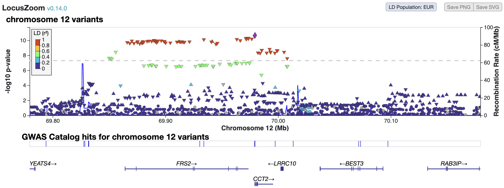

## Homework 7: Post-GWAS Analyses - Conditional Analyses and Find Mapping
### BS859 Applied Genetic Analysis
### Addison Yam
### March 25, 2026

```bash
# load the necessary modules
module load gcta/1.94.1
module load plink/1.90b6.21
```

Use the GWAS results from the Albuminuria GWAS located in `/projectnb/bs859/data/meta/downloads/UKB.v2.albuminuria.n382500.sorted.tsv.gz` for this assignment. This is the same GWAS we used for the in class computing example. The individuals included in this GWAS are primarily of European (and mostly British) ancestry.

We will focus on the region of chromosome 12 centered around rs2601006, the most significant SNP on that chromosome.

1)	Create a LocusZoom plot for rs2601006, with the most significant SNP as the LD reference SNP, between which all other LD is reported.   Include the LD legend in the plot, and display with European LD. Use a screenshot to record your plot, as the LocusZoom png download feature does not include LD reference or version of LocusZoom used.  Provide the plot here.
```bash
# get the header of the chromosome 12 file and the chromosome 12 variants
> zcat /projectnb/bs859/data/meta/downloads/UKB.v2.albuminuria.n382500.sorted.tsv.gz |  awk 'NR==1 || $3==12' > chr12_albuminuria.txt

# check the number of chromosome 12 variants
> wc -l chr12_albuminuria.txt 
556851 chr12_albuminuria.txt

# find the position of rs2601006
> grep "rs2601006" chr12_albuminuria.txt
12:69979517_C_T rs2601006       12      69979517        T       C       0.34288 -0.011756      0
.0017554        2.12953e-11     382500

# get 500000 before and after of the  rs2601006's position
awk -v pos=69979517 'NR==1 || ($3==12 && $4>=pos-500000 && $4<=pos+500000)' chr12_albuminuria.txt > rs2601006_region.txt
```

- LocusZoom plot around rs2601006:



a. Interpret the plot:   do you think there may be more than one independent association in the region?  Why, or why not?
- Asnwer: Looking at the plot, there is only one independent association in the region. This is because there are about 20 to 30 variants with similiar allele frequency and are in high LD correlation in the EUR 1000G LD panel (in red). The smallest-positioned red peak is scattered around 69.866 and the highest-position red peak is around 70.0008. These variants are so close to each other and don't have gaps between them, so this is a single continous peak. 

b. Do the variants that are highly associated with Albuminuria and in high LD with the top variant (in red) have similar effect sizes and allele frequencies to the top variant?
- Answer: Yes, the variants that are highly associated with Albuminuria and in high LD with the top variant (in red) have similar effect sizes and allele frequences to the top variant. The top variant and these (red) variants all have an allele frequency around 0.35. and a beta effect of -0.012. The red variants are all tagging the same underlying causal variant, which is why their association sigals are similiar.

c. Do the variants in modest LD with the top variant (in green) near 69.85MB have similar allele frequency and effect as the top variant?
- Answer: The variants in modest LD with the top variant (in green) do not have similiar allele frequency ans effect as the top variants. The variants in green have an allele frequency around 0.5 and a beta effect of -0.009, which is 0.15 higher than the top variant's allele frequency and 0.003 higher than the top variant's beta effect. This difference means that these green variants are partially capturing the association signal. 

2) a. Use GCTA to perform a conditional analysis on the full chromosome 12.  Use the 1000G Europeans as a reference sample.    Present the results, and interpret your findings:  do you have any concerns about the analysis? Is there evidence for multiple independent associations on this chromosome?  
- Answer: When I used the 1000G Europeans as a reference sample, there was 1 independent association rs2601006 on chromosome 12 where the join model effect is (bJ = -0.01176). There were 519175 variants that were matched. And in terms of concerns, 902 variants that couldn't be matched, and 112 variants had large difference of allele frequency between the GWAS summary data and the reference. These mismatches may be due to rare variants not captured in the reference. There isn't evidence that are multiple independent associations as only one variant shows independent association.

```bash
# create the GCTA input file of chromosome 12
> zcat /projectnb/bs859/data/meta/downloads/UKB.v2.albuminuria.n382500.sorted.tsv.gz | 
  awk '$3==12 {print $2, $5, $6, $7, $8, $9, $10, $11}' > chr12_gcta.txt

> head chr12_gcta.txt
rs141322959 A G 0.0010902 0.00637917 0.0239258 0.78976 382500
rs7974215 T C 0.00950889 0.0027742 0.00867692 0.749179 382500
rs118105404 T C 0.0012719 -0.0157241 0.0312613 0.614972 382500
rs188120028 C T 0.0018719 0.00737152 0.021581 0.732671 382500
rs3858702 C T 0.994863 0.00109803 0.0121108 0.927759 382500
rs587604735 T C 0.00145098 0.000742805 0.0252262 0.976509 382500
rs556602880 C T 0.0015451 -0.0105494 0.0227163 0.642363 382500
rs145944399 A C 0.0149673 -0.00601864 0.00705628 0.393689 382500
rs143568698 G C 0.00378173 -0.0100898 0.0135197 0.455485 382500
rs12299547 T G 0.0160745 -0.00834897 0.00679562 0.21923 382500

# run the GTCA command with the 1000G Europeans as a reference sample
gcta64 --bfile /projectnb/bs859/data/1000G/plinkformat/1000G_EUR \
  --cojo-file chr12_gcta.txt \
  --cojo-slct \
  --chr 12 \
  --out chr12_EUR > chr12_EUR.log

> ls -lh chr12_EUR*
-rw-r--r-- 1 addisony bs859ta  16K Mar 14 21:54 chr12_EUR.badsnps
-rw-r--r-- 1 addisony bs859ta  57M Mar 14 21:55 chr12_EUR.cma.cojo
-rw-r--r-- 1 addisony bs859ta 4.0K Mar 14 21:54 chr12_EUR.freq.badsnps
-rw-r--r-- 1 addisony bs859ta  169 Mar 14 21:55 chr12_EUR.jma.cojo
-rw-r--r-- 1 addisony bs859ta   28 Mar 14 21:55 chr12_EUR.ldr.cojo
-rw-r--r-- 1 addisony bs859ta  19K Mar 14 21:55 chr12_EUR.log

> tail -20 chr12_EUR.log 
GWAS summary statistics of 556849 SNPs read from [chr12_gcta.txt].
Phenotypic variance estimated from summary statistics of all 556849 SNPs: 0.535555 (variance of logit for case-control studies).
Matching the GWAS meta-analysis results to the genotype data ...
Calculating allele frequencies ...
Warning: cant match the reference alleles of 902 SNPs to those in the genotype data. These SNPs have been saved in [chr12_EUR.badsnps].
112 SNP(s) have large difference of allele frequency between the GWAS summary data and the reference sample. These SNPs have been saved in [chr12_EUR.freq.badsnps].
519175 SNPs are matched to the genotype data.
Calculating the variance of SNP genotypes ...

Performing stepwise model selection on 519175 SNPs to select association signals ... (p cutoff = 5e-08; collinearity cutoff = 0.9)
(Assuming complete linkage equilibrium between SNPs which are more than 10Mb away from each other)
Finally, 1 associated SNPs are selected.
Performing joint analysis on all the 1 selected signals ...
Saving the 1 independent signals to [chr12_EUR.jma.cojo] ...
Saving the LD structure of 1 independent signals to [chr12_EUR.ldr.cojo] ...
Saving the conditional analysis results of 519174 remaining SNPs to [chr12_EUR.cma.cojo] ...
(0 SNPs eliminated by backward selection and 0 SNPs filtered by collinearity test are not included in the output)

Analysis finished at 21:55:05 EDT on Sat Mar 14 2026
Overall computational time: 8 minutes 33 sec.
```

b. Repeat the analysis, but use the 1000G Africans as a reference sample.  Present the results, and interpret your findings as if the UK Biobank data were an African ancestry sample.   do you have any concerns about the analysis? Is there evidence for multiple independent associations on this chromosome?  
- Answer: When I used the 1000G Africans as a reference sample, there was 2 independent associations rs2601006 and rs710684 on chromosome 12 identified. There were 428674 variants that were matched. And in terms of concerns, 902 variants that couldn't be matched, and 90613 variants had large difference of allele frequency between the GWAS summary data and the reference. This shows more concern than the EUR reference, which means that the AFR reference should not be used for this and the EUR reference is more reliable for this input. These mismatches are due to not being captured in the reference. There is evidence that are multiple independent associations as two variant show independent association.

```bash
# Run GCTA with the African reference sample
gcta64 --bfile /projectnb/bs859/data/1000G/plinkformat/1000G_AFR \
  --cojo-file chr12_gcta.txt \
  --cojo-slct \
  --chr 12 \
  --out chr12_AFR > chr12_AFR.log

> ls -lh chr12_AFR*
-rw-r--r-- 1 addisony bs859ta  16K Mar 14 22:14 chr12_AFR.badsnps
-rw-r--r-- 1 addisony bs859ta  44M Mar 14 22:14 chr12_AFR.cma.cojo
-rw-r--r-- 1 addisony bs859ta 3.0M Mar 14 22:14 chr12_AFR.freq.badsnps
-rw-r--r-- 1 addisony bs859ta  295 Mar 14 22:14 chr12_AFR.jma.cojo
-rw-r--r-- 1 addisony bs859ta   69 Mar 14 22:14 chr12_AFR.ldr.cojo
-rw-r--r-- 1 addisony bs859ta  19K Mar 14 22:14 chr12_AFR.log

> tail -20 chr12_AFR.log 
GWAS summary statistics of 556849 SNPs read from [chr12_gcta.txt].
Phenotypic variance estimated from summary statistics of all 556849 SNPs: 0.535555 (variance of 
logit for case-control studies).
Matching the GWAS meta-analysis results to the genotype data ...
Calculating allele frequencies ...
Warning: cant match the reference alleles of 902 SNPs to those in the genotype data. These SNPs
 have been saved in [chr12_AFR.badsnps].
90613 SNP(s) have large difference of allele frequency between the GWAS summary data and the ref
erence sample. These SNPs have been saved in [chr12_AFR.freq.badsnps].
428674 SNPs are matched to the genotype data.
Calculating the variance of SNP genotypes ...
Performing stepwise model selection on 428674 SNPs to select association signals ... (p cutoff =
 5e-08; collinearity cutoff = 0.9)
(Assuming complete linkage equilibrium between SNPs which are more than 10Mb away from each othe
r)
Finally, 2 associated SNPs are selected.
Performing joint analysis on all the 2 selected signals ...
Saving the 2 independent signals to [chr12_AFR.jma.cojo] ...
Saving the LD structure of 2 independent signals to [chr12_AFR.ldr.cojo] ...
Saving the conditional analysis results of 428672 remaining SNPs to [chr12_AFR.cma.cojo] ...
(0 SNPs eliminated by backward selection and 0 SNPs filtered by collinearity test are not includ
ed in the output)
Analysis finished at 22:14:24 EDT on Sat Mar 14 2026
Overall computational time: 9 minutes 7 sec.
```

c. Explain why it is important to match the LD panel ancestry with the GWAS participants ancestry, based on your analyses a) and b) above.
- Answer: It's important to match the LD panel ancestry with the GWAS participants ancestry because depending on the reference sample, the LD pattern will differ where European ancestry has larger LD blocks and African ancestry has smaller LD blocks. In my analysis, there were 113 variants with large differences between allele frequencies in the European reference and 90,614 variants with large differences in allele frequencies in the African reference. My analysis was more reliable when using the European reference and not as reliable when using the African reference because this is a European GWAS. If you use the wrong ancestry mismatch,  we'd get incorrect effect estimates in joint models, miss associations within a particular popultation, and get incrorrect independent signals. 

3)	If you were to do a full GWAS of this phenotype in a large African ancestry sample, would you expect to see more than one independent association on chromosome 12?  Why or why not?
- Answer: Yes, if I were to do a full GWAS of this phenotype in a large African ancestry sample, I'd expect to see more than one independent associations on chromosome 12. This is due to African populations having smaller LD blocks as they have more diversity and an older population history. And these smaller LD blocks may be separated into multiple independent signals. Also, there is greater resolution for African ancestry populations, that make it more likely to highlight multiple peaks and phenotypes.

4)	Use VEP and/or or other tools to determine the functional annotations for rs2601006 and other SNPs that have p<5e-7 in within that region between and including positions 69,850,008 through 70,008,337  (this is the region of the Locus Zoom plot where there appear to be highly associated variants that are all in high LD).
```bash
# Get variants with p-values <5e-7 in chromosome 12 in the 69850008 to 70008337 region
> awk -v start=69850008 -v end=70008337 '$3==12 && $4>=start && $4<=end && $10 < 5e-7' chr12_albuminuria.txt > region_variants.txt

> head region_variants.txt 
12:69850008_A_G rs11177679      12      69850008        G       A       0.246622 -0.0107899       0.00193238      2.35576e-08     382500
rs7979636       rs7979636       12      69851374        G       A       0.246033 -0.010796        0.00193245      2.31615e-08     382500
12:69852485_A_C rs10878991      12      69852485        C       A       0.246098 -0.0106985       0.00193338      3.1394e-08      382500
12:69855910_G_A rs11177683      12      69855910        A       G       0.273292 -0.0110563       0.00187326      3.5904e-09      382500
12:69866114_C_T rs2870898       12      69866114        T       C       0.345078 -0.0112073       0.00175865      1.85945e-10     382500
12:69868410_A_C rs10444582      12      69868410        C       A       0.345272 -0.0111208       0.00175742      2.48733e-10     382500
12:69870219_G_C rs1573630       12      69870219        C       G       0.345661 -0.0113192       0.00175723      1.18432e-10     382500
12:69872095_A_G rs10748130      12      69872095        G       A       0.346305 -0.0111117       0.00175553      2.46219e-10     382500
12:69875018_C_T rs916090        12      69875018        T       C       0.367111 -0.0110402       0.00173229      1.85388e-10     382500
12:69875367_C_T rs7135091       12      69875367        T       C       0.345695 -0.0112585       0.00175585      1.43786e-10     382500

> wc -l region_variants.txt
96 region_variants.txt

# Gets only the variants as inputs for VEP
awk '{print $2}' region_variants.txt > vep_input.txt
> head vep_input.txt 
rs11177679
rs7979636
rs10878991
rs11177683
rs2870898
rs10444582
rs1573630
rs10748130
rs916090
rs7135091

> wc -l vep_input.txt 
96 vep_input.txt
```

a. How many variants were there in this region?
- Answer: There are 96 variants in this 69850008 to 70008337 region.
b. How many of the variants are intronic?
- Answer: 78% of the variants are intronic, which is 75 variants.

c. Are there any SNPs in the total set that are more likely to be functional or causal than others?  Present and explain your findings.
- Answer: Yes, there are variants that are more likely to be function or causal than others, they include the NMD_transcript_variants (1%), 3_prime_UTR_variant (2%), 5_prime_UTR_variant (1%), and regulatory_region_variant (1%). The NMD_transcript_variant trigger nonsense-mediated decay and degrade transcripts. The 5' and 3' UTR varianys affect the efficeny of translation. The regulatory region variants impact transcription factor binding and promoter and enhancer activity. Also, from the exonic variants, 100% are synonymous variants, which mean they don't change the amino acid sequence but can still affect splicing, stability of transcripts, and the rate of translation. 

d. What does VEP tell you about the top SNP (lowest p-value) rs2601006?  Does this variant appear to have a known function?
- Answer: rs2601006 is located majority of the time on the CCT2 gene and sometimes on the MIR3913-1 gene. Although the exact function isn't known, rs2601006 is usually as a intronic variants and also acts as a 5_prime_UTR_variant, upstream_gene_variant, non_coding_transcript_variant, NMD_transcript_variant, splice_polypyrimidine_tract_variant, and regulatory_region_variant. It is either a T or A allele. rs2601006 is an important genetic marker for this trait with strong statistical evidence for association with albuminuria.
