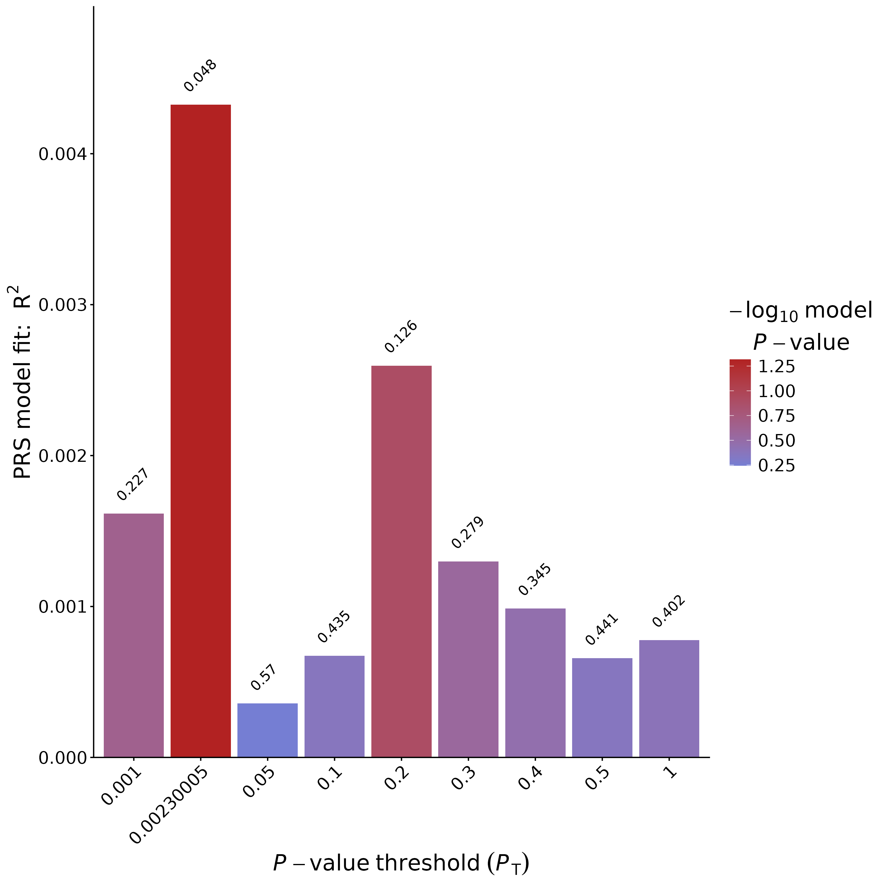
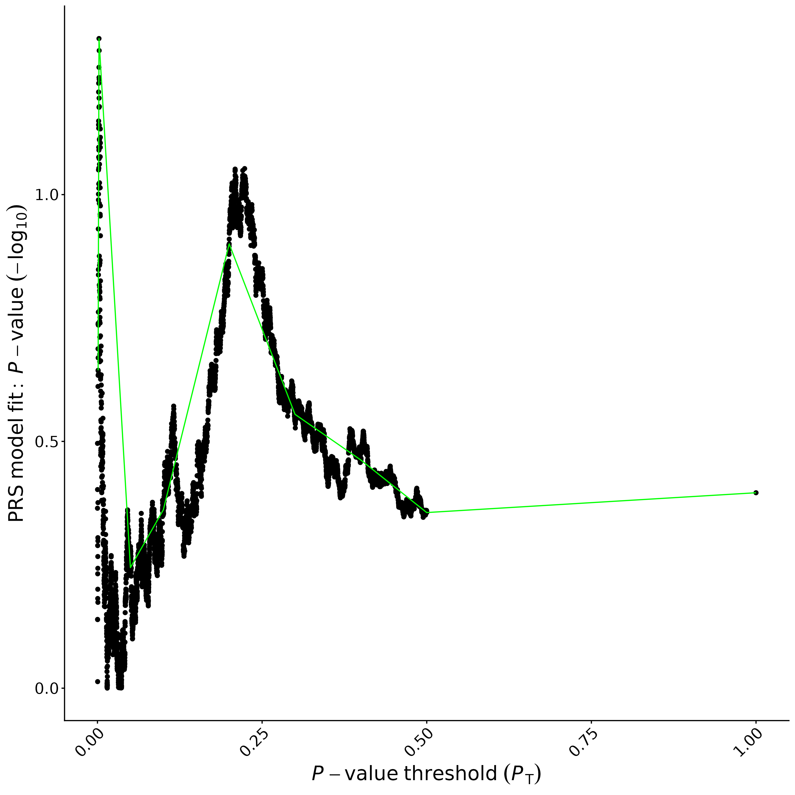

## Homework 9: Polygenic (Risk) Scores
### BS859 Applied Genetic Analysis
### Addison Yam
### April 8, 2026

```bash
# load the necessary modules
module load R
module load python2
module load ldsc
module load prsice
# set the proper shortcut paths
export LDSCORES_DIR=/projectnb/bs859/data/ldscore_files
export UKBB_EUR_LD=$LDSCORES_DIR/UKBB.ALL.ldscore/UKBB.EUR.rsid
```

1.	We will explore in more detail using PRSice to develop Alzheimer Disease polygenic scores using the TGEN data and the IGAP Alzheimer disease summary statistics.  First change the clumping r2 parameter (see PRSice manual:  https://choishingwan.github.io/PRSice/command_detail/#clumping): Set the r2 threshold for clumping to 0.05, and then 0.15 instead of 0.1.   Then , use the default clump-r2 of 0.1, and change clump-kb 500.  

```bash
# First run of clump-r2 0.1
Rscript $SCC_PRSICE_BIN/PRSice.R --dir . \
    --prsice $SCC_PRSICE_BIN/PRSice \
    --base $IGAPDIR/Kunkle_etal_Stage1_results2019.txt.gz \
    --target $TGENDIR/TGEN_cleaned \
    --stat Beta \
    --snp MarkerName \
    --A1 Effect_allele \
    --A2 Non_Effect_allele \
    --pvalue Pvalue \
    --binary-target T \
    --cov-file $TGENDIR/TGEN_pcs.txt \
    --cov-col PC6,PC8 \
    --clump-r2 0.1 \
    --clump-kb 250 \
    --extract AD_default.valid \
    --out AD_default

PRSice 2.3.5 (2021-09-20) 
https://github.com/choishingwan/PRSice
(C) 2016-2020 Shing Wan (Sam) Choi and Paul F. O'Reilly
GNU General Public License v3
If you use PRSice in any published work, please cite:
Choi SW, O'Reilly PF.
PRSice-2: Polygenic Risk Score Software for Biobank-Scale Data.
GigaScience 8, no. 7 (July 1, 2019)
2026-04-08 00:02:07
/share/pkg.8/prsice/2.3.5/install/bin/PRSice \
    --a1 Effect_allele \
    --a2 Non_Effect_allele \
    --bar-levels 0.001,0.05,0.1,0.2,0.3,0.4,0.5,1 \
    --base /projectnb/bs859/data/igap//Kunkle_etal_Stage1_results2019.txt.gz \
    --beta  \
    --binary-target T \
    --clump-kb 250kb \
    --clump-p 1.000000 \
    --clump-r2 0.100000 \
    --cov /projectnb/bs859/data/tgen/cleaned//TGEN_pcs.txt \
    --cov-col PC6,PC8 \
    --extract AD_default.valid \
    --interval 5e-05 \
    --lower 5e-08 \
    --num-auto 22 \
    --out AD_default \
    --pvalue Pvalue \
    --seed 1995796835 \
    --snp MarkerName \
    --stat Beta \
    --target /projectnb/bs859/data/tgen/cleaned//TGEN_cleaned \
    --thread 1 \
    --upper 0.5
Initializing Genotype file: 
/projectnb/bs859/data/tgen/cleaned//TGEN_cleaned (bed) 
Start processing Kunkle_etal_Stage1_results2019.txt 
================================================== 
SNP extraction/exclusion list contains 5 columns, will 
assume first column contains the SNP ID 
Base file: 
/projectnb/bs859/data/igap//Kunkle_etal_Stage1_results2019.txt.gz 
GZ file detected. Header of file is: 
Chromosome Position MarkerName Effect_allele 
Non_Effect_allele Beta SE Pvalue 
Reading 100.00%
11480632 variant(s) observed in base file, with: 
1627795 variant(s) excluded based on user input 
9852837 total variant(s) included from base file 
Loading Genotype info from target 
================================================== 
1237 people (0 male(s), 0 female(s)) observed 
1237 founder(s) included 
Warning: Currently not support haploid chromosome and sex 
         chromosomes 
50307 variant(s) not found in previous data 
380 variant(s) with mismatch information 
257581 variant(s) included 
There are a total of 1 phenotype to process 
Start performing clumping 
Clumping Progress: 100.00%
Number of variant(s) after clumping : 63540 
Processing the 1 th phenotype 
Phenotype is a binary phenotype 
468 control(s) 
769 case(s) 
Processing the covariate file: 
/projectnb/bs859/data/tgen/cleaned//TGEN_pcs.txt 
============================== 
Include Covariates: 
Name    Missing Number of levels 
PC6     0       - 
PC8     0       - 
After reading the covariate file, 1237 sample(s) included 
in the analysis 
Start Processing
Processing 100.00%
There are 1 region(s) with p-value less than 1e-5. Please 
note that these results are inflated due to the overfitting 
inherent in finding the best-fit PRS (but it's still best 
to find the best-fit PRS!). 
You can use the --perm option (see manual) to calculate an 
empirical P-value. 
Begin plotting
Current Rscript version = 2.3.3
Plotting Bar Plot
Plotting the high resolution plot

head AD_default.summary 
Phenotype       Set     Threshold       PRS.R2  Full.R2 Null.R2 Prevalence      Coefficient     Standard.Error  P       Num_SNP
-       Base    0.447   0.186366        0.200324        0.0171549       -       12544.5 1048.16 5.21949e-33     39337

grep "Number of variant(s) after clumping" AD_default.log
Number of variant(s) after clumping : 63540
```

```bash
# Second run of clump-r2 0.05
Rscript $SCC_PRSICE_BIN/PRSice.R --dir . \
    --prsice $SCC_PRSICE_BIN/PRSice \
    --base $IGAPDIR/Kunkle_etal_Stage1_results2019.txt.gz \
    --target $TGENDIR/TGEN_cleaned \
    --stat Beta \
    --snp MarkerName \
    --A1 Effect_allele \
    --A2 Non_Effect_allele \
    --pvalue Pvalue \
    --binary-target T \
    --cov-file $TGENDIR/TGEN_pcs.txt \
    --cov-col PC6,PC8 \
    --clump-r2 0.05 \
    --clump-kb 250 \
    --extract AD_default.valid \
    --out AD_r2_0.05

PRSice 2.3.5 (2021-09-20) 
https://github.com/choishingwan/PRSice
(C) 2016-2020 Shing Wan (Sam) Choi and Paul F. O'Reilly
GNU General Public License v3
If you use PRSice in any published work, please cite:
Choi SW, O'Reilly PF.
PRSice-2: Polygenic Risk Score Software for Biobank-Scale Data.
GigaScience 8, no. 7 (July 1, 2019)
2026-04-08 00:08:05
/share/pkg.8/prsice/2.3.5/install/bin/PRSice \
    --a1 Effect_allele \
    --a2 Non_Effect_allele \
    --bar-levels 0.001,0.05,0.1,0.2,0.3,0.4,0.5,1 \
    --base /projectnb/bs859/data/igap//Kunkle_etal_Stage1_results2019.txt.gz \
    --beta  \
    --binary-target T \
    --clump-kb 250kb \
    --clump-p 1.000000 \
    --clump-r2 0.050000 \
    --cov /projectnb/bs859/data/tgen/cleaned//TGEN_pcs.txt \
    --cov-col PC6,PC8 \
    --extract AD_default.valid \
    --interval 5e-05 \
    --lower 5e-08 \
    --num-auto 22 \
    --out AD_r2_0.05 \
    --pvalue Pvalue \
    --seed 3627920797 \
    --snp MarkerName \
    --stat Beta \
    --target /projectnb/bs859/data/tgen/cleaned//TGEN_cleaned \
    --thread 1 \
    --upper 0.5
Initializing Genotype file: 
/projectnb/bs859/data/tgen/cleaned//TGEN_cleaned (bed) 
Start processing Kunkle_etal_Stage1_results2019.txt 
================================================== 
SNP extraction/exclusion list contains 5 columns, will 
assume first column contains the SNP ID 
Base file: 
/projectnb/bs859/data/igap//Kunkle_etal_Stage1_results2019.txt.gz 
GZ file detected. Header of file is: 
Chromosome Position MarkerName Effect_allele 
Non_Effect_allele Beta SE Pvalue 
Reading 100.00%
11480632 variant(s) observed in base file, with: 
1627795 variant(s) excluded based on user input 
9852837 total variant(s) included from base file 
Loading Genotype info from target 
================================================== 
1237 people (0 male(s), 0 female(s)) observed 
1237 founder(s) included 
Warning: Currently not support haploid chromosome and sex 
         chromosomes 
50307 variant(s) not found in previous data 
380 variant(s) with mismatch information 
257581 variant(s) included 
There are a total of 1 phenotype to process 
Start performing clumping 
Clumping Progress: 100.00%
Number of variant(s) after clumping : 49526 
Processing the 1 th phenotype 
Phenotype is a binary phenotype 
468 control(s) 
769 case(s) 
Processing the covariate file: 
/projectnb/bs859/data/tgen/cleaned//TGEN_pcs.txt 
============================== 
Include Covariates: 
Name    Missing Number of levels 
PC6     0       - 
PC8     0       - 
After reading the covariate file, 1237 sample(s) included 
in the analysis 
Start Processing
Processing 100.00%
There are 1 region(s) with p-value less than 1e-5. Please 
note that these results are inflated due to the overfitting 
inherent in finding the best-fit PRS (but it's still best 
to find the best-fit PRS!). 
You can use the --perm option (see manual) to calculate an 
empirical P-value. 
Begin plotting
Current Rscript version = 2.3.3
Plotting Bar Plot
Plotting the high resolution plot

cat AD_r2_0.05.summary 
Phenotype       Set     Threshold       PRS.R2  Full.R2 Null.R2 Prevalence      Coefficient     Standard.Error  P       Num_SNP
-       Base    0.4386  0.172438        0.186635        0.0171549       -       10914.3 941.916 4.77979e-31     31896

grep "Number of variant(s) after clumping" AD_r2_0.05.log
Number of variant(s) after clumping : 49526 
```

```bash
# Third run of clump r2 0.15 
Rscript $SCC_PRSICE_BIN/PRSice.R --dir . \
    --prsice $SCC_PRSICE_BIN/PRSice \
    --base $IGAPDIR/Kunkle_etal_Stage1_results2019.txt.gz \
    --target $TGENDIR/TGEN_cleaned \
    --stat Beta \
    --snp MarkerName \
    --A1 Effect_allele \
    --A2 Non_Effect_allele \
    --pvalue Pvalue \
    --binary-target T \
    --cov-file $TGENDIR/TGEN_pcs.txt \
    --cov-col PC6,PC8 \
    --clump-r2 0.15 \
    --clump-kb 250 \
    --extract AD_default.valid \
    --out AD_r2_0.15

PRSice 2.3.5 (2021-09-20) 
https://github.com/choishingwan/PRSice
(C) 2016-2020 Shing Wan (Sam) Choi and Paul F. O'Reilly
GNU General Public License v3
If you use PRSice in any published work, please cite:
Choi SW, O'Reilly PF.
PRSice-2: Polygenic Risk Score Software for Biobank-Scale Data.
GigaScience 8, no. 7 (July 1, 2019)
2026-04-08 00:15:14
/share/pkg.8/prsice/2.3.5/install/bin/PRSice \
    --a1 Effect_allele \
    --a2 Non_Effect_allele \
    --bar-levels 0.001,0.05,0.1,0.2,0.3,0.4,0.5,1 \
    --base /projectnb/bs859/data/igap//Kunkle_etal_Stage1_results2019.txt.gz \
    --beta  \
    --binary-target T \
    --clump-kb 250kb \
    --clump-p 1.000000 \
    --clump-r2 0.150000 \
    --cov /projectnb/bs859/data/tgen/cleaned//TGEN_pcs.txt \
    --cov-col PC6,PC8 \
    --extract AD_default.valid \
    --interval 5e-05 \
    --lower 5e-08 \
    --num-auto 22 \
    --out AD_r2_0.15 \
    --pvalue Pvalue \
    --seed 3766715035 \
    --snp MarkerName \
    --stat Beta \
    --target /projectnb/bs859/data/tgen/cleaned//TGEN_cleaned \
    --thread 1 \
    --upper 0.5

Initializing Genotype file: 
/projectnb/bs859/data/tgen/cleaned//TGEN_cleaned (bed) 

Start processing Kunkle_etal_Stage1_results2019.txt 
================================================== 

SNP extraction/exclusion list contains 5 columns, will 
assume first column contains the SNP ID 

Base file: 
/projectnb/bs859/data/igap//Kunkle_etal_Stage1_results2019.txt.gz 
GZ file detected. Header of file is: 
Chromosome Position MarkerName Effect_allele 
Non_Effect_allele Beta SE Pvalue 

Reading 100.00%
11480632 variant(s) observed in base file, with: 
1627795 variant(s) excluded based on user input 
9852837 total variant(s) included from base file 

Loading Genotype info from target 
================================================== 

1237 people (0 male(s), 0 female(s)) observed 
1237 founder(s) included 

Warning: Currently not support haploid chromosome and sex 
         chromosomes 

50307 variant(s) not found in previous data 
380 variant(s) with mismatch information 
257581 variant(s) included 

There are a total of 1 phenotype to process 

Start performing clumping 

Clumping Progress: 100.00%
Number of variant(s) after clumping : 74278 

Processing the 1 th phenotype 

Phenotype is a binary phenotype 
468 control(s) 
769 case(s) 

Processing the covariate file: 
/projectnb/bs859/data/tgen/cleaned//TGEN_pcs.txt 
============================== 

Include Covariates: 
Name    Missing Number of levels 
PC6     0       - 
PC8     0       - 

After reading the covariate file, 1237 sample(s) included 
in the analysis 


Start Processing
Processing 100.00%
There are 1 region(s) with p-value less than 1e-5. Please 
note that these results are inflated due to the overfitting 
inherent in finding the best-fit PRS (but it's still best 
to find the best-fit PRS!). 
You can use the --perm option (see manual) to calculate an 
empirical P-value. 

Begin plotting
Current Rscript version = 2.3.3
Plotting Bar Plot
Plotting the high resolution plot

cat AD_r2_0.15.summary
Phenotype       Set     Threshold       PRS.R2  Full.R2 Null.R2 Prevalence      Coefficient     Standard.Error  P       Num_SNP
-       Base    1       0.186317        0.200276        0.0171549       -       20682.1 1729.76 5.99527e-33     74278

grep "Number of variant(s) after clumping" AD_r2_0.15.log
Number of variant(s) after clumping : 74278 
```

```bash
# Fourth run of clump r2=0.1, clump-kb = 500
Rscript $SCC_PRSICE_BIN/PRSice.R --dir . \
    --prsice $SCC_PRSICE_BIN/PRSice \
    --base $IGAPDIR/Kunkle_etal_Stage1_results2019.txt.gz \
    --target $TGENDIR/TGEN_cleaned \
    --stat Beta \
    --snp MarkerName \
    --A1 Effect_allele \
    --A2 Non_Effect_allele \
    --pvalue Pvalue \
    --binary-target T \
    --cov-file $TGENDIR/TGEN_pcs.txt \
    --cov-col PC6,PC8 \
    --clump-r2 0.1 \
    --clump-kb 500 \
    --extract AD_default.valid \
    --out AD_kb_500

PRSice 2.3.5 (2021-09-20) 
https://github.com/choishingwan/PRSice
(C) 2016-2020 Shing Wan (Sam) Choi and Paul F. O'Reilly
GNU General Public License v3
If you use PRSice in any published work, please cite:
Choi SW, O'Reilly PF.
PRSice-2: Polygenic Risk Score Software for Biobank-Scale Data.
GigaScience 8, no. 7 (July 1, 2019)
2026-04-08 00:18:54
/share/pkg.8/prsice/2.3.5/install/bin/PRSice \
    --a1 Effect_allele \
    --a2 Non_Effect_allele \
    --bar-levels 0.001,0.05,0.1,0.2,0.3,0.4,0.5,1 \
    --base /projectnb/bs859/data/igap//Kunkle_etal_Stage1_results2019.txt.gz \
    --beta  \
    --binary-target T \
    --clump-kb 500kb \
    --clump-p 1.000000 \
    --clump-r2 0.100000 \
    --cov /projectnb/bs859/data/tgen/cleaned//TGEN_pcs.txt \
    --cov-col PC6,PC8 \
    --extract AD_default.valid \
    --interval 5e-05 \
    --lower 5e-08 \
    --num-auto 22 \
    --out AD_kb_500 \
    --pvalue Pvalue \
    --seed 3805980120 \
    --snp MarkerName \
    --stat Beta \
    --target /projectnb/bs859/data/tgen/cleaned//TGEN_cleaned \
    --thread 1 \
    --upper 0.5

Initializing Genotype file: 
/projectnb/bs859/data/tgen/cleaned//TGEN_cleaned (bed) 

Start processing Kunkle_etal_Stage1_results2019.txt 
================================================== 

SNP extraction/exclusion list contains 5 columns, will 
assume first column contains the SNP ID 

Base file: 
/projectnb/bs859/data/igap//Kunkle_etal_Stage1_results2019.txt.gz 
GZ file detected. Header of file is: 
Chromosome Position MarkerName Effect_allele 
Non_Effect_allele Beta SE Pvalue 

Reading 100.00%
11480632 variant(s) observed in base file, with: 
1627795 variant(s) excluded based on user input 
9852837 total variant(s) included from base file 

Loading Genotype info from target 
================================================== 

1237 people (0 male(s), 0 female(s)) observed 
1237 founder(s) included 

Warning: Currently not support haploid chromosome and sex 
         chromosomes 

50307 variant(s) not found in previous data 
380 variant(s) with mismatch information 
257581 variant(s) included 

There are a total of 1 phenotype to process 

Start performing clumping 

Clumping Progress: 100.00%
Number of variant(s) after clumping : 62104 

Processing the 1 th phenotype 

Phenotype is a binary phenotype 
468 control(s) 
769 case(s) 

Processing the covariate file: 
/projectnb/bs859/data/tgen/cleaned//TGEN_pcs.txt 
============================== 

Include Covariates: 
Name    Missing Number of levels 
PC6     0       - 
PC8     0       - 

After reading the covariate file, 1237 sample(s) included 
in the analysis 


Start Processing
Processing 100.00%
There are 1 region(s) with p-value less than 1e-5. Please 
note that these results are inflated due to the overfitting 
inherent in finding the best-fit PRS (but it's still best 
to find the best-fit PRS!). 
You can use the --perm option (see manual) to calculate an 
empirical P-value. 

Begin plotting
Current Rscript version = 2.3.3
Plotting Bar Plot
Plotting the high resolution plot

cat AD_kb_500.summary
Phenotype       Set     Threshold       PRS.R2  Full.R2 Null.R2 Prevalence      Coefficient     Standard.Error  P       Num_SNP
-       Base    0.447   0.188545        0.202465        0.0171549       -       12655.9 1052.83 2.76271e-33     38594

grep "Number of variant(s) after clumping" AD_kb_500.log
Number of variant(s) after clumping : 62104 
```
a.	Fill in the results in the table below.  

|                                                                  |     clump-r2 0.1 (default, in class)    |     clump-r2 0.05 (new)    |     Clump r2 0.15 (new)    |     Clump r2=0.1, clump-kb = 500     |
|------------------------------------------------------------------|-------------------------------------------|----------------------------|----------------------------|----------------------------------------|
|     # of SNPs after clumping                                     |63,540|49,526|74,278|62,104|
|     # snps in optimal score                                      |39,337|31,896|74,278|38,594|
|     proportion of variance in   AD explained by optimal score    |0.186366|0.172438|0.186317|0.188545|
|     optimal p-value threshold                                    |0.447|0.4386|1.0|0.447|
|     p-value of best PRS with   AD phenotype in TGEN              |5.21949e-33|4.77979e-31|5.99527e-33|2.76271e-33|

b.	Which clumping r2 threshold among those with clump-kb=250 explains the largest proportion of variance and has the smallest p-value?  Can we be sure this is the optimal clump-r2 parameter to use?
- Answer: clump-r2 = 0.1 explains the largest proportion of variation (0.186366) and has the smallest p-value (5.99527e-33). We can't be too sure that this is the optimal clump-r2 parameter to use because we tested three values 0.05, 0.1 and 0.15 and could've ran this with different parameters several more times such as at 0.08, 0.12, 0.20 and more. We were able to see clump-r2=0.1, clump-kb=500 does not do as well as clump-kb=250, which means that we can run this more with different parameters of clump-kp. 

c.	Do your results for clump-kb 500 and clump-r2 0.1 change from –clump-kb 250 with --clump-r2 0.1?  If so, how? 
- Answer: Yes, my results for clump-kp 500 and clump-r2 0.1 change from –clump-kb 250 with --clump-r2 0.1, where the SNPs after clumping decreased by 1436 (from 63540 to 62104), SNPs in optimal score decreased by 742 (from 39337 to 38594), variance explained increased by 0.002179 (from 0.186366 to 0.188545), and the p-value became more significant and decreased (from 5.21949e-33 to 2.76271e-33). This means that we removed more SNPs in LD when you increase the clumping window from 250 to 500 kb, and the SNPs left explain more variance and have a more significant assocation with Alzheimer's Disease.

d.	Explain the differences in numbers of SNPs after clumping and in the optimal score across the four sets of parameters in the table.
- Answer: For r2=0.05, the number of SNPs after clumping is 49526 and the SNPs in optimal score is 31896 because a lower r2 threshold led less SNPs being correlated as it removed more SNPs, leaving less after clumping, and the optimal p-value threshold selects a smaller subset. For r=0.1, there were 63540 SNPs after clumping and 39337 SNPs in optimal score because a less strict r2 threshold allowed for more SNPs to be clumped, but not as much as r=0.15. For r=0.15, there were 74278 SNPs after clumping and 74278 SNPs in optimal score because an even less strict r2 threshold allowed more SNPs to be correlated, kept in, and keep in after clumping, and the optimal threshold is p=1.0, so all the clumped SNPs are included in the score. For kb=500, there were 62104 SNP after clumping and 38594 SNPs in optimal score because more SNPs that are nearby are able to be accounted for LD when the window size is increased from 250 to 500bp and allows for some of the SNPS to be removed. The optimal threshold is at 0.447 which is close to what theh default saw.

2.	Lower hippocampal volume is associated with Alzheimer Disease.  This manuscript describes a GWAS of hippocampal volume: https://www.nature.com/articles/s41380-018-0262-7.  The GWAS summary statistics from the study were downloaded from here:  ftp://ftp.ebi.ac.uk/pub/databases/gwas/summary_statistics/vanderMeerD_30279459_GCST006871/Meta_Whole_hippocampus.zip
and are on the scc here: /projectnb/bs859/data/hippo 
```
zcat /projectnb/bs859/data/hippo/Meta_Whole_hippocampus.txt.gz |head
CHR POS SNP A1 A2 N P Z
1 100000012 rs10875231 T G 20 0.3166 -1.00146924840626
1 100000827 rs6678176 T C 21 0.7427 -0.328279953323096
1 100000843 rs78286437 C T 14 0.05404 1.92651580743038
1 100001201 rs76909621 T G 20 0.5975 -0.527999043244635
1 100002490 rs78642210 T C 14 0.06876 1.81999346559286
1 100002713 rs77140576 T C 20 0.263 -1.11932855055492
1 100002714 rs113470118 G A 14 0.06146 1.87017154359303
1 100002882 rs7545818 G T 21 0.7463 -0.323521932665517
1 100002991 rs75635821 A G 20 0.2449 -1.1628262611733
```
A1 is the coded allele, Z is the Z-statistic for association, and P is the p-value (determined from the Z statistic).  Ignore the “N” column, as this is NOT the sample size!)

Use the summary statistics to create a PRS using the default PRSice settings EXCEPT change the clumping KB distance to 500 from its default setting.  Include 1000 permutations to assess the significance of the most significant PRS, using seed 1443.

```bash
Rscript $SCC_PRSICE_BIN/PRSice.R --dir . \
    --prsice $SCC_PRSICE_BIN/PRSice \
    --base /projectnb/bs859/data/hippo/Meta_Whole_hippocampus.txt.gz \
    --target $TGENDIR/TGEN_cleaned \
    --stat Z \
    --beta \
    --snp SNP \
    --chr CHR \
    --A1 A1 \
    --A2 A2 \
    --pvalue P \
    --binary-target T \
    --cov-file $TGENDIR/TGEN_pcs.txt \
    --cov-col PC6,PC8 \
    --clump-kb 500 \
    --perm 1000 \
    --seed 1443 \
    --out hippo_base_TGEN_target

PRSice 2.3.5 (2021-09-20) 
https://github.com/choishingwan/PRSice
(C) 2016-2020 Shing Wan (Sam) Choi and Paul F. O'Reilly
GNU General Public License v3
If you use PRSice in any published work, please cite:
Choi SW, O'Reilly PF.
PRSice-2: Polygenic Risk Score Software for Biobank-Scale Data.
GigaScience 8, no. 7 (July 1, 2019)
2026-04-08 01:01:13
/share/pkg.8/prsice/2.3.5/install/bin/PRSice \
    --a1 A1 \
    --a2 A2 \
    --bar-levels 0.001,0.05,0.1,0.2,0.3,0.4,0.5,1 \
    --base /projectnb/bs859/data/hippo/Meta_Whole_hippocampus.txt.gz \
    --beta  \
    --binary-target T \
    --chr CHR \
    --clump-kb 500kb \
    --clump-p 1.000000 \
    --clump-r2 0.100000 \
    --cov /projectnb/bs859/data/tgen/cleaned//TGEN_pcs.txt \
    --cov-col PC6,PC8 \
    --interval 5e-05 \
    --lower 5e-08 \
    --num-auto 22 \
    --out hippo_base_TGEN_target \
    --perm 1000 \
    --pvalue P \
    --seed 1443 \
    --snp SNP \
    --stat Z \
    --target /projectnb/bs859/data/tgen/cleaned//TGEN_cleaned \
    --thread 1 \
    --upper 0.5

Initializing Genotype file: 
/projectnb/bs859/data/tgen/cleaned//TGEN_cleaned (bed) 

Start processing Meta_Whole_hippocampus.txt 
================================================== 

Base file: 
/projectnb/bs859/data/hippo/Meta_Whole_hippocampus.txt.gz 
GZ file detected. Header of file is: 
CHR POS SNP A1 A2 N P Z 

Reading 100.00%
6163371 variant(s) observed in base file, with: 
60518 NA stat/p-value observed 
939132 ambiguous variant(s) excluded 
5163721 total variant(s) included from base file 

Loading Genotype info from target 
================================================== 

1237 people (0 male(s), 0 female(s)) observed 
1237 founder(s) included 

Warning: Currently not support haploid chromosome and sex 
         chromosomes 

64964 variant(s) not found in previous data 
297 variant(s) with mismatch information 
243007 variant(s) included 

There are a total of 1 phenotype to process 

Start performing clumping 
Clumping Progress: 100.00%
Number of variant(s) after clumping : 57084 
Processing the 1 th phenotype 
Phenotype is a binary phenotype 
468 control(s) 
769 case(s) 
Processing the covariate file: 
/projectnb/bs859/data/tgen/cleaned//TGEN_pcs.txt 
============================== 
Include Covariates: 
Name    Missing Number of levels 
PC6     0       - 
PC8     0       - 
After reading the covariate file, 1237 sample(s) included 
in the analysis 
Start Processing
Processing 100.00%
There are 1 region(s) with p-value between 0.1 and 1e-5 
(may not be significant). 
Begin plotting
Current Rscript version = 2.3.3
Plotting Bar Plot
Plotting the high resolution plot

cat hippo_base_TGEN_target.summary
Phenotype       Set     Threshold       PRS.R2  Full.R2 Null.R2 Prevalence      Coefficient     Standard.Error  P       Num_SNP Empirical-P
-       Base    0.00230005      0.00432503      0.0214058       0.0171549       -       -2.59743        1.31523 0.0482809       540     0.424575
```

a.	Is the “best” PRS associated with Alzheimer Disease in the TGEN sample?  Explain.
- Answer: This is not the 'best' PRS associated with Alzheimer's Disease in the TGEN sample even though the nominal p-value is 0.0482809 which is significant, the empirical p-value after permutation is 0.424575 which is not significant. The nominal p-value overestimates the assocation as many threshols are tested and the empirical p-value after permutation shows that the assocation between PRS and AD isn't significant even after accounting for multiple testing.

b.	Present plots of the results for the thresholds that were tested.  What is the optimal p-value threshold, and what percentage of the variation in AD does this PRS explain?




- Answer: The optimal p-value threshold is 0.00230005 and the percentage of the variation in AD this PRS explains is 0.00432503.

c.	How many SNPs are in the best model?
- Answer: 540 SNPs are in this model.

d.	Present and interpret the association statistic for the final model, even if it is not significant.  (What is the direction of effect?)
- Because the coefficient = -2.59743, which is negative, this shows that there is a negative direction of effect. This means that an increase in PRS is associated with a decrease in AD. So, it seems that genetic variants that increase the size of the hippocamus are protective against AD. 

e.	Summarize your findings: Are the genetic variants that are associated with hippocampal volume associated with AD in the TGEN sample?
- Answer: The genetic variants associated with hippocampal volume are nominally significantly associted with AD in the TGEN sample where there is a negative direction of effect. But, when permuation correction is performed, the association is not significant due to the empiricial p-value = 0.425. And 0.432503% of the variance in AD is explained by PRB. So, there isn't enough evidence to illustrate that hippocampal volume variants are actually associated with AD risk.

f.	What is the TGEN target sample size?  Do you think it is adequate to allow you to draw conclusions about this research question?  Can you think of a different way to go about testing whether hippocampal volume variants also affect AD that might be more powerful that what we have done here?
- Answer: The TGEN target sample size is 1237 individuals. I don't think this was adequate to allow us to have enough statistical power and draw conclusions about this research question. Different ways we could go about testing whether hippocampal volume variants also affect AD are performing a meta analysis of PRS across multiple AD datasets and corhorts to combine the results from multiple datasets or we could use a much larger AD cohort / dataset such as UK Biobank instead of TGEN. 