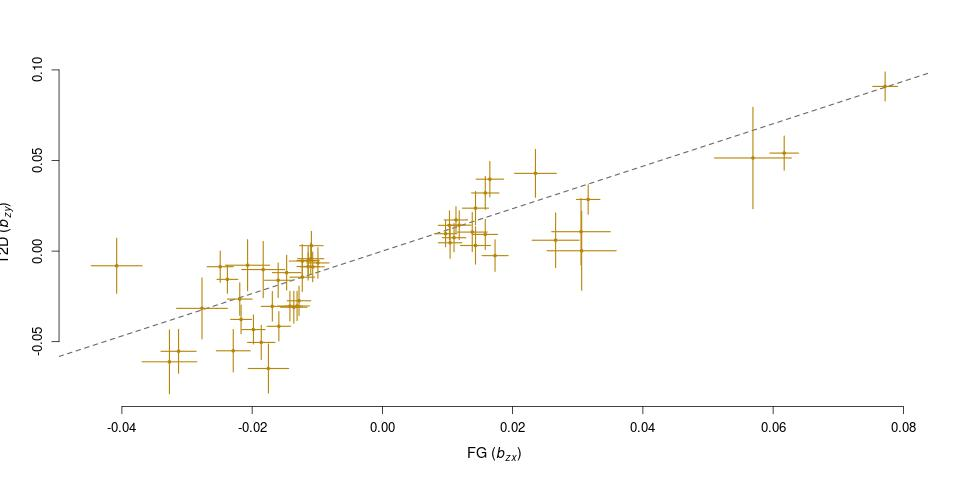
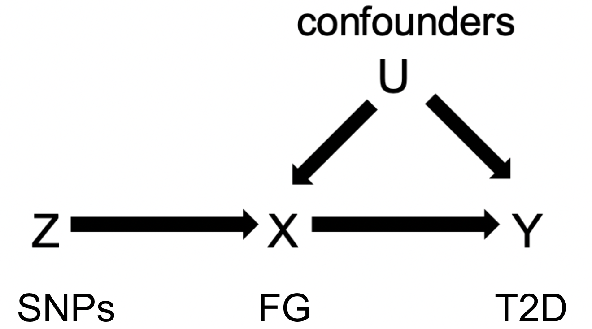
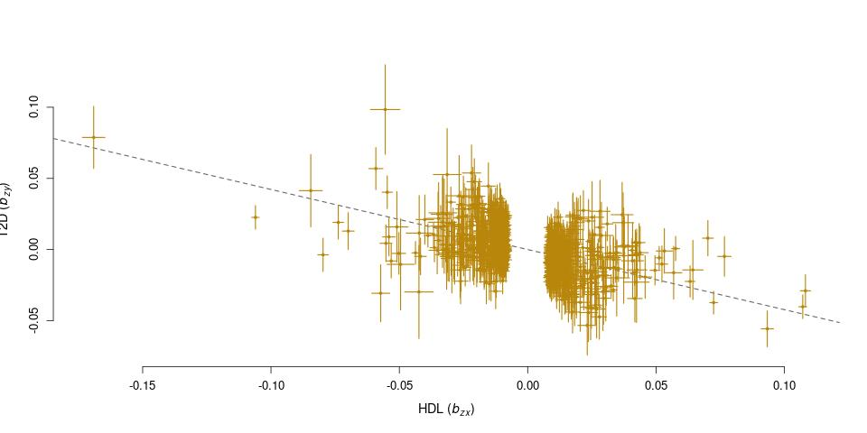
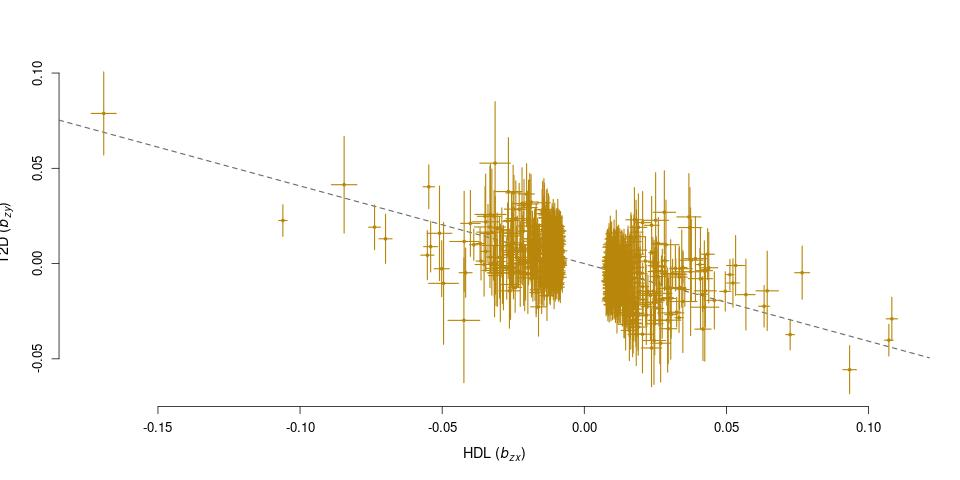

## Homework 10: Mendelian Randomization
### BS859 Applied Genetic Analysis
### Addison Yam
### April 15, 2026

```bash
module load gcta/1.94.1
module load R
```

In class we investigated causal relationships between Body Mass Index (BMI) and Type 2 Diabetes (T2D), a dichotomous trait. We observed a causal relationship where for every SD increase in BMI, the odds of T2D increased by 3 times (OR 3.00). There are many other factors that have been observed to affect T2D risk. In this assignment, we will investigate causal relationships between High Density Lipoprotein cholesterol (HDL-c) and Fasting Glucose (FG) with T2D. 

Outcome Dataset (For Q1&2): Type 2 Diabetes GWAS Meta Analysis by Xue et al. 60,000 Cases and 600,000 controls of European ancestry that we used in class. (Xue, A., Wu, Y., Zhu, Z. et al. Genome-wide association analyses identify 143 risk variants and putative regulatory mechanisms for type 2 diabetes. Nat Commun 9, 2941 (2018). https://doi.org/10.1038/s41467-
018-04951-w)
Location:/projectnb/bs859/data/T2D/T2D_Xue_et_al_2018.txt

1. Fasting glucose (FG) is a blood biomarker used in the diagnosis of T2D, with higher FG indicating T2D. This trait has also been studied through genetic association studies. One example is a meta-analysis by Chen et al. ("The trans-ancestral genomic architecture of glycemic traits." Nature genetics 53.6 (2021): 840-860. http://nature.com/articles/s41588-
021-00852-9 ) Chen et al. (2021) analyzed 281,416 individuals of European ancestry. The file containing the
summary statistics for European ancestry individuals can be found in FG folder on scc: /projectnb/bs859/data/FG/MAGIC1000G_FG_EUR.tsv
There is a readme file that will tell you about the column names.
This file was downloaded from https://magicinvestigators.org/downloads/

a. Reformat the FG-GWAS file into GCTA format as we did in class for the T2D file and create the appropriate “exposure” and “outcome” files that list the file names for GSMR.
```bash
awk 'NR==1{print "SNP A1 A2 freq b se p N"} NR>1 && $6 != "NA" {print $1, $4, $5, $6, $7, $8, $9, $10}' /projectnb/bs859/data/FG/MAGIC1000G_FG_EUR.tsv > FG.ss.txt

head FG.ss.txt
SNP A1 A2 freq b se p N
rs149836397 A G 0.999 0.1687 0.0611 0.002439 26709
rs2902208 A C 0.641 0.0052 0.0021 0.005199 166895
rs11189550 T C 0.095 -0.0104 0.0039 0.0009045 146212
rs11189551 T C 0.096 -0.0107 0.0039 0.0006773 144834
rs17109553 A G 0.003 0.0972 0.0341 0.005231 70910.1
rs149954310 A G 0.003 0.1884 0.0519 0.0001431 35112
rs10883089 A C 0.756 -0.0053 0.002 0.008143 166896
rs7897357 T C 0.319 0.0047 0.0019 0.008113 166896
rs7914401 T C 0.768 -0.0052 0.0021 0.008143 166896
sort -t ' ' -k 1,1 -u FG.ss.txt > FG.ss.dedup.txt
mv FG.ss.dedup.txt FG.ss.txt

awk 'NR==1{print "SNP A1 A2 freq b se p N"};NR>1{print $3,$4,$5,$6,$7,$8,$9,$10}' /projectnb/bs859/data/T2D/T2D_Xue_et_al_2018.txt > T2D.ss.txt
sort -t ' ' -k 1,1 -u T2D.ss.txt > T2D.ss.dedup.txt
mv T2D.ss.dedup.txt T2D.ss.txt

head T2D.ss.txt
rs1000000 A G 0.22423143191563 -0.0026 0.0091 0.7732 573633
rs10000003 A G 0.299115918145665 -0.0164 0.0086 0.05677 572797
rs10000005 G A 0.465396826742671 0.0087 0.008 0.2755 569352
rs10000010 C T 0.484323793394236 0.0036 0.0073 0.6158 587226
rs10000011 T C 0.0423365901422619 0.0275 0.0192 0.1525 572657
rs10000012 G C 0.137141996909376 0.0089 0.0113 0.432 579288
rs10000013 C A 0.21643591806807 0.0213 0.0094 0.02406 569081
rs10000015 G A 0.0542489200770293 0.0277 0.0172 0.1068 572603
rs10000017 T C 0.2207426749064 0.0067 0.0095 0.4764 568090
rs10000018 G A 0.293451245828133 -0.0177 0.0086 0.03974 573209

gcta64 --gsmr-file exposure.txt outcome.txt --bfile /projectnb/bs859/data/1000G/plinkformat/1000G_EUR --gsmr-direction 0 --out FG_T2D_gsmr --effect-plot
*******************************************************************
* Genome-wide Complex Trait Analysis (GCTA)
* version v1.94.1 Linux
* Built at Nov 15 2022 21:14:25, by GCC 8.5
* (C) 2010-present, Yang Lab, Westlake University
* Please report bugs to Jian Yang <jian.yang@westlake.edu.cn>
*******************************************************************
Analysis started at 20:13:33 EDT on Tue Apr 14 2026.
Hostname: scc-202

Accepted options:
--gsmr-file exposure.txt outcome.txt
--bfile /projectnb/bs859/data/1000G/plinkformat/1000G_EUR
--gsmr-direction 0
--out FG_T2D_gsmr
--effect-plot

Reading PLINK FAM file from [/projectnb/bs859/data/1000G/plinkformat/1000G_EUR.fam].
503 individuals to be included from [/projectnb/bs859/data/1000G/plinkformat/1000G_EUR.fam].
Reading PLINK BIM file from [/projectnb/bs859/data/1000G/plinkformat/1000G_EUR.bim].
77818101 SNPs to be included from [/projectnb/bs859/data/1000G/plinkformat/1000G_EUR.bim].
...
Reading GWAS summary data for exposure(s) from [exposure.txt].
Reading GWAS summary data for outcome(s) from [outcome.txt].
7616 genome-wide significant SNPs in common between the exposure(s) and the outcome(s).
Filtering out SNPs with multiple alleles or missing value ...
1 SNPs have missing value or mismatched alleles. These SNPs have been saved in [FG_T2D_gsmr.badsnps].
7615 SNPs are retained after filtering.
7572 genome-wide significant SNPs with p < 5.0e-08 are in common among the exposure(s), the outcome(s) and the LD reference sample.

Reading PLINK BED file from [/projectnb/bs859/data/1000G/plinkformat/1000G_EUR.bed] in SNP-major format ...
Genotype data for 503 individuals and 7572 SNPs to be included from [/projectnb/bs859/data/1000G/plinkformat/1000G_EUR.bed].
Calculating allele frequencies ...
Checking allele frequencies among the GWAS summary data and the reference sample...

Forward GSMR analysis for exposure #1 and outcome #1 ...
85 index SNPs are obtained from the clumping analysis with p < 5.0e-08 and LD r2 < 0.05.
34 pleiotropic SNPs are filtered by HEIDI-outlier analysis.
51 index SNPs are retained after HEIDI-outlier analysis.
Forward GSMR analysis for exposure #1 and outcome #1 completed.

The pleiotropic SNPs filtered by HEIDI-outlier analysis have been saved in [FG_T2D_gsmr.pleio_snps].
Saving the SNP instruments for the GSMR plots to [FG_T2D_gsmr.eff_plot.gz] ...
Saving the GSMR analyses results of 1 exposure(s) and 1 outcome(s) to [FG_T2D_gsmr.gsmr] ...

GSMR analyses completed.

Analysis finished at 20:21:42 EDT on Tue Apr 14 2026
Overall computational time: 8 minutes 8 sec.
```
b. Use GSMR to test the causal hypothesis that FG results in a change in odds of T2D. You may use the default parameters for GSMR.
List the effect estimate, standard error P-value for the causal effect along with the number of SNP instruments
- Answer: The effect estimate is 1.17136, SE is 0.059947, P-value is 5.01697e-85, and the number of SNP instruments is 51. 

```bash
# check the effect estimate, SE, p-value, and number of SNP instruments
cat FG_T2D_gsmr.gsmr 
Exposure	Outcome	bxy	se	p	nsnp
FG	T2D	1.17136	0.059947	5.01697e-85	51

# plot for 1d to plot the SNP instrument effects
vi plot.R
cat plot.R
source("gsmr_plot.r")
gsmr_data = read_gsmr_data("FG_T2D_gsmr.eff_plot.gz")
gsmr_summary(gsmr_data)
jpeg("FG_T2D_gsmr.jpeg", width=960, height=480)
par(mfrow=c(1,1))
plot_gsmr_effect(gsmr_data, "FG", "T2D", colors()[75])
dev.off()

Rscript plot.R
[1] 8
[1] "rs10040098" "T"          "C"          "0.318"      "-0.0249"   
[6] "0.002"      "-0.0086"    "0.0086"    
[1] 8
[1] "rs10305457" "T"          "C"          "0.065"      "0.0235"    
[6] "0.0032"     "0.0429"     "0.0132"    
[1] 8
[1] "rs10497345" "C"          "G"          "0.054"      "0.0305"    
[6] "0.0045"     "0.0107"     "0.0183"    
[1] 8
[1] "rs10501320" "C"          "G"          "0.262"      "-0.0219"   
[6] "0.0019"     "-0.0265"    "0.009"     
[1] 8
[1] "rs10830963" "G"          "C"          "0.286"      "0.0772"    
[6] "0.0019"     "0.0909"     "0.008"     
[1] 8
[1] "rs10830974" "C"          "T"          "0.409"      "-0.0159"   
[6] "0.0018"     "-0.0415"    "0.0081"    
[1] 8
[1] "rs10838524" "G"          "A"          "0.52"       "-0.0238"   
[6] "0.0016"     "-0.0156"    "0.0077"    
[1] 8
[1] "rs10885120" "T"          "A"          "0.082"      "-0.0313"   
[6] "0.0027"     "-0.0553"    "0.0121"    
[1] 8
[1] "rs11619319" "G"          "A"          "0.234"      "0.0173"    
[6] "0.002"      "-0.0025"    "0.0087"    
[1] 8
[1] "rs12053049" "C"          "T"          "0.017"      "0.0569"    
[6] "0.0059"     "0.0514"     "0.028"     
[1] 8
[1] "rs13242882" "T"          "A"          "0.508"      "0.0097"    
[6] "0.0017"     "0.0096"     "0.0072"    
[1] 8
[1] "rs1371614" "T"         "C"         "0.222"     "0.0158"    "0.0019"   
[7] "0.0092"    "0.0083"   
[1] 8
[1] "rs1604038" "T"         "C"         "0.288"     "-0.0198"   "0.0018"   
[7] "-0.0433"   "0.008"    
[1] 8
[1] "rs1681630" "C"         "T"         "0.666"     "-0.0114"   "0.0017"   
[7] "-0.0052"   "0.0077"   
[1] 8
[1] "rs16851397" "G"          "A"          "0.045"      "-0.0327"   
[6] "0.0042"     "-0.0611"    "0.0176"    
[1] 8
[1] "rs17265513" "C"          "T"          "0.204"      "0.0158"    
[6] "0.0021"     "0.0321"     "0.0091"    
[1] 8
[1] "rs174564" "G"        "A"        "0.359"    "-0.0169"  "0.0017"   "-0.0305" 
[8] "0.0082"  
[1] 8
[1] "rs17726390" "T"          "C"          "0.146"      "0.0138"    
[6] "0.0023"     "0.0105"     "0.0108"    
[1] 8
[1] "rs1799884" "T"         "C"         "0.181"     "0.0617"    "0.0022"   
[7] "0.0541"    "0.0094"   
[1] 8
[1] "rs189548" "A"        "G"        "0.723"    "-0.0123"  "0.002"    "-0.0055" 
[8] "0.0091"  
[1] 8
[1] "rs2003076" "A"         "G"         "0.082"     "-0.0277"   "0.0039"   
[7] "-0.0316"   "0.0168"   
[1] 8
[1] "rs2126259" "C"         "T"         "0.909"     "-0.0229"   "0.0026"   
[7] "-0.055"    "0.0117"   
[1] 8
[1] "rs2593741" "T"         "A"         "0.343"     "0.0118"    "0.0018"   
[7] "0.0143"    "0.0079"   
[1] 8
[1] "rs2839671" "A"         "G"         "0.164"     "-0.016"    "0.0022"   
[7] "-0.0161"   "0.0095"   
[1] 8
[1] "rs2971672" "C"         "A"         "0.402"     "0.0316"    "0.0018"   
[7] "0.0285"    "0.0081"   
[1] 8
[1] "rs35206230" "T"          "C"          "0.594"      "-0.0099"   
[6] "0.0017"     "-0.0065"    "0.0084"    
[1] 8
[1] "rs35463245" "G"          "C"          "0.224"      "0.0143"    
[6] "0.002"      "0.0237"     "0.0092"    
[1] 8
[1] "rs35533056" "G"          "A"          "0.616"      "-0.0131"   
[6] "0.0019"     "-0.0303"    "0.0081"    
[1] 8
[1] "rs3778321" "A"         "G"         "0.176"     "-0.0186"   "0.0021"   
[7] "-0.0504"   "0.0094"   
[1] 8
[1] "rs3783347" "T"         "G"         "0.189"     "-0.0136"   "0.002"    
[7] "-0.031"    "0.0088"   
[1] 8
[1] "rs4760278" "A"         "C"         "0.181"     "-0.011"    "0.002"    
[7] "-0.0042"   "0.0085"   
[1] 8
[1] "rs552619" "C"        "T"        "0.62"     "-0.0128"  "0.0018"   "-0.0274" 
[8] "0.0081"  
[1] 8
[1] "rs58234170" "G"          "A"          "0.281"      "0.0104"    
[6] "0.0018"     "0.0046"     "0.0086"    
[1] 8
[1] "rs58925536" "T"          "C"          "0.032"      "0.0306"    
[6] "0.0053"     "0.0002"     "0.0218"    
[1] 8
[1] "rs62262650" "T"          "C"          "0.398"      "0.0103"    
[6] "0.0017"     "0.0142"     "0.008"     
[1] 8
[1] "rs635634" "T"        "C"        "0.187"    "0.0165"   "0.0021"   "0.0397"  
[8] "0.0098"  
[1] 8
[1] "rs6489811" "G"         "A"         "0.512"     "0.011"     "0.0018"   
[7] "0.0074"    "0.0078"   
[1] 8
[1] "rs6538804" "G"         "C"         "0.377"     "-0.0142"   "0.0019"   
[7] "-0.0304"   "0.0082"   
[1] 8
[1] "rs6552828" "G"         "A"         "0.598"     "-0.0123"   "0.0019"   
[7] "-0.0144"   "0.0079"   
[1] 8
[1] "rs6598541" "G"         "A"         "0.648"     "-0.0114"   "0.0017"   
[7] "-0.0085"   "0.0075"   
[1] 8
[1] "rs6663742" "T"         "G"         "0.199"     "0.0143"    "0.0023"   
[7] "0.0031"    "0.0103"   
[1] 8
[1] "rs6720602" "A"         "G"         "0.525"     "-0.0109"   "0.0018"   
[7] "0.003"     "0.0079"   
[1] 8
[1] "rs68054705" "G"          "A"          "0.358"      "-0.0107"   
[6] "0.0018"     "-0.0087"    "0.0082"    
[1] 8
[1] "rs7163757" "T"         "C"         "0.433"     "-0.0217"   "0.0016"   
[7] "-0.0377"   "0.0079"   
[1] 8
[1] "rs737383" "C"        "T"        "0.416"    "0.0113"   "0.0018"   "0.0172"  
[8] "0.0073"  
[1] 8
[1] "rs7584277" "A"         "G"         "0.075"     "0.0266"    "0.0036"   
[7] "0.006"     "0.0151"   
[1] 8
[1] "rs77560898" "T"          "A"          "0.07"       "-0.0183"   
[6] "0.0033"     "-0.0102"    "0.0155"    
[1] 8
[1] "rs77609521" "A"          "G"          "0.049"      "-0.0408"   
[6] "0.0039"     "-0.0081"    "0.0152"    
[1] 8
[1] "rs78132593" "A"          "C"          "0.203"      "-0.0147"   
[6] "0.0022"     "-0.0119"    "0.0096"    
[1] 8
[1] "rs79600615" "A"          "T"          "0.112"      "-0.0175"   
[6] "0.0031"     "-0.0648"    "0.0136"    
[1] 8
[1] "rs8192552" "A"         "G"         "0.059"     "-0.0207"   "0.0034"   
[7] "-0.0078"   "0.0141"   

## Exposure and outcome
1 exposure(s): FG
1 outcome(s): T2D

## GSMR result
  Exposure Outcome     bxy       se           p n_snps
1       FG     T2D 1.17136 0.059947 5.01697e-85     51
null device 
          1 

# Ran in the other direction for 1f
gcta64 --gsmr-file exposure.txt outcome.txt --bfile /projectnb/bs859/data/1000G/plinkformat/1000G_EUR --gsmr-direction 1 --out T2D_FG_gsmr --effect-plot
Analysis started at 20:44:03 EDT on Tue Apr 14 2026.
Hostname: scc-202

Accepted options:
--gsmr-file exposure.txt outcome.txt
--bfile /projectnb/bs859/data/1000G/plinkformat/1000G_EUR
--gsmr-direction 1
--out T2D_FG_gsmr
--effect-plot

Reading PLINK FAM file from [/projectnb/bs859/data/1000G/plinkformat/1000G_EUR.fam].
503 individuals to be included from [/projectnb/bs859/data/1000G/plinkformat/1000G_EUR.fam].
Reading PLINK BIM file from [/projectnb/bs859/data/1000G/plinkformat/1000G_EUR.bim].
77818101 SNPs to be included from [/projectnb/bs859/data/1000G/plinkformat/1000G_EUR.bim].
...
Reading GWAS summary data for exposure(s) from [exposure.txt].
Reading GWAS summary data for outcome(s) from [outcome.txt].
7616 genome-wide significant SNPs in common between the exposure(s) and the outcome(s).
Filtering out SNPs with multiple alleles or missing value ...
1 SNPs have missing value or mismatched alleles. These SNPs have been saved in [T2D_FG_gsmr.badsnps].
7615 SNPs are retained after filtering.
7572 genome-wide significant SNPs with p < 5.0e-08 are in common among the exposure(s), the outcome(s) and the LD reference sample.

Reading PLINK BED file from [/projectnb/bs859/data/1000G/plinkformat/1000G_EUR.bed] in SNP-major format ...
Genotype data for 503 individuals and 7572 SNPs to be included from [/projectnb/bs859/data/1000G/plinkformat/1000G_EUR.bed].
Calculating allele frequencies ...
Checking allele frequencies among the GWAS summary data and the reference sample...

Reverse GSMR analysis for exposure #1 and outcome #1 ...
85 index SNPs are obtained from the clumping analysis with p < 5.0e-08 and LD r2 < 0.05.
17 pleiotropic SNPs are filtered by HEIDI-outlier analysis.
68 index SNPs are retained after HEIDI-outlier analysis.
Reverse GSMR analysis for exposure #1 and outcome #1 completed.

The pleiotropic SNPs filtered by HEIDI-outlier analysis have been saved in [T2D_FG_gsmr.pleio_snps].
Saving the SNP instruments for the GSMR plots to [T2D_FG_gsmr.eff_plot.gz] ...
Saving the GSMR analyses results of 1 exposure(s) and 1 outcome(s) to [T2D_FG_gsmr.gsmr] ...

GSMR analyses completed.

Analysis finished at 20:51:42 EDT on Tue Apr 14 2026
Overall computational time: 7 minutes 38 sec.


cat T2D_FG_gsmr.gsmr
Exposure        Outcome bxy     se      p       nsnp
T2D     FG      0.128677        0.00395241      1.69509e-232    68
```

1c. Provide an Odds Ratio for the causal effect of FG and T2D, and interpret it with appropriate units. Is this estimate expected given what we know about FG & T2D?
- Answer: The OR = exp(bxy) = exp(1.17136) = 3.22637752957. This means that the odds ratio for the causal effect of FG on T2D is 3.226 per standard deviation increase in FG. This estimate is expected given what we know about FG and T2D because fasting glucose is a diagnostic biomarker for T2D and high glucose levels can cause T2D. 

1d. Provide a plot of the SNP instrument effects for FG & T2D. Comment on the features of the plot and if the plot agrees with the odds ratio from 1c.



This plot shows SNP instruments with a positive linear trend as is a direct relationship between FG and T2D. Most points are on the dashed line which means that the causual estimates are consistent across instruments. this plot agrees with the OR from 1c. 

1e. GSMR used the HEIDI outlier method to remove outlier SNPs. How many SNPs were removed from the FG exposure? Explain why these variants were removed.
- Answer: 34 pleiotropic SNPs were removed from the FG exposure because the HEIDI test tries to detect horizontal pleiotropy and prevent bias in the causal estimate by looking at each SNP's ratio estimate and compares that with the target SNP's estimate. 

1f. Report (and interpret) the result of causal analysis in the other direction (T2DFG), using the default GSMR parameters. 
- The effect estimate is 0.128677, SE is 0.00395241, P-value is 1.69509e-232, and the number of SNP instruments is 58. There seems to be a positive effect of an increase of T2D and increase of FG but this effect seems to be pretty small and is statistically significant. So, both directions confirm this relationship but the FG to T2D direction is more prominent than the reverse.

Question 2

2a. Draw a causal diagram similar to the one seen on page 14 of the class 11 notes for the Mendelian Randomization (MR) framework addressed in Question 1. Namely, the causal relationship between FG & T2D (where FG is the exposure and T2D is the outcome).



2b. Explain briefly in your own words the following MR assumptions in the context of the causal diagram you drew in 2a.

Relevance Assumption: The SNPs treated as instruments are significantly associated with fasting glucose levels which was done by filtering for genome-wide significant SNPs.

Independence Assumption: There should be indpendence in the SNPs associated with FG and the SNPs associated with T2D.

Exclusion Assumption: The SNPs associated with FG do not affect T2D's other mechanisms execpt only changing levels of FG.

2c. Given what we know about how T2D is diagnosed, which direction of the causal effects do you think is most likely correct?
- Answer: The direction from FG to T2D is most likely correct because this direction has a stronger effect (1.17) while the opposite direction has a weaker effect (0.13).

2d. Thinking about the assumptions you explained in 2b., what possible explanations for the bidirectional result do you think are plausible?
- Answer: Some possible explanations for the bidirectional results are there is horizontal pleiotrophy where some SNPs associated with T2D may impact FG through other pathways, there may be bias in how the samples were collected, there may be genetic correlation or underlying mechanism between T2D and FG, or that the instruments for T2D may be weaker than for FG.

Question 3
High Density Lipoprotein cholesterol (HDL-c) is a blood-lipid biomarker related to many health outcomes, but not directly involved in the diagnosis T2D. In general, higher levels of HDL-c is considered protective with regards to negative health outcomes such as heart disease. This trait has been extensively studied by GWAS, and meta-analysis summary statistics by Graham et al. (Graham, S.E., Clarke, S.L., Wu, KH.H. et al. The power of genetic diversity in genome-wide association studies of lipids. Nature 600, 675–679 (2021). https://doi.org/10.1038/s41586-021-04064-3) are provided for this assignment. The authors investigated genetic associations with HDL-c
among 1,320,016 individuals of European ancestry. The summary statistics can be found in /projectnb/bs859/data/lipids folder on scc: HDL_INV_EUR_HRC_1KGP3_others_ALL.meta.singlevar.results

3a. Reformat the HDL-GWAS file into GCTA format as we did in class for the T2D file.
Make sure to include explicit NA values in the output.
Note: Alt is the effect allele
Create the appropriate “exposure” and “outcome” files for GSMR.

```bash
awk 'NR==1{print "SNP A1 A2 freq b se p N"} NR>1 && $8 != "NA" {print $1, $5, $4, $8, $9, $10, $12, $7}' /projectnb/bs859/data/lipids/HDL_INV_EUR_HRC_1KGP3_others_ALL.meta.singlevar.results > HDL.ss.txt

head HDL.ss.txt
SNP A1 A2 freq b se p N
rs554760071 C G 0.005 -0.0774387 0.0273598 0.00465 2
rs559500163 T A 0.00168 -0.13866 0.0508073 0.00635 2
rs528344458 C A 0.00168 -0.13866 0.0508073 0.00635 2
rs551668143 T A 0.00168 -0.13866 0.0508073 0.00635 2
rs565211799 T G 0.00168 -0.13866 0.0508073 0.00635 2
rs3844233 T A 0.316 0.0767158 0.0274585 0.00521 5
rs530221379 A G 0.00503 -0.0739205 0.0272874 0.00675 2
rs4030326 T A 0.0196 -0.0399539 0.0150969 0.00813 5
rs192472955 C A 0.0345 -0.403461 0.138064 0.00347 2

sort -t ' ' -k 1,1 -u HDL.ss.txt > HDL.ss.dedup.txt
mv HDL.ss.dedup.txt HDL.ss.txt

echo "HDL HDL.ss.txt" > exposure_hdl.txt
echo "T2D T2D.ss.txt" > outcome.txt

gcta64 --gsmr-file exposure_hdl.txt outcome.txt --bfile /projectnb/bs859/data/1000G/plinkformat/1000G_EUR --gsmr-direction 0 --out HDL_T2D_gsmr --effect-plot

Analysis started at 21:26:25 EDT on Tue Apr 14 2026.
Hostname: scc-202

Accepted options:
--gsmr-file exposure_hdl.txt outcome.txt
--bfile /projectnb/bs859/data/1000G/plinkformat/1000G_EUR
--gsmr-direction 0
--out HDL_T2D_gsmr
--effect-plot

Reading PLINK FAM file from [/projectnb/bs859/data/1000G/plinkformat/1000G_EUR.fam].
503 individuals to be included from [/projectnb/bs859/data/1000G/plinkformat/1000G_EUR.fam].
Reading PLINK BIM file from [/projectnb/bs859/data/1000G/plinkformat/1000G_EUR.bim].
....
Reading GWAS summary data for exposure(s) from [exposure_hdl.txt].
Reading GWAS summary data for outcome(s) from [outcome.txt].
76598 genome-wide significant SNPs in common between the exposure(s) and the outcome(s).
Filtering out SNPs with multiple alleles or missing value ...
2 SNPs have missing value or mismatched alleles. These SNPs have been saved in [HDL_T2D_gsmr.badsnps].
76596 SNPs are retained after filtering.
76014 genome-wide significant SNPs with p < 5.0e-08 are in common among the exposure(s), the outcome(s) and the LD reference sample.

Reading PLINK BED file from [/projectnb/bs859/data/1000G/plinkformat/1000G_EUR.bed] in SNP-major format ...
Genotype data for 503 individuals and 76014 SNPs to be included from [/projectnb/bs859/data/1000G/plinkformat/1000G_EUR.bed].
Calculating allele frequencies ...
Checking allele frequencies among the GWAS summary data and the reference sample...
Warning: There are 5 SNPs with MAF < 0.01 in the reference sample.

Forward GSMR analysis for exposure #1 and outcome #1 ...
1199 index SNPs are obtained from the clumping analysis with p < 5.0e-08 and LD r2 < 0.05.
178 pleiotropic SNPs are filtered by HEIDI-outlier analysis.
1021 index SNPs are retained after HEIDI-outlier analysis.
Forward GSMR analysis for exposure #1 and outcome #1 completed.

The pleiotropic SNPs filtered by HEIDI-outlier analysis have been saved in [HDL_T2D_gsmr.pleio_snps].
Saving the SNP instruments for the GSMR plots to [HDL_T2D_gsmr.eff_plot.gz] ...
Saving the GSMR analyses results of 1 exposure(s) and 1 outcome(s) to [HDL_T2D_gsmr.gsmr] ...

GSMR analyses completed.

Analysis finished at 21:34:17 EDT on Tue Apr 14 2026
Overall computational time: 7 minutes 51 sec.

cat HDL_T2D_gsmr.gsmr
Exposure        Outcome bxy     se      p       nsnp
HDL     T2D     -0.422286       0.0173717       1.58089e-130    1021

vi plot_HDL.R
cat plot_HDL.R
source("gsmr_plot.r")
gsmr_data = read_gsmr_data("HDL_T2D_gsmr.eff_plot.gz")
jpeg("HDL_T2D_gsmr.jpeg", width=960, height=480)
par(mfrow=c(1,1))
plot_gsmr_effect(gsmr_data, "HDL", "T2D", colors()[75])
dev.off()

Rscript plot_HDL.R

```

3b. Use GSMR to test the causal hypothesis that HDL-c results in a change in odds of T2D. You may use the default parameters for GSMR.
Please list the effect estimate, standard error P-value for the causal effect along with the number of SNP instruments.
- Answer: The effect estimate is -0.422286, SE is 0.0173717, P-value is 1.58089e-130, and the number of SNP instruments is 1021.

3c. How many pleiotropic HDL SNPs were removed by GSMR?
- Answer: 178 pleiotropic SNPs were removed by HEIDI-outlier analysis.

3d. Provide an Odds Ratio for the causal effect of HDL-c and T2D, and interpret it with appropriate units. Is this estimate expected given what we know about HDL-c in general? 
- Answer: OR = exp(bxy) = exp(-0.422286) = 0.65554652627. This estimate is expected given what we know about HDL-c in general because HDL is considered good cholestorol which is a more healthy outcome which would usually not be associated with an unhealthy outcome of T2D. 

3e. Provide a plot of the SNP instrument effects for HDL-c & T2D. Comment on the features of the plot and if the plot agrees with the odds ratio from 2c. Do you see any potential outliers remaining? (Remember that by default the HEIDI procedure removes outliers at threshold p<0.01.)



- Answer: This plot shows a negative slope between HDL-c and T2D and most points cluster near the dashed line, indicating consistent causal estimates across SNPs. I do observe one potential outlier. This plot seems to agree with the OR and there seems to be a protective causal effect of HDL on T2D.

3f. Rerun GSMR to test for a causal relationship between HDL-c and T2D as in 2b, but use a more strict significance threshold to select SNPs of 1×10-10. Report the effect estimate and PValue and explain any similarities/differences from 2b.
- Answer: The effect estimate is -0.422286 and the p-value is 1.58089e-130. This GSMR I ran has very similiar statistics to the previous GSMR as the effect estimate, SE, p-value, and nsnp seem to be the exact same.

```bash
gcta64 --gsmr-file exposure_hdl.txt outcome.txt --bfile /projectnb/bs859/data/1000G/plinkformat/1000G_EUR --gsmr-direction 0 --out HDL_T2D_gsmr_1e10 --effect-plot --gsmr-snp-min 1e-10


Analysis started at 21:36:46 EDT on Tue Apr 14 2026.
Hostname: scc-202

Accepted options:
--gsmr-file exposure_hdl.txt outcome.txt
--bfile /projectnb/bs859/data/1000G/plinkformat/1000G_EUR
--gsmr-direction 0
--out HDL_T2D_gsmr_1e10
--effect-plot
--gsmr-snp-min 1

Warning: The number of SNP instruments included in the analysis is too small. There might not be enough SNPs to perform the HEIDI-outlier analysis.

Reading PLINK FAM file from [/projectnb/bs859/data/1000G/plinkformat/1000G_EUR.fam].
503 individuals to be included from [/projectnb/bs859/data/1000G/plinkformat/1000G_EUR.fam].
Reading PLINK BIM file from [/projectnb/bs859/data/1000G/plinkformat/1000G_EUR.bim].
77818101 SNPs to be included from [/projectnb/bs859/data/1000G/plinkformat/1000G_EUR.bim].
...
Reading GWAS summary data for exposure(s) from [exposure_hdl.txt].
Reading GWAS summary data for outcome(s) from [outcome.txt].
76598 genome-wide significant SNPs in common between the exposure(s) and the outcome(s).
Filtering out SNPs with multiple alleles or missing value ...
2 SNPs have missing value or mismatched alleles. These SNPs have been saved in [HDL_T2D_gsmr_1e10.badsnps].
76596 SNPs are retained after filtering.
76014 genome-wide significant SNPs with p < 5.0e-08 are in common among the exposure(s), the outcome(s) and the LD reference sample.

Reading PLINK BED file from [/projectnb/bs859/data/1000G/plinkformat/1000G_EUR.bed] in SNP-major format ...
Genotype data for 503 individuals and 76014 SNPs to be included from [/projectnb/bs859/data/1000G/plinkformat/1000G_EUR.bed].
Calculating allele frequencies ...
Checking allele frequencies among the GWAS summary data and the reference sample...
Warning: There are 5 SNPs with MAF < 0.01 in the reference sample.

Forward GSMR analysis for exposure #1 and outcome #1 ...
1199 index SNPs are obtained from the clumping analysis with p < 5.0e-08 and LD r2 < 0.05.
178 pleiotropic SNPs are filtered by HEIDI-outlier analysis.
1021 index SNPs are retained after HEIDI-outlier analysis.
Forward GSMR analysis for exposure #1 and outcome #1 completed.

The pleiotropic SNPs filtered by HEIDI-outlier analysis have been saved in [HDL_T2D_gsmr_1e10.pleio_snps].
Saving the SNP instruments for the GSMR plots to [HDL_T2D_gsmr_1e10.eff_plot.gz] ...
Saving the GSMR analyses results of 1 exposure(s) and 1 outcome(s) to [HDL_T2D_gsmr_1e10.gsmr] ...

GSMR analyses completed.

Analysis finished at 21:44:41 EDT on Tue Apr 14 2026
Overall computational time: 7 minutes 54 sec.

cat HDL_T2D_gsmr_1e10.gsmr
Exposure        Outcome bxy     se      p       nsnp
HDL     T2D     -0.422286       0.0173717       1.58089e-130    1021
```

3g. Rerun GSMR to test for a causal relationship between HDL-c and T2D as in 2b, but use a more strict significance threshold for the HEIDI outlier removal – use p=0.05. Plot the SNP effects, and report the effect estimate and P-Value and explain any similarities/differences from 2b. Have some of the more extreme instruments in the earlier plot been removed?
- Answer: This more strict threshold removed 310 pleiotropic SNPs (compared to 178 previously), leaving 889 index SNPs for analysis. The effect estimate is -0.40741 which is similiar to the previous and the p-value is 1.72368e-103. I plotted the SNP effects and the points are a lot more clustered to the dashed line and the outlier point from the earlier plot had been removed. 



```bash
gcta64 --gsmr-file exposure_hdl.txt outcome.txt --bfile /projectnb/bs859/data/1000G/plinkformat/1000G_EUR --gsmr-direction 0 --out HDL_T2D_gsmr_heidi05 --effect-plot --heidi-thresh 0.05

Analysis started at 21:47:33 EDT on Tue Apr 14 2026.
Hostname: scc-202

Accepted options:
--gsmr-file exposure_hdl.txt outcome.txt
--bfile /projectnb/bs859/data/1000G/plinkformat/1000G_EUR
--gsmr-direction 0
--out HDL_T2D_gsmr_heidi05
--effect-plot
--heidi-thresh 0.05

Reading PLINK FAM file from [/projectnb/bs859/data/1000G/plinkformat/1000G_EUR.fam].
503 individuals to be included from [/projectnb/bs859/data/1000G/plinkformat/1000G_EUR.fam].
Reading PLINK BIM file from [/projectnb/bs859/data/1000G/plinkformat/1000G_EUR.bim].
77818101 SNPs to be included from [/projectnb/bs859/data/1000G/plinkformat/1000G_EUR.bim].
...

Reading GWAS summary data for exposure(s) from [exposure_hdl.txt].
Reading GWAS summary data for outcome(s) from [outcome.txt].
76598 genome-wide significant SNPs in common between the exposure(s) and the outcome(s).
Filtering out SNPs with multiple alleles or missing value ...
2 SNPs have missing value or mismatched alleles. These SNPs have been saved in [HDL_T2D_gsmr_heidi05.badsnps].
76596 SNPs are retained after filtering.
76014 genome-wide significant SNPs with p < 5.0e-08 are in common among the exposure(s), the outcome(s) and the LD reference sample.

Reading PLINK BED file from [/projectnb/bs859/data/1000G/plinkformat/1000G_EUR.bed] in SNP-major format ...
Genotype data for 503 individuals and 76014 SNPs to be included from [/projectnb/bs859/data/1000G/plinkformat/1000G_EUR.bed].
Calculating allele frequencies ...
Checking allele frequencies among the GWAS summary data and the reference sample...
Warning: There are 5 SNPs with MAF < 0.01 in the reference sample.

Forward GSMR analysis for exposure #1 and outcome #1 ...
1199 index SNPs are obtained from the clumping analysis with p < 5.0e-08 and LD r2 < 0.05.
310 pleiotropic SNPs are filtered by HEIDI-outlier analysis.
889 index SNPs are retained after HEIDI-outlier analysis.
Forward GSMR analysis for exposure #1 and outcome #1 completed.

The pleiotropic SNPs filtered by HEIDI-outlier analysis have been saved in [HDL_T2D_gsmr_heidi05.pleio_snps].
Saving the SNP instruments for the GSMR plots to [HDL_T2D_gsmr_heidi05.eff_plot.gz] ...
Saving the GSMR analyses results of 1 exposure(s) and 1 outcome(s) to [HDL_T2D_gsmr_heidi05.gsmr] ...

GSMR analyses completed.

Analysis finished at 21:55:26 EDT on Tue Apr 14 2026
Overall computational time: 7 minutes 52 sec.

cat HDL_T2D_gsmr_heidi05.gsmr
Exposure        Outcome bxy     se      p       nsnp
HDL     T2D     -0.40741        0.0188599       1.72368e-103    889

vi plot_HDL_heidi05.R
cat plot_HDL_heidi05.R
source("gsmr_plot.r")
gsmr_data = read_gsmr_data("HDL_T2D_gsmr_heidi05.eff_plot.gz")
jpeg("HDL_T2D_gsmr_heidi05.jpeg", width=960, height=480)
par(mfrow=c(1,1))
plot_gsmr_effect(gsmr_data, "HDL", "T2D", colors()[75])
dev.off()

Rscript plot_HDL_heidi05.R
```